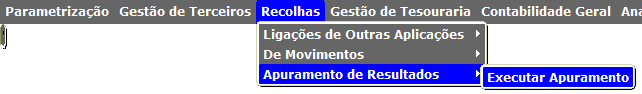
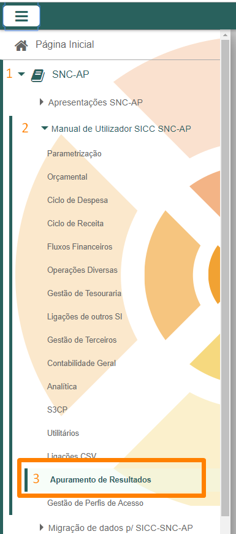

Voltar

# Atualizações no SICC - 22 de março de 2019

- Disponibilização de contas específicas em SNC-AP para o documento OD;
- Correções no DTAS;
- Alterações no BA de forma a considerar os lançamentos nas contas 0251 e 024 na entidade de Cabimentos;
- Correções no abate de documentos do tipo CO;
- Correções no mapa DDORC (cálculos e inclusão dos valores do N-1);
- Correções na impressão de informação de execução orçamental dos documentos CM;
- Correções no Balancete de Contabilidade Orçamental;

- Disponibilização do menu "**Apuramento de Resultados**" (apenas para os Supervisores de cada instituição);

Sugere-se a leitura do manual desta funcionalidade disponível no botão de Ajuda no ecrã ou no capítulo:

