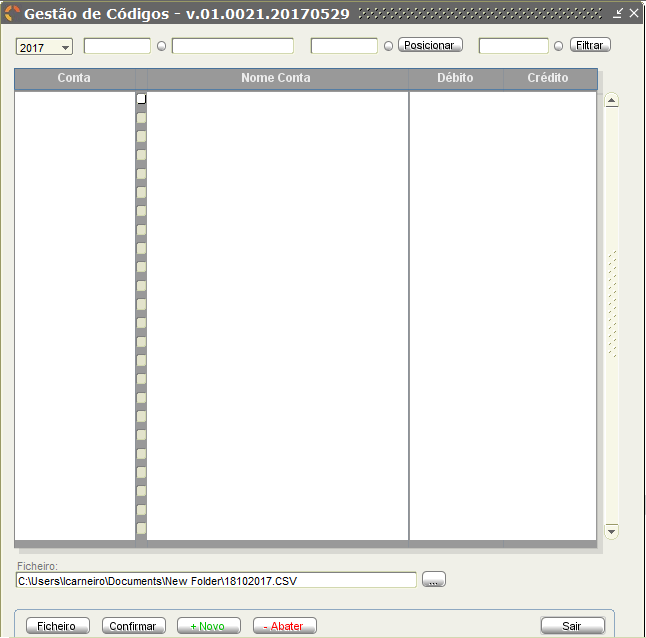

# Manual de Utilizador SICC SNC-AP (em atualização)

## Introdução

O presente documento visa especificar o funcionamento do novo sistema SICC SNC-AP, evidenciando as novas funcionalidades e ajustes na ótica do utilizador, bem como a satisfação dos requistos específicos da Contabilidade.

 O sistema é composto por nove Menus principais cada um com vários sub-menus.

 **Botões Gerais**

O sistema, ao longo da navegação por vários ecrãs contempla vários botões que se podem ou não repetir de ecrã para ecrã. A sua descrição segue na tabela abaixo.

| Botão | Ação |
|:---|:---|
|  | Posicionar-se no primeiro registo  com base nos critérios de pesquisa introduzidos ou, caso não tenha sido efetuada nenhuma pesquisa, no último registo existente no sistema. |
|  | Navegar no sentido do primeiro registo correspondente à secção aberta  |
|  | Navegar no sentido do último registo correspondente à secção aberta.|
|  | Posicionar-se no último registo  com base nos critérios de pesquisa introduzidos ou, caso não tenha sido efetuada nenhuma pesquisa, no último registo existente no sistema. |
|  | Confirmar as alterações efetuadas e registá-las. |
|  | Introduzir um novo registo corresponde à secção aberta. Ao carregar neste botão, é perguntado se o utilizador pretende introduzir um novo Registo. Caso o utilizador responda que sim, todos os campos são limpos e o utilizador deve preencher com os dados pretendidos. No final, o utilizador, tem de carregar no botão Confirmar de forma a que a informação seja validada e gravada. |
|  | Eliminar o registo que estiver selecionado. Para registar esta ação, é necessário selecionar o botão "Confirmar". |
|  | Cancelar todas as alterações que efetuou desde a abertura o ecrã. |
|  | Abrir o Manual do Utilizador na secção correspondente ao ecrã aberto. _Esta funcionalidade não está ainda disponível em todos os ecrãs do sistema_ |
|  | Sair do ecrã. |

> Recomenda-se o uso da tecla **_TAB_** para a navegação pelos campos dos ecrãs do sistema. Esta forma de navegação garante que todos os campos obrigatórios sejam preenchidos e validados permitindo o posterior desbloqueio de outros campos.

## 1. Menu Parametrização

Este menu permite efetuar a parametrização de informação necessária ao correto funcionamento da aplicação.

Acedendo ao mesmo temos as seguintes opções disponíveis:

| Opção | Descrição | Utilizadores |
|:---|:---|:---:|
|  | Manipular a informação relacionada com a instituição, com os exercícios e configurações de sistema. | Todos |
|  | Atualizar as informações genéricas do sistema, nomeadamente a informação relativa a códigos postais, bancos, fatores de aglutinação, tipo de entidade, instituições bancárias, responsáveis e ROC. | Todos |
|  | Atualizar as informações relacionadas com contabilidade, nomeadamente o plano de contas, a contabilidade pública, tipos de diário, centros de custo, CRI/departamentos e associações LCPA. | Todos |
|  | Atualizar as informações relacionadas com terceiros, nomeadamente a gestão de entidades, tabela de projetos e gestão de entidades *factoring*. | Todos |
| | Terminar sessão de utilização. | Todos |
|  | Sair da aplicação. | Todos |

 A maioria dos sub-menus disponiliza formulários de recolha de dados, "Recolhas", e a listagem dos dados já guardados em cada sub-menu, "Listagens".

**Recolhas**

Os formulários "Recolhas" são detalhadamente descritos ao longo deste capítulo para cada sub-menu.

 **Listagens**

A janela correspondente às "Listagens" segue a mesma lógica de processo, para cada sub-menu, indicada seguidamente. Os casos excepcionais são descritos detalhadamente no respectivo sub-menu.
Para efeitos de exemplo na imagem que se segue está indicada a janela de "Listagens" referente ao sub-menu Tabelas Genéricas >  Códigos Postais.

Este ecrã permite ao utilizador extrair a listagem de Códigos Postais, para ficheiro de texto com o formato CSV e imprimir o ficheiro em formato PDF.

| Campo | Descrição |
|:---|:---|
| Primeiro Cód. Postal | Código do primeiro código postal a extrair. Apenas é extraída informação cujo código postal seja igual ou superior ao indicado neste campo. |
| Último Cód. Postal | Código do último código postal a extrair. Apenas é extraída informação cujo código postal seja igual ou superior ao indicado no campo superior e menor ou igual ao indicado neste campo. |
| Ficheiro | Este campo indica a localização onde o ficheiro será gravado. |

| Botão | Ação |
|:---|:---|
| | Escolher a localização onde pretende guardar a informação a extrair, seja dentro da máquina local ou de uma pasta de rede. O nome do ficheiro é composta pela sigla “LIST\_CODPOST_” mais a data de extração, no formato DDMMAAAA ( D – Dia; M – Mês; A – Ano ). |
|  | Extrair a informação pretendida para um ficheiro de texto com o formato CSV. |
|  | Imprimir uma listagem de códigos postais com base nos critérios definidos.|
| | Sair do ecrã. |

 Existem ecrãs de "Listagens" que possibilitam a pesquisa do primeiro e último registo a listar através do botão posicionado entre dois campos.
A título de exemplo está apresentado na imagem abaixo o processo de listagem de contas no sub-menu Contabilidade > Plano multidimensional > Plano de Contas-SNC-AP.

- Aspeto da exportação para "Ficheiro" (CSV):

- Aspeto da Impressão (PDF):

### 1.1 Instituição
Este submenu permite o acesso ao tratamento de informação relacionada com a instituição, exercícios e configurações.

#### 1.1.1. Recolha

Menu de acesso:

Esta opção permite ao utilizador manipular as informações relacionadas com a instituição. Por exemplo, Ministério da Saúde.

No ecrã o utilizador pode introduzir ou alterar toda a informação relacionada com uma
instituição, nomeadamente:

| Campo | Descrição |
|:---|:---|
| Ministério/Região Autónoma | Identificação do ministério ou região autónoma a que pertence a instituição. |
| Serviço Central | Identificação do serviço central a que pertence a instituição. |
| Sigla | Sigla da instituição. Ex: ACSS. |
| Nome da Instituição | Nome da instituição. |
| Morada | Morada da instituição. |
| Localidade | Localidade a que pertence a instituição. |
| Código Postal | Código postal associado à instituição. A lista de códigos postais é acessível através do botão redondo que se encontra entre os campos.  |
| NIF | Número de identificação fiscal da instituição. |
| CAE | Classificação portuguesa das atividades económicas a que pertence a Instituição. |
| Capital | Capital da instituição. |
| Matrícula | Matrícula da instituição. |
| De | Data de início da validade da matrícula. |
| Em | Data de fim da validade da matrícula. |
| Rep. Finanças | Repartição de finanças em que a instituição está registada. |
| Atividade | Atividade exercida pela instituição. |
| NIF RL | |
| NIF TOC | Número de identificação fiscal do técnico oficial de contas. |
| SIEF (Código da Instituição) | Código da instituição no Sistema Integrado de Informações Económico Fiscais. |
| DGO (Classificação Funcional) | Classificação funcional da instituição na Direção Geral do Orçamento. |
| Exercício | Exercício a que dizem respeito as informação da instituição. |
| Fecho do Mês | Data de fecho do mês. |
| Entidade Jurídica | Identificação da entidade jurídica, que pode ser Entidade Pública Empresarial (EPE) ou Sector Público Administrativo (SPA/EPR). |

| Botão | Ação |
|:---|:---|
|  | Bloquear os dados do ecrã, impedindo que os mesmos sejam alterados até confirmar ou cancelar os mesmos ou desbloquear os dados, que entretanto assumiu o nome <Desbloquear Alterações>. |

#### 1.1.2. Exercícios
Menu de acesso:

Este ecrã permite ao utilizador introduzir novos períodos de exercício ou somente atualizar os actuais.

Os campos disponíveis para utilizador são os seguintes:

| Campo | Descrição |
|:---|:---|
| Exercícios | Esta lista permite ao utilizar visualizar a informação existente para cada um dos períodos definidos. O utilizador poderá ainda atualizar a informação constante do quadro direito e confirmar essas alterações através do botão . Para introduzir um novo exercício o utilizador deve carregar com o botão esquerdo no rato na primeira posição vazia, no final da lista Exercício (ver rectângulo laranja). Posteriormente deve preencher as informações do quadro direito (instruções de preenchimento, por baixo) e para finalizar carregar no botão , conforme mostra na image:  |
| Início | Data inicial do exercício. Este valor pode ser diferente de dia 01 de janeiro. |
|Fim | Data Final do exercício. Este valor pode ser diferente de dia 31 de dezembro. |
| Contab. Fechada a: | Data de fecho da contabilidade para o exercício. |
| Fundos Disponíveis Transitados | Fundos disponíveis para serem usados durante o exercício. |
|Contabilidade Orçamental   |Chave Orçamental do exercício aberto. A lista de códigos para cada campo estão disponível no botão redondo entre os campos.    |
| Mês de final de exercício | O utilizador deve selecionar os meses extras que devem ser tidos em conta no ano selecionado. |

| Botão | Ação |
|:---|:---|
|  |Ao carregar neste botão o utilizador vai ter acesso aos documentos ainda por regularizar. (_Em atualização_)  |

#### 1.1.3. Configurações

Menu de acesso:

Este ecrã permite ao utilizador atualizar as informações do SICC, em diferentes tabulações.

| Campo | Descrição |
|:---|:---|
| IP | Neste campo o utilizador deve definir o Protocolo de Internet de acesso ao SICC. Este campo é de preenchimento **obrigatório**. |
| Porta | Neste campo o utilizador deve definir a porta para acesso ao SICC. Este campo é de preenchimento **obrigatório**. |
| Email | Neste campo o utilizador deve definir o email do responsável pelo SICC, na instituição. Este campo é de preenchimento **obrigatório**. |
|Email bcc |  Endereço de email para enviar cópia oculta |
| Contabilidade Orçamental | Nestes campos o utilizador deve identificar qual o método classificador da Contabilidade Orçamental. Deverá escolher entre: i) Método - Classificador Económico  ii) Método – Contas Patrimoniais. |

<!-- | Sistema  |  Identificador numérico do sistema de informação. |
| Entidade Cobrança  | Identificador da entidade detentora da conta bancária para a qual será feito pagamento multibanco. |
| Prefixo   | Identificador numérico, com tamanho variável de 1 a 9, que será incluído no início das referências multibanco geradas. Exemplo: se o prefixo for "999", todas as referências geradas terão a seguinte composição 999 xxx xxx. O total de referências que será possível gerar, depende do tamanho do prefixo definido. Por exemplo, se o prefixo tiver um tamanho de 8 algarismos, apenas poderão ser geradas 9 referências. | -->

### 1.2 Tabelas Genéricas

Este submenu permite o acesso ao tratamento de informação genérica do sistema, tais como Códigos Postais, Bancos, Fatores de Aglutinação, Tipos de Entidades, Instituições Bancárias, Responsáveis e R.O.C.

#### 1.2.1. Códigos Postais

##### Recolhas
Este ecrã permite ao utilizador manipular as informações relacionadas com os Códigos Postais.

| Campo | Descrição |
|:---|:---|
| Listagem de Códigos Postais | A listagem de códigos, números e localidades apresentada no ecrã, permite a manipulação da mesma. |
| (Pesquisa) Código Postal | Este campo permite ao utilizador efetuar uma pesquisa de código postal através da introdução de um código numérico de quatro dígitos. Deve o utilizador após introduzir, pelo menos esta informação e carregar no botão Filtrar, para ter acesso à informação pretendida na listagem de códigos postais. Este campo pode ser utilizado em simultâneo com os restantes. |
| (Pesquisa) Número Postal | Este campo permite ao utilizador efetuar uma pesquisa de código postal através da introdução de um código numérico de três dígitos. Deve o utilizador após introduzir, pelo menos esta informação e carregar no botão Filtrar, para ter acesso à informação pretendida na listagem de códigos postais. Este campo pode ser utilizado em simultâneo com os restantes. |
| (Pesquisa) Localidade | Este campo permite ao utilizador efetuar uma pesquisa de código postal através da introdução da localidade. Deve o utilizador após introduzir, pelo menos esta informação e carregar no botão Filtrar, para ter acesso à informação pretendida na listagem de códigos postais. Este campo pode ser utilizado em simultâneo com os restantes. **NOTA**: **A informação introduzida neste campo deve estar em letras maiúsculas.** |

#### 1.2.2. Bancos

##### Recolhas

Este ecrã permite ao utilizador manipular as informações relacionadas com os bancos.

| Campo | Descrição |
|:---|:---|
| Código | Código sequencial atribuído aos bancos no registo da mesma no sistema. |
| Nome | Nome ou designação do banco. |
| Morada | Morada do banco. |
| Localidade | Localidade do banco. |
| Código Postal | Código postal do banco. A parte do código postal (XXXX) deve ser introduzido no primeiro campo e a parte do número postal, no segundo campo. |
| NIB | Número de Identificação Bancária do banco. |
| Contacto | Contacto definido pelo banco. |
| Critério de filtragem | Critério para filtragem da pesquisa.   |
| Critério de posicionamento | Critério a escolher para realçar um resultado da pesquisa.   |

#### 1.2.3. Factores de Aglutinação
##### Recolhas
Este ecrã permite ao utilizador manipular as informações relacionadas com os Fatores de Aglutinação.

| Campo | Descrição |
|:---|:---|
| Critério de filtragem | Critério para filtragem da pesquisa.  |
| Critério de posicionamento | Critério a escolher para realçar um resultado da pesquisa.  |

 Para **inserir** novos Factores de aglutinação deve o utilizador seguir o processo:

1. Clicar em "+ Novo";
2. Na nova linha aberta, inserir o código e a designação do factor pretendido;
3. Clicar em "Confirmar".

#### 1.2.4. Tipos de Entidade

##### Recolhas

Este ecrã permite ao utilizador manipular as informações relacionadas com os Tipos de
Entidades.

| Campo | Descrição |
|:---|:---|
| Critério de filtragem | Critério para filtragem da pesquisa.  |
| Critério de posicionamento | Critério a escolher para realçar um resultado da pesquisa.   |

 Para **inserir** novos Tipos de Entidade deve o utilizador seguir o processo:

1. Clicar em "+ Novo";
2. Na nova linha aberta, inserir o código e a designação do tipo pretendido;
3. Clicar em "Confirmar".

#### 1.2.5. Instituições Bancárias

##### Recolhas

Este ecrã permite ao utilizador manipular as informações relacionadas com as Instituições Bancárias.

| Campo | Descrição |
|:---|:---|
| Número | Código sequencial atribuído à entidade bancária no registo da mesma no sistema. |
| Conta Contabilidade Geral | Conta do Plano Oficial de Contas a que está associada a Instituição Bancária. |
| Nome | Nome ou designação da Instituição Bancária. |
| Morada | Morada da Instituição Bancária. |
| Localidade | Localidade da Instituição Bancária. |
| Código Postal | Código Postal da Instituição Bancária. A parte do código postal (XXXX) deve ser introduzido no primeiro campo e a parte do número postal, no segundo campo. |
| IBAN | Número Internacional de Conta Bancária da Instituição Bancária. |
| BIC/SWIFT |Código Internacional Bancário da instituição bancária. |
| Telefone | Telefone de contacto da Instituição Bancária. |
| Fax | Fax de contacto da Instituição Bancária. |
| Contacto | Pessoa de contacto definido pela Instituição Bancária. |
| Email | Email de contacto da Instituição Bancária. |
|Identificador IGCP   | Instituto de Gestão de Tesouraria e do Crédito Público  |
|Num. de sequência prox.:   | Número com o qual será lançado o ficheiro da transferência bancária  |
|Departamento   | Departamento da entidade associado à instituição bancária  |

 Neste formulário de configuração, entidades que tenham acesso a 2 Departamentos, o utilizador define o Identificador do IGCP, o Num. de Sequência e o Departamento a que diz respeito. Todas as restantes informações já existiam, pelo que o procedimento de preenchimento continua a ser o mesmo utilizado até à data.

#### 1.2.6. Responsáveis

Este ecrã permite ao utilizador manipular as informações relacionadas com os Responsáveis.

| Campo | Descrição |
|:---|:---|
| Número | Código sequencial atribuído responsável no registo do mesmo no sistema.
| Período de Gerência de: | Período em que a pessoa está responsável pela aplicação. Deve ser introduzida a data de inicio e a data de fim. |
| Vencimento | Vencimento do responsável. |
| Morada | Morada do responsável. |
| Localidade | Localidade do responsável. |
| Código Postal | Código Postal do responsável. A parte do código postal (XXXX) deve ser introduzido no primeiro campo e a parte do número postal, no segundo campo. Para obter a listagem de códigos postal, o utilizador deve carregar no círculo à direita do campo. |
| Telefone | Telefone de contacto do responsável. |
| Nº de Contribuinte | Número de Identificação Fiscal do responsável. |
| Cargo | Cargo desempenhado pelo responsável. |

| Botão | Ação |
|:---|:---|
|  | Bloquear o registo atual contra alterações ou desbloquear o registo atual, permitindo assim a sua alteração. |

#### 1.2.7. R.O.C.- Revisor Oficial de Contas

Este ecrã permite ao utilizador manipular as informações relativas aos diferentes Revisores Oficiais de Contas.

| Campo | Descrição |
|:---|:---|
| Número | Código sequencial atribuído ao revisor oficial de contas no registo do mesmo no sistema. |
| Nome | Nome do revisor oficial de contas. |
| Morada | Morada do revisor oficial de contas. |
| Localidade | Localidade do revisor oficial de contas. |
| Código Postal | Código Postal de residência do revisor oficial de contas. A parte do código postal (XXXX) deve ser introduzido no primeiro campo e a parte do número postal, no segundo campo. Para obter a listagem de códigos postal, o utilizador deve carregar no círculo  à direita do campo. |
| Nº de Contribuinte | Número de identificação fiscal do revisor oficial de contas. |
| NIB | Número de identificação bancária do revisor oficial de contas. |
| Telefone nº 1 | Primeiro número de telefone de contacto do revisor oficial de contas. |
| Telefone nº 2 | Segundo número de telefone de contacto do revisor oficial de contas. |
| Fax | Fax de contacto do revisor oficial de contas. |
| Email | Email de contacto do revisor oficial de contas. |

| Botão | Ação |
|:---|:---|
|  | Bloquear o registo atual contra alterações ou desbloquear o registo atual, permitindo assim a sua alteração. |

### 1.3. Contabilidade

Este submenu permite o acesso à parametrização de informação contabilística do sistema.

#### 1.3.1. Plano Multidimensional

Neste menu estão contempladas as funcionalidades necessárias para parametrização do Plano Multidimensional.

#### 1.3.1.1. Plano de Contas SNC-AP

##### Recolha

Formulário de parametrização:

| Campo | Descrição |
|:---|:---|
| Exercício | Listagem de exercícios disponíveis conforme o Plano de Contas. Neste campo o utilizador pode escolher o exercício e apenas verá as informações das contas registadas para esse ano. Caso o utilizador pretenda inserir uma nova conta, deve indicar neste campo a qual a exercício que pertence.  |
| Critério de filtragem | Critério para filtragem da pesquisa. Permite ao utilizador, mediante os critérios de pesquisa disponíveis, efetuar consultas aos dados (contas). Os critérios disponíveis são os indicados na imagem.  O utilizador também pode optar por filtrar os dados apenas por tipo e acumulação ou movimento.  |
| Critério de posicionamento |  Critério a escolher para realçar um resultado da pesquisa. O utilizador pode escolher uma conta e após carregar no botão, o registo atual passa a ser aquele que o utilizador identificou.  |
| Tipo | A informação contida neste campo, indica se a conta selecionada é uma conta do tipo Acumulação ou do tipo Movimento.  |
| Código | Esta informação, está dividida em dois campos. O primeiro indica o número da conta, conforme aparece na listagem. E o segundo, apresenta o descritivo dessa mesma conta. |
| Conta Acumulação | Esta informação, está dividida em dois campos. O primeiro indica o número da conta de acumulação a que pertence a conta selecionada, conforme aparece na listagem. E o segundo, apresenta o descritivo dessa mesma conta. |
| Valores de Balanço N-1 (Débito) | Valores a débito do balanço do ano anterior. |
| Valores de Balanço N-1 (Crédito) | Valores a crédito do balanço do ano anterior. |
| Valores Resultados N-1 (Débito) | Valores a débito do resultado do ano anterior. |
| Valores Resultados N-1 (Crédito) | Valores a crédito do resultado do ano anterior. |
| Rubrica Financeira | Informação relativa à rubrica financeira. No caso da inserção de uma nova conta, o utilizador tem acesso a uma listagem de rubricas financeiras, carregando no círculo  à direita do campo de código. A descrição da rubrica financeira será colocada automaticamente pelo sistema. |
| Rubrica Financeira Ano Anterior | Informação relativa à rubrica financeira do ano anterior. No caso da inserção de uma nova conta, o utilizador tem acesso a uma listagem de rubricas financeiras, carregando no círculo  à direita do campo de código. A descrição da rubrica financeira será colocada automaticamente pelo sistema. |
| Conta Analítica | Informação relativa à conta analítica. No caso da inserção de uma nova conta, o utilizador tem acesso a uma listagem de contas analíticas, carregando no círculo  à direita do campo de código. A descrição da conta analítica será colocada automaticamente pelo sistema. |
| Receita / Despesa | Informação relativa à conta analítica, indicando se é uma conta de despesa ou de receita. Na inserção de uma nova conta, o utilizador deve marcar a opção correta.  |
| Classificador económico | Informação relativa ao classificador económico. No caso da inserção de uma nova conta, o utilizador tem acesso a uma listagem de classificadores económicos, carregando no círculo  à direita do campo de código. A descrição do classificador económico será colocada automaticamente pelo sistema. |

#####Desdobramento de Contas
 Quando o utilizador pretende desdobrar uma conta deve ele seguir o seguinte processo:

1. Deve o utilizador selecionar a conta que pretende desdobrar;
2. Indicar que a conta selecionada passa a ser de acumulação;
3. Selecionar o botão "+Novo";
4. Atribuir o número à conta;
5. Indicar a sua designação, a Conta de Financiamento e o Classificador Económico;
6. Por fim, deve selecionar o botão "Confirmar".

**O exemplo seguinte é meramente ilustrativo.**

>Não é permitido ao utilizador criar contas novas, apenas é permitido o desdobramento de contas já contempladas no Plano de Contas carregado no sistema.

#### 1.3.1.2. Classificadores económicos

Menu de acesso:

##### Recolha

Este ecrã permite ao utilizador manipular as informações relacionadas com Classificadores económicos.

- Formulário de parametrização:

<!---->
<!--  -->

| Campo | Descrição |
|:---|:---|
| Exercício | Listagem de exercícios disponíveis conforme o Plano de Contas. Neste campo o utilizador pode escolher o exercício e apenas verá as informações das contas registadas para esse ano. Caso o utilizador pretenda inserir uma nova conta, deve indicar neste campo a qual a exercício que pertence.  |
| Critério de posicionamento |  Critério a escolher para realçar um resultado da pesquisa. O utilizador pode escolher uma conta e após carregar no botão, o registo atual passa a ser aquele que o utilizador identificou. |
| Critério de filtragem | Critério para filtragem da pesquisa. Permite ao utilizador, mediante os critérios de pesquisa disponíveis, efetuar consultas aos dados (contas). Os critérios disponíveis são os indicados na imagem. |
| Código | Esta informação, está dividida em dois campos. O primeiro indica o número da conta, conforme aparece na listagem. E o segundo, apresenta o descritivo dessa mesma conta. |
| Tipo de Movimento | Indicação do tipo de movimento: despesa ou receita.) |
| Tipo de Conta | Indicação do tipo de conta.  |
| Conta Acumulação | Esta informação, está dividida em dois campos. O primeiro indica o número da conta de acumulação a que pertence a conta selecionada, conforme aparece na listagem. E o segundo, apresenta o descritivo dessa mesma conta. |
|Conta Multi.   |Esta informação está dividida em dois campos.  O primeiro indica o número de conta e o segundo a sua descrição. O acesso à listagem de contas Multi. é feito através do botão que está entre os dois campos.   |

#### 1.3.1.3. Chave Orçamental

Componentes parametrizáveis da chave orçamental:

- Fonte Financiamento;
- Grupos de Fonte Financiamentos;
- Programa;
- Medida;
- Projeto;
- Regionalização;
- Atividade;
- Natureza;
- Class. Orgânica.

Menu de acesso:

Cada componente da chave orçamental é gerida através do seguinte tipo de formulário:

| Campo | Descrição |
|:---|:---|
| Exercício | Ano do exercício. Para pesquisar é necessário selecionar a tecla *Enter* ou *Tab*. Caso o utilizador pretenda inserir uma nova componente, deve indicar neste campo o exercício a que pertence. |
| _Nome da componente da chave orçamental_ | Este campo indica o código da componente. |
| Nome | Este campo apresenta a descrição da componente para o código indicado. |

 No caso específico da componente da chave orçamental **Fonte de Financiamento** a parametrização desta componente engloba também o Grupo da Fonte de Financiamento.

O acesso à lista dos grupos de financiamento é feito através do botão redondo.

- Parametrização dos Grupos das Fontes de Financiamento

A parametrização dos grupos das Fontes de Financiamento é feita da mesma forma que as restantes componentes da Chave Orçamental:

#### 1.3.1.4. Rúbricas Orçamentais
Para aceder ao ecrã das parametrizações das Rubricas Orçamentais o utilizador deve seguir o seguinte caminho:

No ecrã que é aberto, o utilizador pode consultar, desdobrar e abater rubricas.

O processo de desdobramento de uma rubrica orçamental segue a mesma lógica que o processo de desdobramento de contas no Plano de Contas descrito em 1.3.1.1.

#### 1.3.2. Gestão de Tabelas

Neste menu estão contempladas as funcionalidades necessárias para parametrização das várias Tabelas do Sistema.

#### 1.3.2.1. Tipo de Diário

##### Recolhas
Este ecrã permite ao utilizador manipular as informações relacionadas com Tipo de Diário.

| Campo | Descrição |
|:---|:---|
| Critério de posicionamento | Critério a escolher para realçar um resultado da pesquisa.. O utilizador pode escolher uma código e após carregar no botão, o registo atual passa a ser aquele que o utilizador identificou.  |
| Designação | Este campo apresenta a designação do código de diário apresentado. |
| Ano | Este campo indica a que exercício pretende o tipo de diário. |
| Último Número | Este campo indica o último número do tipo de diário. |

#### 1.3.2.2. Centros de Custo
##### Recolhas
Este ecrã permite ao utilizador manipular as informações relacionadas com Centros de Custos.

| Campo | Descrição |
|:---|:---|
| Critério de filtragem | Critério para filtragem da pesquisa. Permite ao utilizador, mediante os critérios de pesquisa disponíveis, efetuar consultas aos dados (centros de custos). Os critérios disponíveis são os indicados na imagem. |
| Critério de posicionamento |  Critério a escolher para realçar um resultado da pesquisa. O utilizador pode escolher um centro de custos e após carregar no botão, o registo atual passa a ser aquele que o utilizador identificou. |
| Ano | Este campo indica a que exercício pretende o centro de custos. |
| Designação | Este campo apresenta a designação do código de centro de custos apresentado. |
| Tipo | Este campo indica o tipo de centro de custo. |
| Centro Custo Acumulação | Código do centro de custos de acumulação. |
| Código CRI \ Departamento | Descrição do centro de custos de acumulação. |
| Unidade Obra | Unidade de obra. |
| Quantidade | Quantidade. |
| Unidade Obra nº 2 | Unidade de obra. |
| Quantidade nº 2 | Quantidade. |

#### 1.3.2.3. CRI/Departamentos
##### Recolhas
Este ecrã permite ao utilizador manipular as informações relacionadas com Centro de Responsabilidade Integrado (CRI).

| Campo | Descrição |
|:---|:---|
| Critério de posicionamento | Critério a escolher para realçar um resultado da pesquisa. O utilizador pode escolher um centro de responsabilidade integrado e após carregar no botão, o registo atual passa a ser aquele que o utilizador identificou. |
| Ano | Este campo indica a que exercício pretende o centro de responsabilidade integrado. |
| Descrição | Este campo apresenta a designação do código do centro de responsabilidade integrado apresentado. |
| Unidade Obra | Unidade de obra. |
| Quantidade | Quantidade. |
| Unidade Obra nº 2 | Unidade de obra. |
| Quantidade nº 2 | Quantidade. |

#### 1.3.2.4. Gestão Departamento
##### Actividades Departamentos

| Campo | Descrição |
|:---|:---|
| Exercício | Ano do exercício. Para pesquisar é necessário selecionar a tecla *Enter* ou *Tab*. Caso o utilizador pretenda inserir uma nova componente, deve indicar neste campo o exercício a que pertence. |
|  Critério de posicionamento |  Critério a escolher para realçar um resultado da pesquisa. O utilizador pode escolher um centro de custos e após carregar no botão, o registo atual passa a ser aquele que o utilizador identificou. |
|  Critério de filtragem | Critério para filtragem da pesquisa. Permite ao utilizador, mediante os critérios de pesquisa disponíveis, efetuar consultas aos dados (centros de custos). Os critérios disponíveis são os indicados na imagem. |
| Departamento  | Representa o número correspondente ao departamento.  |
| Nome | Este campo apresenta a descrição do departamento para o código indicado. |

##### Saldos Iniciais
_Em atualização_
<!--  -->

### 1.4. Terceiros

#### 1.4.1. Gestão de Entidades

##### Recolhas
Este ecrã permite ao utilizador manipular as informações relacionadas com a Gestão de Entidades.

| Campo | Descrição |
|:---|:---|
| Número | Este campo identifica o número da entidade. Caso a entidade introduzida já exista, todos os campos são preenchidos com os dados anteriormente introduzidos, podendo o utilizador alterar a informação pretendida. Caso a entidade ainda não exista, é perguntado ao utilizador se pretende inserir uma nova (Esta entidade não existe, quer inserir uma nova?). Se o utilizador disser que Sim, todos os campos são limpos à exceção do campo Número. Caso contrário são todos os campos limpos, incluindo o campo Número. |
| Intragrupo | Este campo indica se a entidade é intragrupo ou não. Caso seja, é apresentado um campo com o descritivo do intragrupo. |
| Entidade Parceira | Este campo indica se a entidade é uma entidade parceira ou não. Caso seja, é apresentado um campo com o descritivo da entidade parceira. |
| Tipo de Entidade | Identificação do tipo de entidade. Na inserção ou alteração de um registo, o utilizador carregando no círculo  entre o campo de código e descritivo pode obter uma listagem de todos os tipos de entidades disponíveis. |
| Fator de Aglutinação | Identificação do fator de aglutinação. Na inserção ou alteração de um registo, o utilizador carregando no círculo  entre o campo de código e descritivo pode obter uma listagem de todos os fator de aglutinação disponíveis. |
| Nome | Nome ou descrição da entidade. |
| Morada | Morada da entidade. |
| Localidade | Localidade da entidade. |
| País | País da entidade. Na inserção ou alteração de um registo, o utilizador carregando no círculo  entre o campo de código e descritivo pode obter uma listagem de todos os países disponíveis. **O preenchimento deste campo é obrigatório para que o sistema faça a validação do NIF.** |
| Código Postal | Código postal da entidade. |
| Telefone | Número de telefone da entidade. |
| Fax | Número de fax da entidade. |
| Contacto | Responsável de relações públicas da entidade. |
| Email | Endereço de correio eletrónico da entidade. |
| Nº de Contribuinte | Número de identificação fiscal da entidade. |
| Situação Contributiva | As explicações desta opção encontram-se no final das tabelas relacionadas com este ecrã. |
| Número - Entidade | Identificação da conta bancária associada à entidade.     **Tipo:**NIB - Número de Identificação Bancária; IBAN - Número Internacional de Conta Bancária.    **Número:** Número de conta bancária, no formato indicado pelo Tipo    **Swift:** Número de BIC (Bank Identifier Code), código que permite identificar bancos internacionais.   **Banco:** Designação da instituição bancária assignada à conta introduzida. Este campo é de preenchimento automático pelo sistema. |
| Número - *Factoring*   | Identificação da conta Factoring.    **Número:** Identificação da conta bancário responsável pelo *factoring*. Na inserção ou alteração de um registo, o utilizador carregando no círculo  entre o campo de código e descritivo pode obter uma listagem de ajuda, com os dados já existentes no sistema.    **Nome Entidade:** Identificação da instituição bancária escolhida no campo anterior. Este campo é de preenchimento automático pelo sistema. |
| Observações | Campo de observações onde estão ou devem ser colocadas todas as informações pretendidas pelo utilizador. |

##### Alteração dos dados
Para efetuar alterações nos dados de uma entidade já criada, deve o utilizador seguir os seguintes passos:
 (Para efeitos de exemplo é considerado que se pretende passar a conta _factoring_ para uma conta bancária normal.)

1. No campo referente ao "Número" inserir o número associado à entidade cujos dados se pretendem alterar.
2. Selecionar os dados do campo referente, neste exemplo, ao número da conta _factoring_.
3. Limpar o campo selecionado e para validar a eliminação de dados pressionar a tecla _TAB_.
4. Selecionar o tipo de Número da Conta Bancária (NIB ou IBAN).
5. Inserir o respectivo número de conta e pressionar a tecla _TAB_ para que o nome do banco fique automaticamente preenchido.
6. Pressionar o botão "Confirmar" para confirmar os dados alterados.

##### Situação Contributiva

Ao carregar no botão Situação Contributiva, é aberto o seguinte ecrã:

| Campo | Descrição |
|:---|:---|
| Critério de filtragem | Critério para filtragem da pesquisa. Permite ao utilizador, mediante os critérios de pesquisa disponíveis, efetuar consultas aos dados.|
| Critério de posicionamento | Critério a escolher para realçar um resultado da pesquisa. O utilizador pode escolher um NIF e após carregar no botão, o registo atual passa a ser aquele que o utilizador identificou. |
| Nº de Contribuinte | Número de identificação fiscal da entidade. |
| NISS | Número de Identificação de Segurança Social. |
| Dívida | Valor em dívida à Segurança Social. |
| Data de Contribuição | Data da contribuição para a Segurança Social. Caso o utilizador pretenda indicar informação neste campo, deve primeiro marcar a caixa da Data de Contribuição. |
| Data da Declaração | Data de entrada da declaração. Caso o utilizador pretenda indicar informação neste campo, deve primeiro marcar a caixa da Data de Contribuição. |
| Data da Validade | Data de validade da declaração. Caso o utilizador pretenda indicar informação neste campo, deve primeiro marcar a caixa da Data de Contribuição. |
| Data do Consentimento | Data de consentimento da declaração. Caso o utilizador pretenda indicar informação neste campo, deve primeiro marcar a caixa da Data de Contribuição. |
| Data da Revogação | Data de revogação da declaração. Caso o utilizador pretenda indicar informação neste campo, deve primeiro marcar a caixa da Data de Contribuição. |
| Data da Consulta | Data de consulta da declaração. Caso o utilizador pretenda indicar informação neste campo, deve primeiro marcar a caixa da Data de Contribuição. |
| Data de Validade | Data de validade da declaração. Caso o utilizador pretenda indicar informação neste campo, deve primeiro marcar a caixa da Data de Contribuição. |
| Data de Declaração Tributária | Data de entrada da declaração tributária à segurança social. |
| Data da Declaração | Data de entrada da declaração. Caso o utilizador pretenda indicar informação neste campo, deve primeiro marcar a caixa da Data de Declaração tributária. |
| Data da Validade | Data de validade da declaração. Caso o utilizador pretenda indicar informação neste campo, deve primeiro marcar a caixa da Data de Declaração tributária. |
| Data do Consentimento | Data de consentimento da declaração. Caso o utilizador pretenda indicar informação neste campo, deve primeiro marcar a caixa da Data de declaração tributária. |
| Data da Revogação | Data de revogação da declaração. Caso o utilizador pretenda indicar informação neste campo, deve primeiro marcar a caixa da Data de Declaração tributária. |
| Data da Consulta | Data de consulta da declaração. Caso o utilizador pretenda indicar informação neste campo, deve primeiro marcar a caixa da Data de Declaração tributária. |
| Date de Validade | Data de validade da declaração. Caso o utilizador pretenda indicar informação neste campo, deve primeiro marcar a caixa da Data de Declaração tributária. |
| Observações | Campo de observações onde estão ou devem ser colocadas todas as informações pretendidas pelo utilizador. |

| Botão | Ação |
|:---|:---|
|  | Criar listagens de NIFs (Número de Identificação Fiscal), na totalidade ou em parte, conforme os dados introduzidos nos critérios disponíveis. Os critérios de filtragem definidos são:  - Primeiro NIF;  - Último NIF.  A extração dos dados pode ser efetuada de duas formas distintas: - Ficheiro : Neste caso o utilizador deve indicar a pasta onde o ficheiro deve ser guardado, sendo que o nome possui sempre o nome “LIST\_SITCONTRIB_” + DATA (no formato, DDMMAAAA).  Imprime: Neste caso, a impressão é feita em documento com o formato PDF. |

#### 1.4.2. Tabela de Projectos
##### Recolhas
Este ecrã permite ao utilizador manipular as informações relacionadas com a Tabela de Projectos.

| Campo | Descrição |
|:---|:---|
| Critério de posicionamento | Critério a escolher para realçar um resultado da pesquisa. O utilizador pode escolher um código de projeto e após carregar no botão, o registo atual passa a ser aquele que o utilizador identificou. |
| Nome | Nome do projeto. Este campo é preenchido de forma automática sempre que é escolhido um código na listagem de códigos de projeto. No caso da inserção de um projeto novo ou alteração de um existente este campo passa a editável. |
| Valor | Valor do projeto. Este campo é preenchido de forma automática sempre que é escolhido um código na listagem de códigos de projeto. No caso da inserção de um projeto novo ou alteração de um existente este campo passa a editável. |

#### 1.4.3. Gestão de Entidades _Factoring_
##### Recolhas
Este ecrã permite ao utilizador manipular as informações relacionadas com a Gestão de Entidades *Factoring*.

| Campo | Descrição |
|:---|:---|
| Número | Este campo identifica o número da entidade. Caso a entidade introduzida já exista, todos os campos são preenchidos com os dados anteriormente introduzidos, podendo o utilizador alterar a informação pretendida. Caso a entidade ainda não exista, é perguntado ao utilizador se pretende inserir uma nova (Esta entidade não existe, quer inserir uma nova?). Se o utilizador disser que Sim, todos os campos são limpos à exceção do campo Número. Caso contrário são todos os campos limpos, incluindo o campo Número. |
| Nome | Nome ou descrição da entidade. |
| Morada | Morada da entidade. |
| Localidade | Localidade da entidade. |
| País | País da entidade. Na inserção ou alteração de um registo, o utilizador carregando no círculo  entre o campo de código e descritivo pode obter uma listagem de todos os países disponíveis. |
| Código Postal | Código postal da entidade. |
| Telefone nº 1 | Número de telefone da entidade. |
| Fax | Número de fax da entidade. |
| Contacto | Responsável de relações publicas da entidade. |
| Email | Endereço de correio eletrónico da entidade. |
| Nº de Contribuinte | Número de identificação fiscal da entidade. |
| (Entidade *Factoring*) – Tipo | Tipo de número de conta bancária:- NIB : Numero de Identificação Bancária;- IBAN : Número Internacional de Conta Bancária. |
| (Entidade *Factoring*) – Numero | Número de conta bancária, no formato indicado no campo anterior. |
| (Entidade *Factoring*) – Swift | Número de BIC (*Bank Identifier Code*), código que permite identificar bancos internacionais. |
| (Entidade *Factoring*) – Nome | Identificação da instituição bancária escolhida no campo anterior. Este campo é de preenchimento automático pelo sistema. |
| Observações | Campo de observações onde estão ou devem ser colocadas todas as informações pretendidas pelo utilizador. |

#### 1.4.4. Gestão de Produtos
##### Recolhas
_Em actualização_

## 2. Menu Gestão de Terceiros
Este menu permite efetuar todas as ações relacionadas com a Gestão de Terceiros.

Acedendo ao menu podemos ter acesso às seguintes opções:

|Opção| Descritivo|
|:---:|:---|
|Extrato por Entidade   | Esta opção de menu permite visualizar e obter impressões/extratos de informação relacionada com a Entidade, tais como conta corrente, notas de encomenda, facturas em conferência/receção ou autorizações de pagamento.   |
|Extrato de Proc. Aquisição   | Esta opção de menu permite visualizar e obter extratos de informação relacionada com o processo de aquisição e compromissos assumidos.   |
|Mapas de Gestão   | Esta opção de menu permite obter impressões e extratos de informação relacionada com documentos por datas e contas, informação de contas correntes de terceiros e mapas para o IVA.  |
|Transferência de Entidades   |Esta opção de menu permite efetuar a transferência de entidades, no exercício atual ou em exercicios anteriores.    |
|Transferência de Contas   | Esta opção de menu permite efetuar a transferência de contas, no exercício atual ou em exercicios anteriores.  |
|Transferência de Centros de Custo   | Esta opção de menu permite efetuar a transferência de centros de contas.   |
|Balancete de Terceiros   | Esta opção de menu permite a impressão e extração de informação relacionada com balancetes de terceiros e respectivos movimentos.   |
|Ofícios   |Esta opção de menu permite a impressão de ofícios a devedores e credores e certificação legal de contas.   |
|Antiguidade de Saldos   |Esta opção de menu permite a extração de informação relacionada com dívidas/créditos a terceiros e dívidas/créditos por conta.    |
|Procura de Documentos   |Esta opção de menu permite visualizar toda a informação respeitante a documentos, tais como a sua contabilidade geral, orçamental, analítica, regularizações, encontros de contas, processos, contabilidade geral (inicial) e outras informações relevantes.   |

> Recomenda-se o uso da tecla **_TAB_** para a navegação pelos campos dos ecrãs do sistema. Esta forma de navegação garante que todos os campos obrigatórios sejam preenchidos e validados permitindo o posterior desbloqueio de outros campos.

### 2.1. Extrato por Entidades

Ao selecionar a opção Extrato por Entidade irá ser aberto o seguinte ecrã:

|Campo| Descitivo |
|:---:|:---|
|Tipo   | Este campo permite ao utilizador efectuar a pesquisa de entidades, através do código da mesma ou do respectivo número de contribuinte.   |
|Entidade   |Código e descritivo (preenchimento automático) da entidade. O utilizador deve colocar aqui o número da entidade para a qual pretende obter informações. Pode, igualmente, preencher este campo através da listagem de entidades existente no sistema, bastando para tal carregar no circulo  à direita do campo.   |
|Ordenação   | O utilizador pode escolher como pretende que os dados sejam ordenados no cálculo dos mesmos. Para tal deve selecionar a chek-box na opção pretendida: Data ou Tipo de Documento.    |
|Data de Referência   |Este campo corresponde à data actual de consulta dos dados. Esta data pode contudo ser alterada, caso o utilizador pretenda consultar dados de outro período do exercício.    |
|Exercício   | O utilizador tem de obrigatoriamente escolher para qual o exercício que pretende obter a informação, sendo por defeito escolhido o período corrente.   |
|Nº Fatura   |O utilizador pode ainda escolher pesquisar apenas por uma determinada factura, pelo que deve para o efeito introduzir o número de factura neste campo.   |

Seguidamente estão apresentados exemplos de como fica o ecrã nas diferentes tabulações.

#### 2.1.1. Conta Corrente

Para visualizar a Conta Corrente, deve o utilizador primeiramente selecionar a Entidade pretendida, a Data de Referência e o Exercício. Seguidamente deve o utilizador clicar sob o botão "Calcular".

Ao calcular a Conta Corrente da entidade selecionada, o ecrã da tabulação e os campos abaixo dele ficam automaticamente preenchidos com os respetivos valores.  

A conta corrente pode ser impressa, guardada num ficheiro em formato CSV e enviada por Email. Para tal, o utilizador deve apenas selecionar a opção pretendida.

**Imprimir**

Ao selecionar a opção "Imprimir" irá ser gerado um ficheiro PDF com o seguinte aspeto:

**Ficheiro**

Ao selecionar a opção "Ficheiro" irá abrir uma janela nova onde o utilizador deve escolher a diretoria onde pretende guardar o ficheiro e por fim, selecionar o botão "Criar Ficheiro".

**Email**

Ao selecionar a opção "Email" irá abrir uma janela nova onde o utilizador deve
1. Selecionar as entidades às quais pretende enviar o email. Esta seleção pode ser feita através do botão redondo disponível entre os campos.
2. Selecionar o botão "Calcular" para que o sistemaverifique se as entidades selecionadas possuem email e se este está válido.
3. Selecionar o botão "Enviar".

#### 2.1.2. Notas de Encomenda

Para visualizar as notas de encomenda associadas à entidade selecionada, o utilizador deve selecionar a tabulação "Notas de Encomenda", a Entidade, a Data de Referência e o Exercício. Seguidamente deve selecionar o botão "Calcular".

Ao calcular as notas de encomenda associadas à entidade selecionada, os campos do ecrã da tabulação bem como os abaixo deste ficam automaticamente preenchidos com os dados respetivos.

A informação relativa às notas de encomenda pode ser agora impressa, guardada num ficheiro CSV e enviada por Email.

** Imprimir**

Ao selecionar a opção "Imprimir" irá ser gerado um ficheiro em formato PDF com o seguinte aspeto:

Todas as restantes opções se processam da mesma forma como descrito em 2.1.1.

#### 2.1.3. Facturas em Conferência/Recepção

Para visualizar as faturas em conferência/receção associadas à entidade selecionada, o utilizador deve selecionar a tabulação "Facturas em Conferência/Recepção", a Entidade, a Data de Referência e o Exercício. Seguidamente deve selecionar o botão "Calcular".
Ao calcular as faturas associadas à entidade selecionada, os campos do ecrã da tabulação bem como os abaixo deste ficam automaticamente preenchidos com os dados respetivos.

A informação relativa às faturas pode ser agora impressa, guardada num ficheiro CSV e enviada por Email.

** Imprimir**

Ao selecionar a opção "Imprimir" irá ser gerado um ficheiro em formato PDF com o seguinte aspeto:

Todas as restantes opções se processam da mesma forma como descrito em 2.1.1.

#### 2.1.4. Autorizações de Pagamento
Para visualizar as autorizações de pagamento associadas à entidade selecionada, o utilizador deve selecionar a tabulação "Autorização de Pagamento", a Entidade, a Data de Referência e o Exercício. Neste caso, o utilizador também deve selecionar se pretende visualizar as autorizações que já foram pagas, que estão por pagar ou todas. Seguidamente deve selecionar o botão "Calcular".
Ao calcular as autorizações associadas à entidade selecionada, os campos do ecrã da tabulação bem como os abaixo deste ficam automaticamente preenchidos com os dados respetivos.

A informação relativa às autorizações de pagamento pode ser agora impressa, guardada num ficheiro CSV e enviada por Email.

** Imprimir**

Ao selecionar a opção "Imprimir" irá ser gerado um ficheiro em formato PDF com o seguinte aspeto:

<!-- ### 2.2. Extrato de Proc. Aquisição

Ao selecionar Extrato de Proc.Aquisição irá abrir o seguinte ecrã:

|Campo|Descritivo|
|:---:|:---|
|Ano   | Ano (Exercício) a que correspondem os documentos.   |
|Primeiro Número   |  Número do primeiro documento a extrair.  |
|Último Número   | Número do último documento a extrair.  |
|Primeira Data:   | Data do primeiro do documento a extrair.   |
|Última Data:   |Data da último documento a extrair.    |
|Pri. Entidade   | Número da primeira entidade a extrair.   |
|Últ. Entidade   |Número da última entidade a extrair.    |

####2.2.1. Proc.Aquisição/Compromisso Assumido

####2.2.2. Compromissos Assumidos/Proc. Aquisição -->

### 2.3. Mapas de Gestão

Este sub-menu permite o acesso a Mapas de Gestão, tais como Documentos por Datas, Documetnos por Contas, Contas Correntes de Terceiros e Mapas para o IVA.

#### 2.3.1. Documentos por Datas

Neste ecrã o utilizador pode pesquisar documentos por datas. Para tal deve preencher os campos de critério de filtragem.

|Campo| Descritivo|
|:---:|:----|
|Exercicio  | Listagem de exercicicios disponíveis conforme o Mapa de Gestão. Neste campo o utilizador pode escolher o exercicio e apenas verá as informações para esse ano.  |
|Pri. Entidade   | Primeiro código da entidade a extrair. Apenas é extraida informação cujo código seja igual ou superior ao indicado neste campo.   |
|Últ. Entidade   |Último código da entidade a extrair. Apenas é extraida informação cujo código seja igual ou superior ao indicado no campo superior e menos ou igual ao indicado neste campo.    |
|Pri. Data   |Data do primeiro do documento a extrair. Apenas é extraida informação cujo código seja igual ou superior ao indicado neste campo.    |
|Últ. Data   |Data da último documento a extrair. Apenas é extraida informação cujo código seja igual ou superior ao indicado no campo superior e menos ou igual ao indicado neste campo.   |
|Data de Referência   | Data de referência  |
|Pri. Tipo de Entidade   |Primeiro tipo da entidade a extrair. Apenas é extraida informação cujo código seja igual ou superior ao indicado neste campo.     |
| Últ. Tipo de Entidade  | Último tipo da entidade a extrair. Apenas é extraida informação cujo código seja igual ou superior ao indicado no campo superior e menos ou igual ao indicado neste campo.   |
|Pri. Fator de Aglutinação   |Primeiro fator de aglutinação a extrair. Apenas é extraida informação cujo código seja igual ou superior ao indicado neste campo.    |
| Últ. Fator de Aglutinação  |Último fator de aglutinação a extrair. Apenas é extraida informação cujo código seja igual ou superior ao indicado no campo superior e menos ou igual ao indicado neste campo   |
|Tipo de Data   |Indica o tipo de data que deve ser utilizada.     |
|Atividade/Departamento   |  Indica o tipo de atividade/departamento que deve ser considerado.  |
|Exercicio   | Exercício a que pertencem os documentos. As opções disponíveis são as seguintes: **Do Exercício**-Todos os documentos iniciados no exercício atual; **Inicial** - Todos os documentos que tenham sido iniciados em exercícios anteriores ao atual; **Todos** - Todos os documentos, independentemente da data dos mesmos. Inclui os documentos anteriores.   |

##### Faturas Credoras
Para visualizar Faturas Credoras, o utilizador deve primeiramente indicar os critérios de pesquisa descritos na tabela acima e também indicar qual o estado das faturas que pretende pesquisar.
- Por Pagar
- Anuladas
- Pagas
- Todas

De seguida, o utilizador deve pressionar o botão "Calcular" para visualizar os resultados de pesquisa.

Pode agora o ficheiro ser guardado em formato CSV sendo que para isso o utilizador deve indicar a diretoria onde pretende guardar o ficheiro ou pode ser impresso.

Quando a opção "Imprimir" é selecionada o aspeto do ficheiro PDF gerado é semelhante ao apresentado seguidamente.

##### Faturas Devedoras
Para visualizar Faturas Devedoras, o utilizador deve primeiramente indicar os critérios de pesquisa descritos na tabela acima e também indicar qual o estado das faturas que pretende pesquisar.
- Por Cobrar
- Anuladas
- Cobradas
- Todas

De seguida, o utilizador deve pressionar o botão "Calcular" para visualizar os resultados de pesquisa.

Mais uma vez o ficheiro pode ser guardado com o formato CSV ou impresso. O aspeto do ficheiro PDF, gerado quando a opção "Imprimir" é selecionada, é semelhante ao demonstrado para Faturas Credoras.

##### Crédito a Clientes
Para visualizar documentos do tipo Crédito a Clientes, o utilizador deve primeiramente indicar os critérios de pesquisa descritos na tabela acima e também indicar qual o estado das faturas que pretende pesquisar.
- Por Cobrar
- Anuladas
- Cobradas
- Todas

De seguida, o utilizador deve pressionar o botão "Calcular" para visualizar os resultados de pesquisa.

Mais uma vez o ficheiro pode ser guardado com o formato CSV ou impresso. O aspeto do ficheiro PDF, gerado quando a opção "Imprimir" é selecionada, é semelhante ao demonstrado para Faturas Credoras.

##### Notas de Crédito
Para visualizar Notas de Crédito, o utilizador deve primeiramente indicar os critérios de pesquisa descritos na tabela acima e também indicar qual o estado das faturas que pretende pesquisar.
- Por Pagar
- Anuladas
- Pagas
- Todas

De seguida, o utilizador deve pressionar o botão "Calcular" para visualizar os resultados de pesquisa.

Mais uma vez o ficheiro pode ser guardado com o formato CSV ou impresso. O aspeto do ficheiro PDF, gerado quando a opção "Imprimir" é selecionada, é semelhante ao demonstrado para Faturas Credoras.

##### Tipos de Documento
Para visualizar documentos específicos, o utilizador deve primeiramente indicar os critérios de pesquisa descritos na tabela acima, indicar qual o estado dos documentos que pretende pesquisar e indicar o tipo de documentos que pretende pesquisar.

Mais uma vez o ficheiro pode ser guardado com o formato CSV ou impresso. O aspeto do ficheiro PDF, gerado quando a opção "Imprimir" é selecionada, é semelhante ao demonstrado para Faturas Credoras.

#### 2.3.2. Documentos por contas

Este submenu permite ao utilizador pesquisar documentos por contas.

|Critério| Descrição |
|:---: |:---|
|Exercício   | Listagem de exercicicios disponíveis conforme o Mapa de Gestão. Neste campo o utilizador pode escolher o exercicio e apenas verá as informações para esse ano.   |
|Pri.Conta   |Código da primeira conta a extrair. Apenas é extraida informação cujo código seja igual ou superior ao indicado neste campo.     |
|Últ. Conta   | Código da última conta a extrair. Apenas é extraida informação cujo código seja igual ou superior ao indicado no campo anterior e menor ou igual ao indicado neste campo.   |
|Pri. Entidade   |Código da primeira entidade a extrair. Apenas é extraida informação cujo código seja igual ou superior ao indicado neste campo.   |
|Últ. Entidade   |Código da última entidade a extrair. Apenas é extraida informação cujo código seja igual ou superior ao indicado no campo anterior e menor ou igual ao indicado neste campo.    |
|Pri. Data  |Indicação da data de inicio a extrair. Apenas é extraida informação cuja data seja igual ou superior ao indicado neste campo.    |
|Últ. Data   |Indicação da data de fim a extrair. Apenas é extraida informação cuja data seja igual ou superior ao indicado no campo anterior e menor ou igual ao indicado neste campo.    |
| Data de Referência  | Data de referência  |
|Tipo de Data    | Indica o tipo de data que deve ser utilizada.  |
|Atividade/Departamento   | Indicação da Atividade/Departamento    |
|Pri. Tipo de Entidade | Primeiro tipo da entidade a extrair. Apenas é extraida informação cujo código seja igual ou superior ao indicado neste campo.   |
|Últ. Tipo de Entidade   |Último tipo da entidade a extrair. Apenas é extraida informação cujo código seja igual ou superior ao indicado no campo superior e menos ou igual ao indicado neste campo.   |
|Pri. Fator de Aglutinação   |Primeiro fator de aglutinação a extrair. Apenas é extraida informação cujo código seja igual ou superior ao indicado neste campo.   |
|Últ. Fator de Aglutinação   | Último fator de aglutinação a extrair. Apenas é extraida informação cujo código seja igual ou superior ao indicado no campo superior e menos ou igual ao indicado neste campo.   |
|Tipo de Conta | Permite escolher o tipo de conta a pesquisar.   |
|Tipo de Documento  |Permite escolher o tipo de documento a pesquisar.    |
| TD   | Caso o utilizador defina que pretende pesquisar por Tipo de Documento, deve neste campo assinalar o(s) tipo(s) de documento(s) a pesquisar. Para tal, deve marcar o(s) pretendido(s) na caixa à frente no nome do(s) mesmo(s).  |
|Estado  |Permite escolher o estado dos  registos a pesquisar.    |
|Exercício  |Permite escolher o exercício a que pertencem os documentos.    |

Para pesquisar os documentos deve o utilizador indicar os critérios e de seguida pressionar sobre o botão "Calcular".

Pode agora o utilizador guardar os dados sob a forma de ficheiro CSV ou imprimir o mesmo.
Quando a opção "Imprimir" for selecionada, o aspeto do ficheiro PDF gerado é o seguinte:

#### 2.3.3. Contas Correntes de Terceiros
Este sub-menu permite ao utilizador pesquisar a conta corrente de terceiros.

|Campo|Descrição|
|:---:|:---|
|Ano    | Indicação do ano referente ao qual será extraida conta corrente.  |
|Pri. Data   | Indicação da data de inicio a extrair. Apenas é extraida informação cuja data seja igual ou superior ao indicado neste campo.     |
|Últ. Data    | Indicação da data de fim a extrair. Apenas é extraida informação cuja data seja igual ou superior ao indicado no campo anterior e menor ou igual ao indicado neste campo.  |
|Pri. Entidade    | Código da primeira entidade a extrair. Apenas é extraida informação cujo código seja igual ou superior ao indicado neste campo.    |
|Últ. Entidade   | Código da última entidade a extrair. Apenas é extraida informação cujo código seja igual ou superior ao indicado no campo anterior e menor ou igual ao indicado neste campo.    |

Para extrair a conta corrente de terceiros deve o utilizador numa primeira fase definir os critérios de pesquisa descritos na tabela anterior. De seguida, deve o utilizador indicar por que tipo de data pretende efetuar a pesquisa - Data de Documento ou Data de Contabilização. Por fim deve o utilizador pressionar sobre o botão "Calcular".

Após de ter feito o cálculo da conta corrente, esta pode agora ser guardada num ficheiro de formato CSV. Para tal, deve o utilizador indicar o diretório no próprio computador onde pretende guardar o ficheiro.

#### 2.3.4. Mapas para o IVA

|Campo| Descrição|
|:---:|:---|
|Exercício    | Listagem de exercicicios disponíveis conforme o Mapa de Gestão. Neste campo o utilizador pode escolher o exercicio e apenas verá as informações para esse ano.    |
|Tipo   | Indicação do  tipo de cálculo a realizar.Este pode ser efetuado por Nº Contribuinte  ou por Entidade. Por defeito, o tipo é Nº Contribuinte.    |
|Nº Contribuinte    |Indicação do primeiro e último Nº Contribuinte a ser considerado no cálculo.  |
| Entidade   |Indicação da primeira e última Entidade a ser considerada no cálculo.    |
|Serviço de Finanças    | Indicação do código referente ao Seviço de Finanças. Por defeito, aparecerá o último código inserido no sistema.  |
|CAE    | Indicação do código referente a Classificação de Actividades Económicas Portuguesas por Ramos de Atividade. Este campo aparecerá preenchido com o último código inserido.  |
|Atividade    | Indicação do código referente à atividade.  |
|NIF Técnico Oficial Contas   | Indicação do NIF do Técnico Oficail de Contas   |
|NIF Representante Legal    |Indicação do NIF do Representante Legal   |
|Volume de Negócios (%)   | Indicação do volume de negócios em percentagem.  |
|Limite de IVA    | Indicação do valor limite relativo ai IVA    |
|Anexo    | Indicação do tipo de Anexo a ser considerado.  Todos - Apresenta Saldos de cliente e fornecedores.   Modelo O - Apresenta saldos devedores.  Modelo P - Apresenta saldos credores.   |

Após de o utilizador definir os critérios é possível agora guardar o ficheiro em formato CSV e XML.

### 2.4. Transferência de Entidades

#### 2.4.1. Do Exercício

Este sub-menu permite ao utilizador efetuar transferência de documentos do exercício de uma entidade para outra.

Deve o utilizador selecionar a entidade **da qual** pretende transferir os documentos e a entidade **para a qual** pretende transferi-los. Também deve selecionar a data a apartir da qual pretende visualizar os documentos. Por fim, deve o utilizador clicar no botão "Calcular".

Após o clicar no "Calcular" irão aparecer os documentos resultantes da pesquisa no ecrã. Para selecionar os documentos a transferir, o utilizador deve indicar na check box qual/is o/os documento/s pretendido/s. De seguida o utilizador deve indicar o diretório onde será guardado um ficheiro em formato CSV aquando a realização da transferência.Para concluir a transferência do documento, o utilizador deve clicar sobre "Transferir".

Se a tranferência for efetuada com sucesso, na linha do documento selecionado irá aparacer que o seu estado está OK.

#### 2.4.2. De Exercícios Anteriores

Este sub-menu permite ao utilizador efetuar transferência de documentos de uma entidade do exercício anterior para uma entidade do exercício atual.

Para efetuar a transferência, o utilizador deve selecionar o exercicio e a entidade da qual pretende efetuar a tranferência de documentos. De seguida deve selecionar o exercicio e a entidade para a qual pretende transferir os documentos. Para visualizar os documentos disponíveis para a transferência deve o utilizador clicar no botão "Calcular".

Para concluir a tranferência, o utilizador deve selecionar o docuemtno pretendido, ou todos se for o caso, preenchendo a check box, deve também selecionar o diretório onde será guardado um ficheiro CSV aquando a transferência e por fim deve clicar sobre "Transferir".

Se a transferência for efetuada com sucesso, no mesmo ecrã estrá indicado que o estado do documento passará para "Processados 1 registos com sucessos (0 erros)"

### 2.5. Transferência de Contas

Serve este sub-menu para efetuar transferência de documentos registados numa conta para uma outra.

Para efetuar este tipo de transferência, o utilizador deve indicar a Conta Origem e a Conta Destino da transferência. Deve indicar a Primeira e a Última Data de Contabilização e outros critérios de pesquisa tais como:
- **Tipo** - Tipo de documento (AP, CB, PG, FD, entre outros)
- **Ano** - Ano do documento
- **Entidade** - Entidade pretendida
- **Número** - Número dos documentos
- **Série** - Série do documento
- **DOCID** - Número Identificativo do documento

Após ter preenchido todos os parâmetros de pesquisa, deve o utilizador clicar no botão "Calcular" para visualizar os documentos disponíveis.

Seguidamente, o utilizador deve selecionar o documento a transferir, através do preenchimento da check box respetiva, selecionar o diretório onde pretende guardar o ficheiro CSV aquando a transferência e clicar no botão "Transferir".

### 2.6. Transferência de Centros de Custo

Serve este sub-menu para efetuar transferência de documentos registados num centro de custo para outro.

Para efetuar este tipo de transferência, o utilizador deve indicar o Centro de Custo Origem e o Centro de Custo Destino da transferência. Deve também indicar a Primeira e a Última Data de Contabilização.

Após ter preenchido todos os parâmetros de pesquisa, deve o utilizador clicar no botão "Calcular" para visualizar os documentos disponíveis.

De seguida o utilizador deve selecionar o documento que pretende transferir através do preenchimento da check box respetiva, indicar o diretório onde pretende guardar o ficheiro CSV gerado aquando a transferência e por fim deve clicar no botão "Transferir".

<!-- ### 2.7. Balancete de Terceiros

####2.7.1. Balancete de Terceiros

####2.7.2. Extrato de Movimento de Terceiros

####2.7.3. Balancete Atividade/Departamento

####2.7.4. Gestão de Projetos -->

### 2.8. Ofícios

Este sub-menu permite ao utilizador gerar oficíos que podem ser posteriormente enviados às entidades.

#### 2.8.1. Certificação Legal de Contas

Este sub-menu permite ao utilizador produzir e enviar certificação legal de contas.

No ecrã que aparece deve o utilizador os seguintes campos:

|Campo| Descrição|
|:---:|:---|
|Ano    | Indicação do ano dos documentos  |
|Pri. Entidade    | Código da primeira entidade a extrair. Apenas é extraida informação cujo código seja igual ou superior ao indicado neste campo.    |
|Últ. Entidade    |  Código da última entidade a extrair. Apenas é extraida informação cujo código seja igual ou inferior ao indicado neste campo. |
|Pri. Data   |Indicação da data de inicio a extrair. Apenas é extraida informação cuja data seja igual ou superior ao indicado neste campo.   |
|Últ. Data    | Indicação da data de fim a extrair. Apenas é extraida informação cuja data seja igual ou superior ao indicado no campo anterior e menor ou igual ao indicado neste campo.  |
|Data de Ref.    | Data de referência  |
|Ordenação   | Indicação da forma como se pretende ordenar os documentos espelhados no ofício.   |
|Ofício   | Indicação da Referência do ofício bem como do texto que será incorporado no mesmo.    |

 Para gerar o ofício, o utilizador deve preencher os campos acima referenciados e de seguida clicar no botão "Calcular". assim que o cálculo dos saldos estiver finalizado, os botões "Imprimir" e "Email" ficarão ativos.

**Imprimir**

Se esta opção for selecionada o aspeto do ficheiro PDF gerado será como o do seguidamente apresentado.

**Email**

Se o utilizador pretender enviar o ofício através do email, deverá selecionar esta opção. Surgirá uma janela nova onde o utilizador deverá confirmar os dados automaticamente preenchidos pelo sistema e clicar no botão "Calcular" para que o sistema mostre os emails disponíveis das entidades selecionadas. Por fim, deve o utilizador clicar no botão "Enviar".

#### 2.8.2. Ofício a Devedores
Neste sub-menu o utilizador deve preencher os seguintes campos:

|Campo| Descrição|
|:---:|:---|
|Ano    | Indicação do ano dos documentos  |
|Pri. Entidade    | Código da primeira entidade a extrair. Apenas é extraida informação cujo código seja igual ou superior ao indicado neste campo.    |
|Últ. Entidade    |  Código da última entidade a extrair. Apenas é extraida informação cujo código seja igual ou inferior ao indicado neste campo. |
|Pri. Data   |Indicação da data de inicio a extrair. Apenas é extraida informação cuja data seja igual ou superior ao indicado neste campo.   |
|Últ. Data    | Indicação da data de fim a extrair. Apenas é extraida informação cuja data seja igual ou superior ao indicado no campo anterior e menor ou igual ao indicado neste campo.  |
|Data de Ref.    | Data de referência  |
|Ordenação   | Indicação da forma como se pretende ordenar os documentos espelhados no ofício.   |
|Ofício   | Indicação da Referência do ofício bem como do texto que será incorporado no mesmo.    |

 Para gerar o ofício, o utilizador deve preencher os campos acima referenciados e de seguida clicar no botão "Calcular". assim que o cálculo dos saldos estiver finalizado, os botões "Imprimir" e "Email" ficarão ativos.

**Imprimir**

Se esta opção for selecionada o aspeto do ficheiro PDF gerado será como o do seguidamente apresentado.

**Email**

Se o utilizador pretender enviar o ofício através do email, deverá selecionar esta opção. Surgirá uma janela nova onde o utilizador deverá confirmar os dados automaticamente preenchidos pelo sistema e clicar no botão "Calcular" para que o sistema mostre os emails disponíveis das entidades selecionadas. Por fim, deve o utilizador clicar no botão "Enviar".

#### 2.8.3. Ofício a Credores
Neste sub-menu o utilizador deve preencher os seguintes campos:

|Campo| Descrição|
|:---:|:---|
|Ano    | Indicação do ano dos documentos  |
|Pri. Entidade    | Código da primeira entidade a extrair. Apenas é extraida informação cujo código seja igual ou superior ao indicado neste campo.    |
|Últ. Entidade    |  Código da última entidade a extrair. Apenas é extraida informação cujo código seja igual ou inferior ao indicado neste campo. |
|Pri. Data   |Indicação da data de inicio a extrair. Apenas é extraida informação cuja data seja igual ou superior ao indicado neste campo.   |
|Últ. Data    | Indicação da data de fim a extrair. Apenas é extraida informação cuja data seja igual ou superior ao indicado no campo anterior e menor ou igual ao indicado neste campo.  |
|Data de Ref.    | Data de referência  |
|Ordenação   | Indicação da forma como se pretende ordenar os documentos espelhados no ofício.   |
|Ofício   | Indicação da Referência do ofício bem como do texto que será incorporado no mesmo.    |

 Para gerar o ofício, o utilizador deve preencher os campos acima referenciados e de seguida clicar no botão "Calcular". assim que o cálculo dos saldos estiver finalizado, os botões "Imprimir" e "Email" ficarão ativos.

**Imprimir**

Se esta opção for selecionada o aspeto do ficheiro PDF gerado será como o do seguidamente apresentado.

**Email**

Se o utilizador pretender enviar o ofício através do email, deverá selecionar esta opção. Surgirá uma janela nova onde o utilizador deverá confirmar os dados automaticamente preenchidos pelo sistema e clicar no botão "Calcular" para que o sistema mostre os emails disponíveis das entidades selecionadas. Por fim, deve o utilizador clicar no botão "Enviar".

### 2.9. Antiguidade de Saldos
Este sub-menu permite ao utilizador consultar saldos por entidade e por conta.

#### 2.9.1. Dividas por Entidade

Este sub-menu permite ao utilizador visualizar as dividas por entidade. Para tal, deve o utilizador preencher os seguintes critérios de pesquisa:

|Critério| Descrição|
|:---:|:---|
|Ano    | Indicação do ano dos documentos que se pretende visualizar.  |
|Primeira Entidade   |Código da primeira entidade a extrair. Apenas é extraida informação cujo código seja igual ou superior ao indicado neste campo.   |
|Última Entidade    | Código da última entidade a extrair. Apenas é extraida informação cujo código seja igual ou inferior ao indicado neste campo.  |
|Primeira Data    |Indicação da data de inicio a extrair. Apenas é extraida informação cuja data seja igual ou superior ao indicado neste campo.   |
|Última Data    | Indicação da data de fim a extrair. Apenas é extraida informação cuja data seja igual ou superior ao indicado no campo anterior e menor ou igual ao indicado neste campo.   |
|Data de Referência    | Data de referência  |
|Primeiro tipo de Entidade    | Primeiro tipo da entidade a extrair. Apenas é extraida informação cujo código seja igual ou superior ao indicado neste campo.  |
|Último tipo de Entidade   |Último tipo da entidade a extrair. Apenas é extraida informação cujo código seja igual ou superior ao indicado no campo superior e menos ou igual ao indicado neste campo.   |
|Primeiro Fator de Aglutinação    |Primeiro fator de aglutinação a extrair. Apenas é extraida informação cujo código seja igual ou superior ao indicado neste campo.   |
|Último Fator de Aglutinação    |Último fator de aglutinação a extrair. Apenas é extraida informação cujo código seja igual ou superior ao indicado no campo superior e menos ou igual ao indicado neste campo.   |
|Atividade/Departamento    | Indicação do departamento.   |
|Intervalos de Antiguidade    |  Indicação dos intervalos nos quais se pretende visualizar os saldos. sempre que se pretender finalizar os intervalos, o campo de fim deve ser preenchido com 9999.   |
|Inclusão do P1 | Indicação da possibilidade de incluir ou não os documentos do tipo P1.  |
|Ordenação   |Indicação da forma  como se pretendem ordenar os documentos.   |

Após o preenchimento de todos os campos, o utilizador pode guardar a informação sob a forma de ficheiro CSV, PDF ou pode também gerar um extrato.

** Extrato**

Quando a opção "Extrato" é selecionada é produzido um ficheiro CSV com o aspeto seguidamente apresentado. Este ficheiro é guardado no diretório indicado.

**Imprimir**

Quando a opção "Imprimir" é selecionada é gerado um ficheiro PDF com o aspeto seguidamente apresentado.

**Nota:** Quando é selecionada a opção "Ficheiro CSV" a informação contemplada neste ficheiro é igual à contemplada no PDF.

#### 2.9.2. Créditos por Entidade

Os processos e os campos inerentes a este sub-menu são semelhantes aos descritos em 2.9.1.

#### 2.9.3. Dividas por Conta

Este sub-menu permite ao utilizador visualizar as dividas por conta. Para tal, deve o utilizador preencher os seguintes critérios de pesquisa:

|Critério| Descrição|
|:---:|:---|
|Ano  | Indicação do ano dos documentos que se pretende visualizar.  |
|Primeira Conta   |Código da primeira conta a extrair. Apenas é extraida informação cujo código seja igual ou superior ao indicado neste campo.   |
|Última Conta    | Código da última conta a extrair. Apenas é extraida informação cujo código seja igual ou inferior ao indicado neste campo.  |
|Primeira Data    |Indicação da data de inicio a extrair. Apenas é extraida informação cuja data seja igual ou superior ao indicado neste campo.   |
|Última Data    | Indicação da data de fim a extrair. Apenas é extraida informação cuja data seja igual ou superior ao indicado no campo anterior e menor ou igual ao indicado neste campo.   |
|Data de Referência    | Data de referência  |
|Primeiro tipo de Entidade    | Primeiro tipo da entidade a extrair. Apenas é extraida informação cujo código seja igual ou superior ao indicado neste campo.  |
|Último tipo de Entidade   |Último tipo da entidade a extrair. Apenas é extraida informação cujo código seja igual ou superior ao indicado no campo superior e menos ou igual ao indicado neste campo.   |
|Primeiro Fator de Aglutinação    |Primeiro fator de aglutinação a extrair. Apenas é extraida informação cujo código seja igual ou superior ao indicado neste campo.   |
|Último Fator de Aglutinação    |Último fator de aglutinação a extrair. Apenas é extraida informação cujo código seja igual ou superior ao indicado no campo superior e menos ou igual ao indicado neste campo.   |
|Atividade/Departamento    | Indicação do departamento.   |
|Intervalos de Antiguidade    |  Indicação dos intervalos nos quais se pretende visualizar os saldos. sempre que se pretender finalizar os intervalos, o campo de fim deve ser preenchido com 9999.   |
|Inclusão do P1 | Indicação da possibilidade de incluir ou não os documentos do tipo P1.  |
|Ordenação   |Indicação da forma como se pretendem ordenar os documentos.   |

Após o preenchimento de todos os campos, pode o utilizador guardar a informação sob a foram de ficheiro CSV ou PDF ou pode também gerar um extrato.

** Extrato**

Quando a opção "Extrato" é selecionada é produzido um ficheiro CSV com o aspeto seguidamente apresentado. Este ficheiro é guardado no diretório indicado.

**Imprimir**

Quando a opção "Imprimir" é selecionada é gerado um ficheiro PDF com o aspeto seguidamente apresentado.

**Nota:** Quando é selecionada a opção "Ficheiro CSV" a informação contemplada neste ficheiro é igual à contemplada no PDF.

#### 2.9.4. Créditos por Conta
Os processos e os campos inerentes a este sub-menu são semelhantes aos descritos em 2.9.3.

### 2.10. Procura de Documentos

Este sub-menu permite ao utilizador realizar uma pesquisa geral de qualquer documento registado na aplicação. Esta pesquisa não só permite ao utilizar consultar os detalhes do documento registado mas também de todos os documentos subsequentes e antecedentes.

Para efetuar a pesquisa, da forma mais simplificada, o utilizador deve seguir os seguintes passos:

1. Indicar o **Tipo** de documento que pretende pesquisar;
2. Indicar o **Ano** em que o documento foi registado;
3. Clicar no botão **Filtrar**.

A pesquisa pode ser feita, como demonstrado anteriormente, apenas por tipo de documento e pelo seu ano. Porém, o utilizador pode efetuar a pesquisa com mais critérios preenchidos nos campos do ecrã com fundo branco.

|Critério| Descrição|
|:---|:---|
|Número    | Indicação do número do documento  |
|Série   | Indicação da série do documento  |
|Entidade    |Indicação da entidade na qual o documento foi registado. As entidades registadas na aplicação podem ser consultadas através do botão redondo. . O não preenchimento deste campo, o sistema irá mostrar o tipo de documento em todas as entidades.  |
|Subtipo   | Indicação subtipo do documento. . |
|DOCID    | Indicação do ID do documento.   |

 A lista de documentos que correspondem aos critérios de pesquisa aparece na janela respetiva.

Para consultar o documento, o utilizador deve clicar sobre ele na janela "Lista de documentos". A informação do documento pode ser visualizada na janela com diferentes tabulações. Seguidamente, são descritos as diferentes tabulações disponíveis.

|Tabulação| Descrição|
|:---|:---|
|Geral   | Esta tabulação fornece informação geral de todas as contas movimento lançadas bem como a sua chave orçamental.   |
|Orçamental    | Permite ao utilizador verificar o detalhe de documentos orçamentais.    |
|Analítica    | Permite ao utilizador consultar os movimentos nas contas analíticas nos documentos que o necessitem, por exemplo as faturas.        |
|Regularizações   | Esta tabulação permite ao utilizador visualizar os documentos subsequentes (Regularizações deste documento) e antecedentes (Regularizações para este documento) ao pesquisado. Se o utilizador pretender consultar um desses documentos (antecedentes e subsequentes) deve clicar sobre ele duas vezes.     |
|Encontro de contas    | Esta tabulação permite ao utilizador visualizar os documentos com os quais foi efetuado o encontro de contas.  |
|Outras Informações    | Esta tabulação permite ao utilizador visualizar outras informações relativas ao documento pesquisado, nomeadamente as observações, o criador do documento, o último quem lhe fez alterações e as respetivas datas, no caso de ter sido efetuada uma transferência bancária é apresentada a respetiva informação e é também dada a informação relativamente à possibilidade de abater o documento pesquisado.     |

## 3. Menu Recolhas

### 3.1. Ligações de Outras Aplicações

Este capítulo pretende descrever o processo de importação de dados provenientes de outras aplicações no sentido de interligar vários departamentos da entidade. As aplicações em questão permitem a gestão de dados referentes a:

- Pessoal;
- Stocks;
- Imobilizados;
- Faturação de Devedores;
- Farmácias;
- SISO/Reembolsos;
- MCDT.

A importação de dados destas aplicações, no sistema SICC /SNC - AP,  pode ser feita via ficheiros em formato TXT.
O _layout_ geral destes ficheiros, isto é, de todos os ficheiros TXT referentes a estas importações, é igual para todas as ligações disponíveis neste menu. No entanto, os campos que são preenchidos no ficheiro para importação, variam consoante o tipo de ligação e o tipo de documento que importam - o que é definido pela referência do ficheiro.

Na imagem abaixo está representado um exemplo de dois ficheiros, referências 101 (Ligação Pessoal) e 211 (Ligação Gestão de Stocks), onde estão apresentados campos que são preenchidos nos dois ficheiros (por exemplo: Conta Débito) e outros que apenas são preenchidos por um deles.

>**Nota:** Apenas pode ser produzido um ficheiro TXT por referência.   No ficheiro TXT, de uma dada referência, podem haver várias linhas por processo de aquisição.

  Ao longo dos próximos sub-capítulos será descrito, com detalhe, todo o fluxo de trabalho necessário para que a importação dos dados seja bem sucedida bem como a estrutura dos ficheiros para cada tipo de importação.

> Recomenda-se o uso da tecla **_TAB_** para a navegação pelos campos dos ecrãs do sistema. Esta forma de navegação garante que todos os campos obrigatórios sejam preenchidos e validados permitindo o posterior desbloqueio de outros campos.

#### 3.1.1. Ligações de Pessoal
Para importar dados relativos ao Pessoal o utilizador deve seguir o seguinte caminho na aplicação:

  No ecrã referente às importações de dados de pessoal, o utilizador deve:

1. Selecionar do diretório o ficheiro TXT a ser importado;
2. Indicar a chave orçamental que será associada a todos os documentos carregados;
3. Selecionar o botão "Ver/Testar Ficheiro".

  Ao selecionar o botão "Ver/Testar Ficheiro" o sistema irá percorrer o ficheiro carregado e verificar se este cumpre os requisitos.
Caso ocorram erros, é dada uma mensagem ao utilizador e é produzido um relatório numa caixa criada para o efeito. Nestes casos, os erros devem ser corrigidos e o ficheiro deve ser validado novamente.

É possível guardar a listagem de erros de duas formas:
- Em formato CSV, disponível através da seleção do botão "Ficheiro de Erros", em que o utilizador deve escolher o caminho no seu compotador onde pretende guardar o ficheiro.
- Em formato PDF, disponível através da seleção do botão "Erros" que terá o seguinte aspeto:

 Quando o ficheiro não contém erros, os elementos do ficheiro carregado ficam visíveis no ecrã. Após validação dos elementos do ficheiro, o utilizador deve selecionar o botão "Importar Ligação".

O utilizador pode ainda, selecionandpo o botão "Ligações" obter um documento PDF com os elementos carregados no sistema.

Para confirmar a importação dos dados, o sistema gera uma mensagem informativa com a indicação abaixo descrita.

Para a importação de dados de pessoal, podem ser importados ficheiros com as referências **101 e 102**. Os ficheiros de referência 101 importam dados relativos a documentos do tipo CB, CP e P2. Os ficheiros de referência 102 importam dados relativos a documentos do tipo OD. Estes ficheiros devem obedecer ao critério dos campos estipulados que estão apresentados seguidamente:

##### Referência 101

|Campo|Posição |Observações|
|:---:|:---:|:---|
|Ref.   |1 - 3 (3)  | Indicar a referência do ficheiro. Neste caso específico a referência é **101**.   |
|Entidade   |  12 - 19 (8) | A numeração das entidades, para todas as contas iniciadas por 63, deve ser iniciada por 9963 e terminada com o indicativo do mês. Por exemplo:   9963**001** - janeiro  9963**002** - fevereiro   ... 9963**012** - dezembro    Estas entidades devem ser criadas e parametrizadas no menu respetivo.    No ecrã aberto, tal como descrito no capítulo 1.4.1. Gestão de Entidades, devem ser preenchidos os campos obrigatórios. Na imagem seguinte, está o exemplo para a entidade referente ao mês de janeiro.  **NOTA:** O NIF para todas estas 12 entidades deve ser **999999990**.   |
|Nº CB, CP, P2   | 20 - 27 (8)  | A numeração dos documentos varia consoante o grupo.    **Vencimentos**   A numeração dos documentos deve ser iniciada por 63 (conta), seguindo-se da indicação do mês - 01- e terminada com digitos sequenciais - 001. Por exemplo:  6301**001** - documento 1 do mês de janeiro  6301**002** - documento 2 do mês de janeiro   63**02**001 - documento 1 do mês de fevereiro     **Encargos sobre renumerações da responsabilidade da entidade**  A numeração dos documentos varia consoante o encargo. Deve ser iniciada por 635 (conta), seguindo-se da indicação do mês - 01- e terminada com digitos sequenciais - 001. Por exemplo:   63501**001** - encargo A   63501**002** - encargo B     **Outros Custos**   A numeração dos documentos deve ser iniciada por 69 (conta), seguindo-se da indicação do mês - 01- e terminada com digitos sequenciais - 001. Por exemplo:   69**01001** - documento 1 do mês de janeiro.   69**02001** - documento 1 do mês de fevereiro.    **Prestação de serviços**   A numeração dos documentos deve ser iniciado por 62 (conta), seguindo-se da indicação do mês - 01- e terminada com digitos sequenciais - 001. Por exemplo:   6201**001** - documento 1 do mês de janeiro   6201**002** - documento 2 do mês de janeiro   62**02**001 - documento 1 do mês de fevereiro.   |
|Data Doc.   |  52 - 59 (8) | Deve ser indicada a data do documento no seguinte formato: **DDMMAAAA**  |
|Conta Débito   | 60 - 109 (50)  | As contas a débito devem ser indicadas **sem pontos** e devem ser iniciadas pelo dígito **6**.   |
|Conta Crédito   | 110 - 159 (50)   | As contas a crédito devem ser indicadas **sem pontos** e devem ser iniciadas pelo dígito **2**.  |
|Importância   |160 - 177 (18)   |Deve ser indicada a importância.   |
|Sinal   |  178 (1)  |Deve ser indicado o sinal da importância (- ou +)   |
|Centro de Custo   | 179 - 188 (10)  |  Deve ser indicado o centro de custo.  |

<button id=descarregar type="button" onclick="location.href='https://spmssicc.github.io/pages/markdown/docs_txt/101.sncap'">Descarregar TXT</button>

##### Referência 102
|Campo|Posição |Observações|
|:---:|:---:|:---|
|Ref.   |1 - 3 (3)  | Indicar a referência do ficheiro. Neste caso específico a referência é **102**.   |
|Entidade   |  12 - 19 (8) | A numeração das entidades, para todas as contas iniciadas por 63, deve ser iniciada por 9963 e terminada com o indicativo do mês. Por exemplo:    9963**001** - janeiro  9963**002** - fevereiro   ... 9963**012** - dezembro    |
|Nº OD  | 20 - 27 (8)  | A numeração dos documentos deve ser inicida pela conta - 63 - seguindo-se do mês - 01 - e terminada com digitos sequenciais - 001. Por exemplo:   6301**001** - documento 1 do mês de janeiro   6301**002** - documento 2 do mês de janeiro   63**02**001 - documento 1 do mês de fevereiro.  |
|Data Doc.   |  52 - 59 (8) | Deve ser indicada a data do documento no seguinte formato: **DDMMAAAA**  |
|Conta Débito   | 60 - 109 (50)  | As contas a débito devem ser indicadas **sem pontos** e devem ser iniciadas pelo dígito **6**.   |
|Conta Crédito   | 110 - 159 (50)   | As contas a crédito devem ser indicadas **sem pontos** e devem ser iniciadas pelo dígito **2**.  |
|Importância   |160 - 177 (18)   | Deve ser indicada a importância.  |
|Sinal   |  178 (1)  | Deve ser indicado o sinal da importância (- ou +)  |
|Centro de Custo   | 179 - 188 (10)  | Deve ser indicado o centro de custo.    |

<button id=descarregar type="button" onclick="location.href='https://spmssicc.github.io/pages/markdown/docs_txt/101.sncap'">Descarregar TXT</button>

##### Contas a crédito

As contas a crédito das faturas conferidas dos fornecedores (P2), bem como das OD's, são obtidas através da relação, previamente estabelecida, com as contas a débito dos cabimentos.

O utilizador deve selecionar o botão "Contas a crédito" para criar essas associações no sentido de garantir um bom registo das faturas.  

Ao clicar no botão é aberto o seguinte ecrã:

Para adicionar uma relação nova, o utilizador deve clicar sobre o botão "+Novo", preencher o novo campo disponível com as contas respetivas e por fim deve confirmar a alteração carregando no botão "Confirmar". O utilizador pode consultar as contas existentes no sistema através do botão ajuda  Abaixo estão apresentadas contas exemplo que podem ser criadas nesta tabela de associação.

Esta tabela ficará guardada e poderá sempre ser editada pelo utilizador.

Em caso de se pretender eliminar uma relação, o utilizador deve selecionar uma linha, clicando sobre a mesma duas vezes, e clicar no botão "-Abater".

#### 3.1.2. Ligações de Gestão de Stocks

##### 3.1.2.1. Referências genéricas
Para importar dados relativos às referências genéricas dos Stocks o utilizador deve seguir o seguinte caminho na aplicação:

  No ecrã referente às importações de dados de gestão de stocks, o utilizador deve:

1. Selecionar do diretório o ficheiro TXT a ser importado;
2. Indicar a chave orçamental que será associada a todos os documentos carregados;
3. Selecionar o botão "Ver/Testar Ficheiro".

  Ao selecionar o botão "Ver/Testar Ficheiro" o sistema irá percorrer o ficheiro carregado e verificar se este cumpre os requisitos. Quando o ficheiro não contém erros, os elementos do ficheiro ficam visíveis no ecrã. No caso do ficheiro conter erros é dada uma mensagem ao utilizador e é produzido um relatório numa caixa criada para o efeito. Nestes casos, os erros devem ser corrigidos e o ficheiro deve ser validado novamente.
 Após validação dos elementos do ficheiro o utilizador deve selecionar o botão "Importar Ligação".

> **Nota:** A funcionalidade dos botões disponíveis neste ecrã é igual aos descritos em 3.1.1.

 Para confirmar a importação dos dados, o sistema gera uma mensagem informativa com a indicação abaixo descrita.

 No caso da gestão de Stocks, é possível importar ficheiros com as referências  **201, 203, 204, 205, 206, 207, 210, 211 e 214**.

 A descrição dos campos para cada uma das referências é apresentada seguidamente.

##### Referência 201
Esta referência importa dados relativos a documentos do tipo CB proveniente dos Stocks. Para ficheiros de referência 201 os campos que devem estar preenchidos são:

|   | Ref. | Nº Proc. Aquisição | Data Doc. | Conta Débito | Conta Crédito | Importância  | Sinal   |
|:---:|:---:|:---:|:---:|:---:|:---:|:---:|:---:|
|Posição (Comprimento)   | 1 - 3 (3)  |4 - 11 (8)   | 52 - 59 (8)  | 60 - 109 (50)  | 110 - 159 (50)  |160 - 177 (18)   |  178 (1) |

<button id=descarregar type="button" onclick="location.href='https://spmssicc.github.io/pages/markdown/docs_txt/201.sncap'">Descarregar TXT</button>

##### Referência 203
Ficheiros de referência 203 importam dados relativos a documentos do tipo P1. Para ficheiros de referência 203 os campos que devem estar preenchidos são:

|   | Ref.  | Ent.| NºCP| NºP1| Data Doc. | Conta Débito | Conta Crédito | Importância  | Sinal   |Centro Custo|
|:---:|:---:|:---:|:---:|:---:|:---:|:---:|:---:|:---:|:---:|:---:|
|Posição (Comprimento)   | 1 - 3 (3)  | 12 - 19 (8)|20 - 27 (8) |28 - 39 (12)|52 - 59 (8)  | 60 - 109 (50)  | 110 - 159 (50)  |160 - 177 (18)   |  178 (1) |179 - 188 (10)|

<button id=descarregar type="button" onclick="location.href='https://spmssicc.github.io/pages/markdown/docs_txt/203.sncap'">Descarregar TXT</button>

##### Referências 204, 205, 206 e 207
Ficheiros destas referências importam dados relativos a documentos do tipo OD. Para ficheiros de referência 204-207 os campos que devem estar preenchidos são:

|   | Ref.    | Data Doc. | Conta Débito | Conta Crédito | Importância  | Sinal   | Centro Custo |
|:---:|:---:|:---:|:---:|:---:|:---:|:---:|:---:|
| Posição (Comprimento) | 1 - 3 (3) | 52 - 59 (8) | 60 - 109 (50)  | 110 - 159 (50)  | 160 - 177 (18) | 178 (1) | 179 - 188 (10) |

<button id=descarregar type="button" onclick="location.href='https://spmssicc.github.io/pages/markdown/docs_txt/204.sncap'">Descarregar TXT</button>

##### Referência 210
Ficheiros de referência 210 importam dados relativos a documentos do tipo P2. Para ficheiros de referência 210 os campos que devem estar preenchidos são:

|   | Ref. | Nº Proc. Aquisição |Ent.|NºCP|NºP2| Data Doc. | Conta Débito | Conta Crédito | Importância  | Sinal   |Centro Custo| Nº dias Data Vencimento |
|:---:|:---:|:---:|:---:|:---:|:---:|:---:|:---:|:---:|:---:|:---:|:---:|:---:|
|Posição (Comprimento)   |1 - 3 (3)   | 4 - 11 (8)  | 12 - 19 (8)  | 20 - 27 (8)  |40 - 51 (12)   | 52 - 59 (8)  |60 - 109 (50)   |110 - 159 (50)   |160 - 177 (18)   |178 (1)   |179 - 188 (10)   |230 - 232 (3)   |

<button id=descarregar type="button" onclick="location.href='https://spmssicc.github.io/pages/markdown/docs_txt/210.sncap'">Descarregar TXT</button>

##### Referência 211
Ficheiros de referência 211 importam dados relativos a documentos do tipo P2. Para ficheiros de referência 211 os campos que devem estar preenchidos são:

|   | Ref. | Nº Proc. Aquisição |Ent.|NºCP|NºP1|NºP2| Data Doc. | Conta Débito | Conta Crédito | Importância  | Sinal   |Centro Custo| Nº dias Data Vencimento |
|:---:|:---:|:---:|:---:|:---:|:---:|:---:|:---:|:---:|:---:|:---:|:---:|:---:|:---:|
|Posição (Comprimento)   |1 - 3 (3)   | 4 - 11 (8)  | 12 - 19 (8)  | 20 - 27 (8)  |28 - 39 (12)| 40 - 51 (12)   | 52 - 59 (8)  |60 - 109 (50)   |110 - 159 (50)   |160 - 177 (18)   |178 (1)   |179 - 188 (10)   |230 - 232 (3)   |

<button id=descarregar type="button" onclick="location.href='https://spmssicc.github.io/pages/markdown/docs_txt/211.sncap'">Descarregar TXT</button>

##### Referência 214
Ficheiros de referência 214 importam dados relativos a documentos do tipo CM.Para ficheiros de referência 214 os campos que devem estar preenchidos são:

|   | Ref. | Nº Proc. Aquisição | Data Doc. | Conta Débito | Conta Crédito | Importância  | Sinal   | Nº dias Data Vencimento |Nota de encomenda|
|:---:|:---:|:---:|:---:|:---:|:---:|:---:|:---:|:---:|:--:|
|Posição (Comprimento)|1 - 3 (3)|4 - 11 (8) |52 - 59(8) |60 - 109 (50)|110 - 159 (50)|160 - 177 (18)|178 (1) |230 - 232(3)   | 250 - 269(10)|

<button id=descarregar type="button" onclick="location.href='https://spmssicc.github.io/pages/markdown/docs_txt/214.sncap'">Descarregar TXT</button>

##### 3.1.2.2. Refª 202 (Compromissos Assumidos)
Para importar dados relativos à Refª 202 de Stocks o utilizador deve seguir o seguinte caminho na aplicação:

Irá abrir o ecrã seguidamente apresentado onde o processo de importação de ficheiros segue o mesmo fluxo de trabalho das referências anteriores referentes à gestão de stocks.
Ficheiros de referência 202 importam dados relativos a documentos do tipo CP.

|   | Ref.  | Nº Proc. Aquisição | Ent.| NºCP| NºCM| Data Doc. | Conta Débito | Conta Crédito | Importância  | Sinal   |Nº Dias Data Vencimento|
|:---:|:---:|:---:|:---:|:---:|:---:|:---:|:---:|:---:|:---:|:---:|:---:|
|Posição (Comprimento)   | 1 - 3 (3)  |4 - 11 (8)| 12 - 19 (8)|20 - 27 (8) |40 - 51 (12)|52 - 59 (8)  | 60 - 109 (50)  | 110 - 159 (50)  |160 - 177 (18)   |  178 (1) |230 - 232 (3)|

<button id=descarregar type="button" onclick="location.href='https://spmssicc.github.io/pages/markdown/docs_txt/202.sncap'">Descarregar TXT</button>

#### 3.1.3. Ligações de Gestão de Imobilizado
Para importar dados relativos aos imobilizados o utilizador deve seguir o seguinte caminho na aplicação:

  No ecrã referente às importações de dados de imobilizado, o utilizador deve:

1. Selecionar do diretório o ficheiro TXT a ser importado;
2. Indicar a chave orçamental que será associada a todos os documentos carregados;
3. Selecionar o botão "Ver/Testar Ficheiro".

  Ao selecionar o botão "Ver/Testar Ficheiro" o sistema irá percorrer o ficheiro carregado e verificar se este cumpre os requisitos. Quando o ficheiro não contém erros, os elementos ficam visíveis no ecrã. No caso do ficheiro conter erros é dada uma mensagem ao utilizador e é produzido um relatório numa caixa criada para o efeito. Nestes casos, os erros devem ser corrigidos e o ficheiro deve ser testado novamente.
 Após validação dos elementos do ficheiro o utilizador deve selecionar o botão "Importar Ligação".

>**Nota:** A funcionalidade dos botões disponíveis neste ecrã é igual aos descritos em 3.1.1.

 Para confirmar a importação dos dados, o sistema gera uma mensagem informativa com a indicação abaixo descrita.

 Para importar ficheiros relativos ao imobilizado, devem ser importados os ficheiros de referência  **301, 302, 303, 304, 305, 306 e 307**. A descrição dos campos para cada uma das referências é apresentada seguidamente.

##### Referência 301
Ficheiros de referência 301 importam dados relativos a documentos do tipo CB. Para ficheiros de referência 301 os campos que devem estar preenchidos são:

|   | Ref.  | NºProc. Aquisição | Data Doc. | Conta Débito | Conta Crédito | Importância  | Sinal   |Centro Custo|
|:---:|:---:|:---:|:---:|:---:|:---:|:---:|:---:|:---:|
|Posição (Comprimento)   | 1 - 3 (3)  |4 - 11 (8)|52 - 59 (8)  | 60 - 109 (50)  | 110 - 159 (50)  |160 - 177 (18)   |  178 (1) |179 - 188 (10)|

<button id=descarregar type="button" onclick="location.href='https://spmssicc.github.io/pages/markdown/docs_txt/301.sncap'">Descarregar TXT</button>

##### Referência 302
Ficheiros de referência 302 importam dados relativos a documentos do tipo CP. Para ficheiros de referência 302 os campos que devem estar preenchidos são:

|   | Ref.  |Ent.| NºCP |NºCM| Data Doc. | Conta Débito | Conta Crédito | Importância  | Sinal   |Centro Custo|
|:---:|:---:|:---:|:---:|:---:|:---:|:---:|:---:|:---:|:---:|:---:|
|Posição (Comprimento)   | 1 - 3 (3)  |12 - 19 (8)|20 - 27 (8)|43 - 51 (9)| 52 - 59 (8)  | 60 - 109 (50)  | 110 - 159 (50)  |160 - 177 (18)   |  178 (1) |179 - 188 (10)|

<button id=descarregar type="button" onclick="location.href='https://spmssicc.github.io/pages/markdown/docs_txt/302.sncap'">Descarregar TXT</button>

##### Referência 303
Ficheiros de referência 303 importam dados relativos a documentos do tipo P1. Para ficheiros de referência 303 os campos que devem estar preenchidos são:

|   | Ref.  |Ent.| NºCP |NºP1| Data Doc. | Conta Débito | Conta Crédito | Importância  | Sinal   |Centro Custo|
|:---:|:---:|:---:|:---:|:---:|:---:|:---:|:---:|:---:|:---:|:---:|
|Posição (Comprimento) | 1 - 3 (3)  |12 - 19 (8)|20 - 27 (8)|28 -  39 (12)| 52 - 59 (8)  | 60 - 109 (50)  | 110 - 159 (50)  |160 - 177 (18)   |  178 (1) |179 - 188 (10)|

<button id=descarregar type="button" onclick="location.href='https://spmssicc.github.io/pages/markdown/docs_txt/303.sncap'">Descarregar TXT</button>

##### Referências 304, 305, 306, 307
Ficheiros destas referências importam dados relativos a documentos do tipo OD. Para ficheiros de referências 304 - 307 os campos que devem estar preenchidos são:

|     | Ref.    | Data Doc. | Conta Débito | Conta Crédito | Importância  | Sinal   | Centro Custo |
|:---:|:---:|:---:|:---:|:---:|:---:|:---:|:---:|
| Posição (Comprimento) | 1 - 3 (3) | 52 - 59 (8) | 60 - 109 (50)  | 110 - 159 (50)  | 160 - 177 (18) | 178 (1) | 179 - 188 (10) |

<button id=descarregar type="button" onclick="location.href='https://spmssicc.github.io/pages/markdown/docs_txt/304.sncap'">Descarregar TXT</button>

#### 3.1.4. Ligações de Faturação de Devedores
Para importar dados relativos à faturação de devedores o utilizador deve seguir o seguinte caminho na aplicação:

  No ecrã referente às importações de dados de faturas de devedores, o utilizador deve:

1. Selecionar do diretório o ficheiro TXT a ser importado;
2. Indicar a chave orçamental que será associada a todos os documentos carregados;
3. Selecionar o botão "Ver/Testar Ficheiro".

  Ao selecionar o botão "Ver/Testar Ficheiro" o sistema irá percorrer o ficheiro carregado e verificar se este cumpre os requisitos. Quando o ficheiro não contém erros, os elementos ficam visíveis no ecrã. No caso do ficheiro conter erros é dada uma mensagem ao utilizador e é produzido um relatório numa caixa criada para o efeito. Nestes casos, os erros devem ser corrigidos e o ficheiro deve ser testado novamente.
 Após validação dos elementos do ficheiro o utilizador deve selecionar o botão "Importar Ligação".

>**Nota:** A funcionalidade dos botões disponíveis neste ecrã é igual aos descritos em 3.1.1.

 Para confirmar a importação dos dados, o sistema gera uma mensagem informativa com a indicação abaixo descrita.

 No caso da gestão de imobilizado, é possível importar ficheiros de referência **401**. A descrição dos campos da referência é apresentada seguidamente. Estes ficheiros importam dados relativos a documentos do tipo FD.

##### Referência 401
Para ficheiros de referência 401 os campos que devem estar preenchidos são:

|   | Ref.  | Ent.| NºP2| Data Doc. | Conta Débito | Conta Crédito | Importância  | Sinal   |Centro Custo|
|:---:|:---:|:---:|:---:|:---:|:---:|:---:|:---:|:---:|:---:|
|Posição (Comprimento)   | 1 - 3 (3)  |12 - 19 (8)| 40 - 51 (12)| 52 - 59 (8)  | 60 - 109 (50)  | 110 - 159 (50)  |160 - 177 (18)   |  178 (1) |179 - 188 (10)|

<button id=descarregar type="button" onclick="location.href='https://spmssicc.github.io/pages/markdown/docs_txt/401.sncap'">Descarregar TXT</button>

#### 3.1.5. Ligações de Farmácias
Para importar dados relativos às Farmácias o utilizador deve seguir o seguinte caminho na aplicação:

  No ecrã referente às importações de dados de farmácias, o utilizador deve:

1. Selecionar do diretório o ficheiro TXT a ser importado;
2. Indicar a chave orçamental que será associada a todos os documentos carregados;
3. Selecionar o botão "Ver/Testar Ficheiro".
<!--falta imagem-->

  Ao selecionar o botão "Ver/Testar Ficheiro" o sistema irá percorrer o ficheiro carregado e verificar se este cumpre os requisitos. Quando o ficheiro não contém erros, os elementos ficam visíveis no ecrã. No caso do ficheiro conter erros é dada uma mensagem ao utilizador e é produzido um relatório numa caixa criada para o efeito. Nestes casos, os erros devem ser corrigidos e o ficheiro deve ser testado novamente.
 Após validação dos elementos do ficheiro o utilizador deve selecionar o botão "Importar Ligação".

>**Nota:** A funcionalidade dos botões disponíveis neste ecrã é igual aos descritos em 3.1.1.

 Para confirmar a importação dos dados, o sistema gera uma mensagem informativa com a indicação abaixo descrita.

 No caso de farmácias, é possível importar ficheiros com as referências  **702, 703, 704 e 706**.
A descrição dos campos para cada uma das referências é apresentada seguidamente.

>**Nota:** Alguns ficheiros variam a sua estrutura para entidades do tipo ARS e ULS. A descrição dos campos destes ficheiros é apresentada separadamente para cada referência.

##### Referência 702
Ficheiros de referência 702 importam dados relativos a documentos do tipo P2. Para ficheiros de referência 702 os campos que devem estar preenchidos são:

|   | Ref.  |NºProc. Aquisição| Ent.| NºCP|Nº P1/P2/Série| Data Doc. | Conta Débito | Conta Crédito | Importância  | Sinal   |Centro Custo|
|:---:|:---:|:---:|:---:|:---:|:---:|:---:|:---:|:---:|:---:|:---:|:---:|
|Posição (Comprimento)   | 1 - 3 (3)  |4 - 11 (8)| 12 - 19 (8)|20 - 27 (8)|28 - 39 (12)| 52 - 59 (8)  | 60 - 109 (50)  | 110 - 159 (50)  |160 - 177 (18)   |  178 (1) |179 -  188 (10)|

<button id=descarregar type="button" onclick="location.href='https://spmssicc.github.io/pages/markdown/docs_txt/702.sncap'">Descarregar TXT</button>

 **ARS e ULS**
 Para entidades do tipo ARS e ULS, ficheiros desta referência devem ter os seguintes campos preenchidos:

|   | Ref.  |NºProc. Aquisição| Ent.| NºCP|Nº P1/P2/Série| Data Doc. | Conta Débito | Conta Crédito | Importância  | Sinal   |Centro Custo|
|:---:|:---:|:---:|:---:|:---:|:---:|:---:|:---:|:---:|:---:|:---:|:---:|
|Posição (Comprimento) |1 - 3 (3)|4 - 11 (8)| 12 - 19 (8)|20 - 27 (8)|**28 - 42 (15)**| 55 - 62 (8)  | 63 - 112 (50)  | 113 - 162 (50)  |163 - 180 (18)   |  181 (1) |182 - 191 (10)|

<button id=descarregar type="button" onclick="location.href='https://spmssicc.github.io/pages/markdown/docs_txt/702_ars.sncap'">Descarregar TXT</button>

##### Referência 703
Ficheiros de referência 703 importam dados relativos a documentos do tipo OD. Para ficheiros de referência 703 os campos que devem estar preenchidos são:

|   | Ref.  | Ent.| NºOD| Data Doc. | Conta Débito | Conta Crédito | Importância  | Sinal   |Centro Custo|
|:---:|:---:|:---:|:---:|:---:|:---:|:---:|:---:|:---:|:---:|
|Posição (Comprimento)   | 1 - 3 (3)  |12 - 19 (8)| 40 - 51 (12)| 52 - 59 (8)  | 60 - 109 (50)  | 110 - 159 (50)  |160 - 177 (18)   |  178 (1) |179 - 188 (10)|

<button id=descarregar type="button" onclick="location.href='https://spmssicc.github.io/pages/markdown/docs_txt/703.sncap'">Descarregar TXT</button>

##### Referência 704
Ficheiros de referência 704 importam dados relativos a documentos do tipo NC. Para ficheiros de referência 704 os campos que devem estar preenchidos são:

|   | Ref.  | Ent.| Nº NC/Série| Data Doc. | Conta Crédito | Importância  | Sinal   |Centro Custo|
|:---:|:---:|:---:|:---:|:---:|:---:|:---:|:---:|:---:|
|Posição (Comprimento)   | 1 - 3 (3)  |12 - 19 (8)| 28 - 39 (12)| 52 - 59 (8)  | 110 - 159 (50)  |160 - 177 (18)   |  178 (1) |179 - 188 (10)|

<button id=descarregar type="button" onclick="location.href='https://spmssicc.github.io/pages/markdown/docs_txt/704.sncap'">Descarregar TXT</button>

 **ARS e ULS**
 Para entidades do tipo ARS e ULS, ficheiros desta referência devem ter os seguintes campos preenchidos:

|   | Ref.  | Ent.| Nº NC/Série| Data Doc. | Conta Crédito | Importância  | Sinal   |Centro Custo|
|:---:|:---:|:---:|:---:|:---:|:---:|:---:|:---:|:---:|
|Posição (Comprimento)   | 1 - 3 (3)  |12 - 19 (8)| **28 - 42 (15)**| 55 - 62 (8)  | 113 - 162 (50)  |163 - 180 (18)   |  181 (1) |182 - 191 (10)|

<button id=descarregar type="button" onclick="location.href='https://spmssicc.github.io/pages/markdown/docs_txt/704_ars.sncap'">Descarregar TXT</button>

##### Referência 706
Ficheiros de referência 706 importam dados relativos a documentos do tipo DF. Para ficheiros de referência 706 os campos que devem estar preenchidos são:

|   | Ref.  | NºProc.Aquisição| Ent.| NºCP|Nº DF/Série| Data Doc. | Conta Débito | Conta Crédito | Importância  | Sinal   |Centro Custo|
|:---:|:---:|:---:|:---:|:---:|:---:|:---:|:---:|:---:|:---:|:---:|:---:|
|Posição (Comprimento)   | 1 - 3 (3)  |4 - 11 (8)| 12 - 19 (8)|20 - 27 (8)|28 - 39 (12)| 52 - 59 (8)  | 60 - 109 (50)  | 110 - 159 (50)  |160 - 177 (18)   |  178 (1) |179 - 188 (10)|

<button id=descarregar type="button" onclick="location.href='https://spmssicc.github.io/pages/markdown/docs_txt/706.sncap'">Descarregar TXT</button>

 **ARS e ULS**
 Para entidades do tipo ARS e ULS, ficheiros desta referência devem ter os seguintes campos preenchidos:

|   | Ref.  | NºProc. Aquisição| Ent.| NºCP|Nº DF/Série| Data Doc. | Conta Débito | Conta Crédito | Importância  | Sinal   |Centro Custo|
|:---:|:---:|:---:|:---:|:---:|:---:|:---:|:---:|:---:|:---:|:---:|:---:|
|Posição (Comprimento)   | 1 - 3 (3)  |4 - 11 (8)| 12 - 19 (8)|20 - 27 (8)|**28 - 42 (15)**| 55 - 62 (8)  | 63 - 112 (50)  | 113 - 162 (50)  |163 - 180 (18)   |  181 (1) |182 - 191 (10)|

<button id=descarregar type="button" onclick="location.href='https://spmssicc.github.io/pages/markdown/docs_txt/706_ars.sncap'">Descarregar TXT</button>

 **Contas a crédito**
  As contas a crédito das faturas conferidas dos fornecedores (P2) são obtidas através da relação, previamente estabelecida, com as contas a débito dos cabimentos.
O utilizador deve selecionar o botão "Contas a crédito" para visualizar as associações já estabelecidas pelo sistema e para adicionar ou remover associações.

Ao clicar no botão é aberto o seguinte ecrã:

Para adicionar uma relação, o utilizador deve clicar sobre o botão "+ Novo", preencher o novo campo disponível com as contas e por fim deve confirmar a alteração carregando no botão "Confirmar". O utilizador pode consultar as contas existentes através do botão ajuda .

Em caso de se pretender eliminar uma relação, o utilizador deve selecionar uma linha e clicar no botão "- Abater".

#### 3.1.6. Ligações do SISO/Reembolsos

##### Ligações de faturas
Para importar dados relativos às faturas de SISO/Reembolsos o utilizador deve seguir o seguinte caminho na aplicação:

  No ecrã referente às importações de dados de SISO/Reembolsos, o utilizador deve:

1. Selecionar do diretório o ficheiro TXT a ser importado;
2. Indicar a chave orçamental que será associada a todos os documentos carregados;
3. Selecionar o botão "Ver/Testar Ficheiro".

  Ao selecionar o botão "Ver/Testar Ficheiro" o sistema irá percorrer o ficheiro carregado e verificar se este cumpre os requisitos. Quando o ficheiro não contém erros, os elementos ficam visíveis no ecrã. No caso do ficheiro conter erros é dada uma mensagem ao utilizador e é produzido um relatório numa caixa criada para o efeito. Nestes casos, os erros devem ser corrigidos e o ficheiro deve ser testado novamente.

 Após validação dos elementos do ficheiro o utilizador deve selecionar o botão "Importar Ligação".

>**Nota:** A funcionalidade dos botões disponíveis neste ecrã é igual aos descritos em 3.1.1.

 Para confirmar a importação dos dados, o sistema gera uma mensagem informativa com a indicação abaixo descrita.

 No caso da ligação SISO/Reembolsos, é possível importar ficheiros de referência  **501**. A descrição dos campos da referência é apresentada seguidamente. Ficheiros desta referência importam dado relativos a documentos do tipo P2.

 **Referência 501**

|   | Ref.  | NºProc. Aquisição| Ent.| NºCP|Nº P1/P2| Data Doc. | Conta Débito | Conta Crédito | Importância| Sinal|Centro Custo|
|:---:|:---:|:---:|:---:|:---:|:---:|:---:|:---:|:---:|:---:|:---:|:---:|
|Posição (Comprimento)   | 1 - 3 (3)  |4 - 11 (8)| 12 - 19 (8)|20 - 27 (8)|40 - 51 (12)| 52 - 59 (8)  | 60 - 79 (20)  | 80 - 99 (20)  |100 - 117 (18)   |  118 (1) |119 - 128 (10)|

<button id=descarregar type="button" onclick="location.href='https://spmssicc.github.io/pages/markdown/docs_txt/501.sncap'">Descarregar TXT</button>

##### Exportação de Pagamentos
Para exportar pagamentos o utilizador deve seguir o seguinte caminho na aplicação:

_Em atualização_

##### Importação de Entidades
Para importar dados relativos às entidades de SISO/Reembolsos o utilizador deve seguir o seguinte caminho na aplicação:

_Em atualização_

#### 3.1.7. Ligações dos MCDT
Para importar dados relativos a MCDT o utilizador deve seguir o seguinte caminho na aplicação:

  No ecrã referente às importações de dados de MCDT, o utilizador deve:

1. Selecionar do diretório o ficheiro TXT a ser importado;
2. Indicar a chave orçamental que será associada a todos os documentos carregados;
3. Selecionar o botão "Ver/Testar Ficheiro".

 

  Ao selecionar o botão "Ver/Testar Ficheiro" o sistema irá percorrer o ficheiro carregado e verificar se este cumpre os requisitos. Quando o ficheiro não contém erros, os elementos ficam visíveis no ecrã. No caso do ficheiro conter erros é dada uma mensagem ao utilizador e é produzido um relatório numa caixa criada para o efeito. Nestes casos, os erros devem ser corrigidos e o ficheiro deve ser testado novamente.

 Após validação dos elementos do ficheiro o utilizador deve selecionar o botão "Importar Ligação".

>**Nota:** A funcionalidade dos botões disponíveis neste ecrã é igual aos descritos em 3.1.1.

 Para confirmar a importação dos dados, o sistema gera uma mensagem informativa com a indicação abaixo descrita.

 No caso da gestão de imobilizado, é possível importar ficheiros com as referências  **902, 903, 904, 905, 906 e 908**. A descrição dos campos para cada uma das referências é apresentada seguidamente.

>**Nota:** Alguns ficheiros variam a sua estrutura para entidades do tipo ARS e ULS. A descrição dos campos destes ficheiros é apresentada separadamente para cada referência.

##### Referência 902
Ficheiros de referência 902 importam dados relativos a documentos do tipo P2. Para ficheiros de referência 902 os campos que devem estar preenchidos são:

Caso Geral:

|   | Ref.  | NºProc. Aquisição| Ent.| NºCP|Nº P1/P2/Série| Data Doc. | Conta Débito | Conta Crédito | Importância  | Sinal   |Centro Custo|
|:---:|:---:|:---:|:---:|:---:|:---:|:---:|:---:|:---:|:---:|:---:|:---:|
|Posição (Comprimento)   | 1 - 3 (3)  |4 - 11 (8)| 12 - 19 (8)|20 - 27 (8)|28 - 39 (12)| 52 - 59 (8)  | 60 - 109 (50)  | 110 - 159 (50)  |160 - 177 (18)   |  178 (1) |179 - 188 (10)|

<button id=descarregar type="button" onclick="location.href='https://spmssicc.github.io/pages/markdown/docs_txt/902.sncap'">Descarregar TXT</button>

 **ARS e ULS**
  Para entidades do tipo ARS e ULS, ficheiros desta referência devem ter os seguintes campos preenchidos:

|   | Ref.  | NºProc. Aquisição| Ent.| NºCP|Nº P1/P2/Série| Data Doc. | Conta Débito | Conta Crédito | Importância  | Sinal   |Centro Custo|
|:---:|:---:|:---:|:---:|:---:|:---:|:---:|:---:|:---:|:---:|:---:|:---:|
|Posição (Comprimento)   | 1 - 3 (3)  |4 - 11 (8)| 12 - 19 (8)|20 - 27 (8)|**28 - 42 (15)**| 55 - 62 (8)  | 63 - 112 (50)  | 113 - 162 (50)  |163 - 180 (18)   |  181 (1) |182 - 191 (10)|

<button id=descarregar type="button" onclick="location.href='https://spmssicc.github.io/pages/markdown/docs_txt/902_ars.sncap'">Descarregar TXT</button>

##### Referência 903
Ficheiros de referência 903 importam dados relativos a documentos do tipo OD. Para ficheiros de referência 903 os campos que devem estar preenchidos são:

|   | Ref.  | Ent.|NºOD| Data Doc. | Conta Débito | Conta Crédito | Importância  | Sinal   |Centro Custo|
|:---:|:---:|:---:|:---:|:---:|:---:|:---:|:---:|:---:|:---:|
|Posição (Comprimento)   | 1 - 3 (3)  | 12 - 19 (8)|40 - 51 (12)| 52 - 59 (8)  | 60 - 109 (50)  | 110 - 159 (50)  |160 - 177 (18)   |  178 (1) |179 - 188 (10)|

<button id=descarregar type="button" onclick="location.href='https://spmssicc.github.io/pages/markdown/docs_txt/903.sncap'">Descarregar TXT</button>

##### Referência 904
Ficheiros de referência 904 importam dados relativos a documentos do tipo NC. Para ficheiros de referência 904 os campos que devem estar preenchidos são:

|   | Ref.  | Entidade|Nº NC/Série| Data Doc. | Conta Débito | Conta Crédito | Importância  | Sinal   |Centro Custo|
|:---:|:---:|:---:|:---:|:---:|:---:|:---:|:---:|:---:|:---:|
|Posição (Comprimento)   | 1 - 3 (3)|12 - 19 (8)|28 - 39 (12)| 52 - 59 (8)|60 - 109 (50)| 110 - 159 (50)  |160 - 177 (18)| 178 (1)|179 - 188 (10)|

<button id=descarregar type="button" onclick="location.href='https://spmssicc.github.io/pages/markdown/docs_txt/904.sncap'">Descarregar TXT</button>

 **ARS e ULS**
 Para entidades do tipo ARS e ULS, ficheiros desta referência devem ter os seguintes campos preenchidos:

|   | Ref.  | Ent.|Nº NC/Série| Data Doc. | Conta Débito | Conta Crédito | Importância  | Sinal   |Centro Custo|
|:---:|:---:|:---:|:---:|:---:|:---:|:---:|:---:|:---:|:---:|
|Posição (Comprimento)   | 1 - 3 (3)|12 - 19 (8)|**28 - 42 (15)**| 55 - 62 (8)|63 - 112 (50)| 113 - 162 (50)  |163 - 180 (18)| 181 (1)|182 - 191 (10)|

<button id=descarregar type="button" onclick="location.href='https://spmssicc.github.io/pages/markdown/docs_txt/904_ars.sncap'">Descarregar TXT</button>

##### Referência 905
Ficheiros de referência 905 importam dados relativos a documentos do tipo CC. Para ficheiros de referência 905 os campos que devem estar preenchidos são:

|   | Ref.  | Ent.| Nº CC/Série| Data Doc. | Conta Débito | Conta Crédito | Importância  | Sinal |Centro Custo|
|:---:|:---:|:---:|:---:|:---:|:---:|:---:|:---:|:---:|:---:|
|Posição (Comprimento) | 1 - 3 (3)|12 - 19 (8)|28 - 39 (12)| 52 - 59 (8)|60 - 109 (50)|110 - 159 (50)|160 - 177 (18)|178 (1) |179 - 188 (10)|

<button id=descarregar type="button" onclick="location.href='https://spmssicc.github.io/pages/markdown/docs_txt/905.sncap'">Descarregar TXT</button>

 **ARS e ULS**
 Para entidades do tipo ARS e ULS, ficheiros desta referência devem ter os seguintes campos preenchidos:

|   | Ref. | Ent.| Nº CC/Série| Data Doc. | Conta Débito | Conta Crédito | Importância  | Sinal |Centro Custo|
|:---:|:---:|:---:|:---:|:---:|:---:|:---:|:---:|:---:|:---:|
|Posição (Comprimento) | 1 - 3 (3)|12 - 19 (8)|**28 - 42 (15)**| 55 - 62 (8)|63 - 112 (50)|113 - 162 (50)|163 - 180 (18)|181 (1) |182 - 191 (10)|

<button id=descarregar type="button" onclick="location.href='https://spmssicc.github.io/pages/markdown/docs_txt/905_ars.sncap'">Descarregar TXT</button>

##### Referência 906
Ficheiros de referência 906 importam dados relativos a documentos do tipo DF. Para ficheiros de referência 906 os campos que devem estar preenchidos são:

|   | Ref.  |NºProc. Aquisição| Ent.| NºCP|Nº DF/Série| Data Doc. | Conta Débito | Conta Crédito | Importância  | Sinal   |Centro Custo|
|:---:|:---:|:---:|:---:|:---:|:---:|:---:|:---:|:---:|:---:|:---:|:---:|
|Posição (Comprimento)   | 1 - 3 (3)  |4 - 11 (8)| 12 - 19 (8)|20 - 27 (8)|28 - 39 (12)| 52 - 59 (8)  | 60 - 109 (50)  | 110 - 159 (50)  |160 - 177 (18)   |  178 (1) |179 - 188 (10)|

<button id=descarregar type="button" onclick="location.href='https://spmssicc.github.io/pages/markdown/docs_txt/906.sncap'">Descarregar TXT</button>

 **ARS e ULS**
  Para entidades do tipo ARS e ULS, ficheiros desta referência devem ter os seguintes campos preenchidos:

|   | Ref.  |NºProc. Aquisição| Ent.| NºCP|Nº DF/Série| Data Doc. | Conta Débito | Conta Crédito | Importância  | Sinal   |Centro Custo|
|:---:|:---:|:---:|:---:|:---:|:---:|:---:|:---:|:---:|:---:|:---:|:---:|
|Posição (Comprimento)   | 1 - 3 (3)  |4 - 11 (8)| 12 - 19 (8)|20 - 27 (8)|**28 - 42 (15)**| 55 - 62 (8)  | 63 - 112 (50)  | 113 - 162 (50)  |163 - 180 (18)   |  181 (1) |182 - 191 (10)|

<button id=descarregar type="button" onclick="location.href='https://spmssicc.github.io/pages/markdown/docs_txt/906_ars.sncap'">Descarregar TXT</button>

##### Referência 908
Ficheiros de referência 908 importam dados relativos a documentos do tipo CF. Para ficheiros de referência 908 os campos que devem estar preenchidos são:

|   | Ref.  | Ent.|Nº CF/Série| Data Doc. | Conta Débito | Conta Crédito | Importância  | Sinal   |Centro Custo|
|:---:|:---:|:---:|:---:|:---:|:---:|:---:|:---:|:---:|:---:|
|Posição (Comprimento)   | 1 - 3 (3)  | 12 - 19 (8)|28 - 39 (12)| 52 - 59 (8)  | 60 - 109 (50)  | 110 - 159 (50)  |160 - 177 (18)   |  178 (1) |179 - 188 (10)|

<button id=descarregar type="button" onclick="location.href='https://spmssicc.github.io/pages/markdown/docs_txt/908.sncap'">Descarregar TXT</button>

  **ARS e ULS**
 Para entidades do tipo ARS e ULS, ficheiros desta referência devem ter os seguintes campos preenchidos:

|   | Ref.  | Ent.|Nº CF/Série| Data Doc. | Conta Débito | Conta Crédito | Importância  | Sinal   |Centro Custo|
|:---:|:---:|:---:|:---:|:---:|:---:|:---:|:---:|:---:|:---:|
|Posição (Comprimento)   | 1 - 3 (3)  | 12 - 19 (8)|**28 - 42 (15)**| 55 - 62 (8)  | 63 - 112 (50)  | 113 - 162 (50)  |163 - 180 (18)   |  181 (1) |182 - 191 (10)|

<button id=descarregar type="button" onclick="location.href='https://spmssicc.github.io/pages/markdown/docs_txt/908_ars.sncap'">Descarregar TXT</button>

### 3.2. Ciclo Despesa

> Recomenda-se o uso da tecla **_TAB_** para a navegação pelos campos dos ecrãs do sistema. Esta forma de navegação garante que todos os campos obrigatórios sejam preenchidos e validados permitindo o posterior desbloqueio de outros campos.

#### 3.2.1. Cabimento (CB)

Esta opção permite, consultar ou criar um novo documento de Cabimento e com base em critérios selecionados pelo utilizador.

Ao selecionar Cabimentos/Verificação Prévia, irá surgir o seguinte ecrã, cujo objetivo é a criação de um Cabimento (CB), conforme imagem abaixo:

O seu registo, o processo de cabimentação não sofre qualquer alteração, continuando a ter registar a referência o orçamento anual da entidade líquido de cativos devendo ser cabimentadas todas as despesas prováveis.

A gravação do CB abre novo ecrã, onde teremos um botão de ajuda no preenchimento dos seguintes campos obrigatórios:

|Campo|Obrigatoriedade|Descrição|
|:----|:--------------|:---------|
|Classificador Económico|**Sim**| No método de registo de contas patrimoniais, disponível a partir do menu de Parametrização>Instituição>Configurações , o classificador económico é mostrado automaticamente através da conta patrimonial, de acordo com a associação feita no menu do Plano de Contas.  No método de registo de Classificador económico, é necessáiro registar primeiro o classificador económico e a conta patrimonial é mostrada automaticamente|
|Conta|**Sim**|Seleção da conta ao classificador. |
|Valor|**Sim**|Montante do cabimento: |

 __Existem dois métodos de Registo (método de classificador económico e método de conta patrimonial) definido no menu de parametrização – Configuração__

O método apresentado é de conta patrimonial que deverá ser registado a contas da classe 3, 4, 5, 6. Automaticamente associa o classificador económico, sendo que este poderá ser alterado pelo utilizador. Relativamente à chave orçamental esta transparece automaticamente de acordo com a chave definida no menu parametrização configuração e que nesta fase também pode ser alterada.

 __Se existirem para a mesma conta ou classificador económico chaves orçamentais diferentes então devem ser criadas várias linhas com a mesma informação mas com chaves orçamentais diferentes.__

O preenchimento final, é idêntico ao do ecrã abaixo. O próximo passo é o de gerar de forma automática os movimentos na contabilidade selecionando o botão "Gerar Contabilidade".

No novo ecrã mostrado, aparecem os movimentos de lançamento do cabimento. Se os lançamentos estiverem corretos, o utilizador confirma, selecionando o botão de confirmação.

O Cabimento acaba de ser gerado, no entanto deverá o utilizador confirmar em sistema a criação do mesmo. No primeiro separador, o utilizador tem duas formas de o fazer: de entrar no seguinte ecrã, evidenciando o número de processo de aquisição da criação do CB:

-   Para aceder à informação de cabimento deverá ser pressionado o botão "Informação de CB";
-   Para consulta deverá ser pressionado o botão "Consulta".

__A novidade no novo sistema SICC é o aparecimento do botão "Importar", que permite aos utilizadores carregarem a partir de um documento de Excel vários cabimentos de forma muito mais rápida e fiável.__

O utilizador ao selecionar o botão , vai fazer com que o novo ecrã surja para importação do ficheiro.

Ao pressionar, o utilizador vai deparar-se com o seguinte ecrã, sendo que para carregamento do ficheiro, tem de escolher o diretório de origem.

O aspeto do ficheiro CSV é o abaixo demonstrado, sendo que o mesmo deve obedecer ao critério das colunas estipuladas, para efeito de carregamento.

> **NOTA:** Na imagem estão destacados com cor os campos que são de preenchimento obrigatório.

<!--  -->

<button id=descarregar type="button" onclick="location.href='https://spmssicc.github.io/pages/markdown/docs_excel/CB_SNCAP.csv'">Descarregar CSV</button>

Antes da importação,o utilizador, tem de usar o botão "Ver/Testar Ficheiro". Ao selecionar este mesmo botão, o utilizador constata que os elementos do ficheiro CSV estão visíveis e que o ficheiro integrado está testado. Caso ocorram erros, os mesmos produzem um relatório no ecrã, na caixa criada para o efeito, no canto inferior direito do ecrã.

Após validação dos elementos integrados e constatado que os valores estão coerentes com o ficheiro integrado, o utilizador deve assim usar o botão  "Importa Ligação". Depois de selecionar e de forma automática, o sistema gera uma mensagem de confirmação, com a indicação abaixo descrita.

Caso se trate de uma importação ou de valores introduzidos manualmente, no ecrã principal o utilizador tem outros botões que permitem assim uma análise mais cuidada.
Desta forma, nos passos seguintes, é demonstrado o funcionamento dos outros botões constantes do ecrã.

O utilizador ao escolher um dos seguintes botões obtém os ecrãs:

##### Informação de CB

O utilizador ao selecionar o botão "Imprimir", gera no ecrã o resultado da criação do CB.

Ao selecionar "Ficheiro", o aspeto do mesmo será como o do seguidamente apresentado:

##### Listagens de CB

Nos ecrãs atrás referidos, o procedimento é similar:

|Botão|Descrição|
|:---|:---|
|Calcular|Este botão permite apresentar os cabimentos no espaço "Documentos para imprimir". |
|Imprimir|Este botão permite que o utilizador gere relatório diretamente no ecrã|
|Ficheiro|Este botão permite ao utilizador escolher o diretório de gravação do Excel que irá ser produzido. |
|Sair|Este botão permite que o utilizador saia do ecrã e regresse ao menu inicial|

O formato na opção "Imprimir", é o seguinte:

#### 3.2.2. Alterações de Cabimentos (AM)

Neste processo o que se pretende demonstrar é uma alteração a um CB já existente. Desta forma, iremos contemplar mais uma linha de item financeiro ao CB criado anteriormente.

Ao entrar no ecrã de Alteração de CB, deve o utilizador associar o “Nº de CB” criado anteriormente para proceder à alteração. Terá igualmente de dar duplo clique na linha assinalada abaixo, para proceder à AM.

Uma vez a linha subir um nível acima, deverá o utilizador definir por que montante pretende fazer a nova AM, pressionando posteriormente o botão "Gravar nova AM".

Novo ecrã surge, no qual o utilizador definirá o novo item financeiro, conta e importância a registar na alteração do CB. Finda a alteração, deverá gerar os documentos contabilísticos de forma automática pressionando para o efeito o botão "Gerar Contabilidade".

O novo ecrã surge e associada a ela, aparecem os movimentos de lançamento do cabimento. Se os lançamentos estiverem corretos, deve o utilizador confirmar, pressionado o botão de confirmação.

A alteração ao Cabimento acaba de ser efetuada, sendo que o sistema gera uma mensagem de confirmação.

De realçar que qualquer movimento de estorno que seja efetuado no CB, não existe a necessidade de alterar o registo inicial, sendo que assim impede que haja alterações a nível dos mapas de execução orçamental.
Da mesma maneira que na importação de cabimentos, este processo de Alteração também pode ser feita por carregamento de ficheiro através do botão "Importar".

Ao pressionar, o utilizador vai deparar-se com o seguinte ecrã, sendo que para carregamento do ficheiro, tem de escolher o diretório de origem.

O aspeto do ficheiro CSV. é o abaixo demonstrado, sendo que o mesmo deve obedecer ao critério das colunas estipuladas, para efeito de carregamento.

> **NOTA:** Na imagem estão destacados com cor os campos que são de preenchimento obrigatório.

<button id=descarregar type="button" onclick="location.href='https://spmssicc.github.io/pages/markdown/docs_excel/AM_SNCAP.csv'">Descarregar CSV</button>

Antes da importação, o utilizador, tem de usar o botão "Verificar Ficheiro". Ao selecionar este mesmo botão, o utilizador constata que os elementos do ficheiro CSV estão visíveis e que o ficheiro integrado está testado. Caso ocorram erros, os mesmos produzem um relatório no ecrã, na caixa criada para o efeito, no canto inferior direito do ecrã.

Após validação dos elementos integrados e constatado que os valores estão coerentes com o ficheiro integrado, o utilizador deve assim usar o botão. Depois de selecionar e de forma automática, o sistema gera uma mensagem de confirmação, com a indicação abaixo descrita.

#### 3.2.3. Verificação Prévia (CM)

Entende-se por _Verificação Prévia (CM)_, a verificação prévia de fundos disponíveis, as obrigações de efetuar pagamentos a terceiros em contrapartida do fornecimento de bens e serviços ou da satisfação de outras condições. Os compromissos consideram-se assumidos quando é executada uma ação formal pela entidade, como seja a emissão de ordem de compra, nota de encomenda ou documento equivalente, ou a assinatura de um contrato, acordo ou protocolo, podendo também ter um carácter permanente e estarem associados a pagamentos durante um período indeterminado de tempo, nomeadamente, salários, rendas, eletricidade ou pagamentos de prestações diversas.

Por parte do utilizador, há necessidade de evidenciar novamente o “Número de Processo de Aquisição”. De forma automática, o preenchimento do “valor disponível de cabimento” aparece por defeito. Posteriormente, deve o utilizador selecionar no botão “Gravar como CM”, bem como atribuir o montante do compromisso.

Neste ecrã, o utilizador terá de introduzir o valor manualmente e após confirmação dos elementos constituintes do CM, deve gerar os movimentos na contabilidade, utilizando o botão "Gerar Contabilidade".

Os movimentos contabilísticos aparecem no ecrã, sendo que se estiverem corretos, deverá o utilizador selecionar o botão "Confirme".

Uma nova mensagem surgirá com a classificação do compromisso criado, sendo que este processo está concluído:

Após a criação do compromisso, o utilizador terá assim a possibilidade de ter “Informação do CM” criado, para o efeito tem de selecionar no botão "Informação de CM".

Neste ecrã, surge o resumo da criação efetuada no passo anterior.

Igualmente e da mesma forma que no ecrã dos cabimentos, o utilizador tem assim disponíveis as seguintes possibilidades:

|Botão|Descrição|
|:---|:---|
|Calcular|Este botão permite o resumo do que foi criado no cabimento|
|Imprimir|Este botão permite que o utilizador gere relatório diretamente no ecrã|
|Ficheiro|Este botão permite ao utilizador escolher o diretório de gravação do Excel que irá ser produzido|

O utilizador ao selecionar o botão "Imprimir", gera no ecrã o resultado da criação do CM.

Ao selecionar "Ficheiro", o aspeto da informação de CM em ficheiro CSV será semelhante ao ficheiro seguidamente apresentado.

__A novidade no novo sistema SICC-SNC-AP é o aparecimento do botão , que permite aos utilizadores carregarem a partir de um documento de Excel vários compromissos de forma muito mais rápida e viável.__

No ecrã inicial, o utilizador ao selecionar este novo botão, vai fazer com que novo ecrã surja para importação do ficheiro.

Ao pressionar, o utilizador vai deparar-se com o seguinte ecrã, sendo que para carregamento do ficheiro, tem de escolher o diretório de origem.

O aspeto do ficheiro CSV é o abaixo demonstrado, sendo que o mesmo deve obedecer ao critério das colunas estipuladas, para efeito de carregamento.

> **NOTA:** Na imagem estão destacados com cor os campos que são de preenchimento obrigatório.

<button id=descarregar type="button" onclick="location.href='https://spmssicc.github.io/pages/markdown/docs_excel/CM-SNCAP.csv'">Descarregar CSV</button>

Antes da importação,o utilizador, tem de usar o botão "Ver/Testar Ficheiro". Ao selecionar este mesmo botão, o utilizador constata que os elementos do ficheiro CSV estão visíveis e que o ficheiro integrado está testado. Caso ocorram erros, os mesmos produzem um relatório no ecrã, na caixa criada para o efeito, no canto inferior direito do ecrã.

Após validação dos elementos integrados e constatado que os valores estão coerentes com o ficheiro integrado, o utilizador deve assim usar o botão "Importa Ligação". Depois de selecionar e de forma automática, o sistema gera uma mensagem de confirmação, com a indicação abaixo descrita.

Sempre que um "Número de Processos de Aquisição" já tenha Compromissos associados, o sistema deve apresentar a seguinte mensagem:

#### 3.2.4. Alteração de Compromisso (AB)

__Existe igualmente a possibilidade de proceder à alteração no Compromisso, pelo que o utilizador terá de ter em atenção que as alterações efetuadas também têm de estar alinhadas com o valor do Cabimento. O sistema deteta e envia mensagem de erro caso se verifique que o valor do compromisso seja superior ao cabimento, ou mesmo quando não existe cabimento para determinado item financeiro produzido posteriormente no compromisso. O Processo em si é semelhante ao explicado anteriormente nas alterações dos cabimentos (AM).__

  Menu de acesso:

Nesta etapa, demostramos, a título de exemplo, este processo de Alteração de Compromisso feita por carregamento de ficheiro através do botão "Importar".

Ao selecionar o botão "Importar", o utilizador vai deparar-se com o seguinte ecrã, sendo que para carregamento do ficheiro, tem de escolher o Diretório de Origem.

O aspeto do ficheiro CSV. é o abaixo demonstrado, sendo que o mesmo deve obedecer ao critério das colunas estipuladas, para efeito de carregamento.

> **NOTA:** Na imagem estão destacados com cor os campos que são de preenchimento obrigatório.

<button id=descarregar type="button" onclick="location.href='https://spmssicc.github.io/pages/markdown/docs_excel/AB_SNCAP.csv'">Descarregar CSV</button>

Antes da importação,o utilizador, tem de usar o botão "Ver/Testar Ficheiro". Ao selecionar este mesmo botão, o utilizador constata que os elementos do ficheiro CSV estão visíveis e que o ficheiro integrado está testado. Caso ocorram erros, os mesmos produzem um relatório no ecrã, na caixa criada para o efeito, no canto inferior direito do ecrã.

Após validação dos elementos integrados e constatado que os valores estão coerentes com o ficheiro integrado, o utilizador deve assim usar o botão. Depois de selecionar e de forma automática, o sistema gera uma mensagem de confirmação, com a indicação abaixo descrita.

#### 3.2.5. Lançamentos

Antes de realizar o registo de fatura FI, existe a necessidade de o utilizador verificar a disponibilidade do compromisso. Esta validação pode ser efetuada utilizando para o efeito, o botão "Consulta", explicado em passos anteriores.

Neste menu o utilizador tem acesso a três separadores diferentes: Comprimisso Assumido (CP), Processado-F.Rec./Conf.(P1) e Processado - F.Confer.(P2).

#### 3.2.5.1. Compromisso Assumido (CP)

O utilizador neste separador, deve indicar o nº do compromisso (CM). De forma automática, o sistema gera a data de criação do documento, a conta financeira associada e o respetivo montante. A fase seguinte é a de definir a entidade. Para o efeito deve selecionar sobre o botão "" para chamada de todas as entidades registadas na base de dados.

Para o exemplo em questão, foi criado mais um compromisso para demonstração do processo, no separador "Compromisso Assumido(CP)".

Este compromisso para a entidade “2 – Sindicato dos trabalhadores Função Publica Zona Norte” foi criada pelo montante abaixo indicado.

Selecionando a opção "Confirme", os movimentos contabilísticos são guardados de acordo com o apresentado no quadro "Razão Geral" e o formulário "Recolha de Contabilidade" é fechado.

Em caso de haver necessidade cria-se um "Processado - F.Conf.\Rec.(P1)" no separador seguinte. Caso não seja necessário, o utilizador prossegue para o separador "Processado - F.Confer. (P2)".

##### Importação CP

Nesta fase, ao exemplo das anteriores, demonstramos este processo de lançamento feito por importação de ficheiro através do botão "Importar".

Ao pressionar, o utilizador vai deparar-se com o seguinte ecrã, sendo que para carregamento do ficheiro, tem de escolher o Diretório de Origem.

O aspeto do ficheiro CSV. é o abaixo demonstrado, sendo que o mesmo deve obedecer ao critério das colunas estipuladas, para efeito de carregamento.

> **NOTA:** Na imagem estão destacados com cor os campos que são de preenchimento obrigatório.

<!--  -->

<button id=descarregar type="button" onclick="location.href='https://spmssicc.github.io/pages/markdown/docs_excel/CP_SNCAP.csv'">Descarregar CSV</button>

Antes da importação, o utilizador, tem de usar o botão "Ver/Testar Ficheiro". Ao selecionar este mesmo botão, o utilizador constata que os elementos do ficheiro CSV estão visíveis e que o ficheiro integrado está testado. Caso ocorram erros, os mesmos produzem um relatório no ecrã, na caixa criada para o efeito, no canto inferior direito do ecrã.

Após validação dos elementos integrados e constatado que os valores estão coerentes com o ficheiro integrado, o utilizador deve assim usar o botão "Importa Ligação". Depois de selecionar e de forma automática, o sistema gera uma mensagem de confirmação, com a indicação abaixo descrita.

#### 3.2.5.2. Processado-F.Rec.\Conf. (P1)

Neste separador o utilizador deve inserir o Nº do Compromisso Assumido (CP) para que o sistema mostre o Valor Disponível e a Entidade correspondente. De seguida, o utilizador deve inserir o "Nº de guia/factura" bem como a "Importância" respectiva. Para gravar, deverá ser seleccionado o botão "Gravar novo P1".

Após a gravação do P1 surge a janela de Recolha de Contabilidade com a conta de custos preenchida. O utilizador deve apenas introduzir a conta de contrapartida e o respetivo valor. De seguida gera-se a contabilidade através do botão correspondente.

No separador "Analítica", que é aberto ao gerar os documentos na contabilidade, é necessário atribuír um centro de custo para as contas de classe 6. O botão "" permite o acesso a todos os centros de custos inseridos no sistema à semelhança do exemplo anterior. Para terminar deve ser selecionada a opção "Confirme".

##### Importação P1

Nesta fase, ao exemplo das anteriores, demonstramos este processo de lançamento feito por importação de ficheiro através do botão "Importar".

Ao pressionar, o utilizador vai deparar-se com o seguinte ecrã, sendo que para carregamento do ficheiro, tem de escolher o Diretório de Origem.

O aspeto do ficheiro CSV. é o abaixo demonstrado, sendo que o mesmo deve obedecer ao critério das colunas estipuladas, para efeito de carregamento.

> **NOTA:** Na imagem estão destacados com cor os campos que são de preenchimento obrigatório.

<button id=descarregar type="button" onclick="location.href='https://spmssicc.github.io/pages/markdown/docs_excel/P1_SNCAP.csv'">Descarregar CSV</button>

Antes da importação, o utilizador, tem de usar o botão "Ver/Testar Ficheiro". Ao selecionar este mesmo botão, o utilizador constata que os elementos do ficheiro CSV estão visíveis e que o ficheiro integrado está testado. Caso ocorram erros, os mesmos produzem um relatório no ecrã, na caixa criada para o efeito, no canto inferior direito do ecrã.

Após validação dos elementos integrados e constatado que os valores estão coerentes com o ficheiro integrado, o utilizador deve assim usar o botão "Importa Ligação". Depois de selecionar e de forma automática, o sistema gera uma mensagem de confirmação, com a indicação abaixo descrita.

#### 3.2.5.3. Processado - F.Confer. (P2)

Este separador é preenchido conforme o tipo de documento anterior: "Compromisso Assumido" ou "F.Conf.\Rec.".

Quando "Compromisso Assumido" é selecionado, o utilizador deve preencher os campos relativos à "Entidade" e ao número do "Compromisso Assumido" gerado para que o sistema indique o montante disponível. De seguida devem ser preenchidos os campos do "Nº de factura" bem como o da "Data da Contabilização" e a respetiva "Importância". Para gravar, deve selecionar sobre o botão "Gravar novo P2".

A conta de custos por defeito aparece, tendo somente o utilizador que introduzir a conta de contrapartida e respetivos valores da fatura.

Ao gerar os documentos na contabilidade, é necessário que na analítica seja atribuído um centro de custo para as contas classe 6. Através do botão "", o utilizador tem acesso a todos os centros de custo inseridos em sistema.

__O botão "Desdobrar Conta", permite ao utilizador, para a mesma conta (separador ca Cont. Analítica) , a possibilidade de escolher o número de linhas para desdobrar, no sentido de integrar vários Centros de Custo.__

Posteriormente à confirmação, o sistema gera uma mensagem com a seguinte informação.

Após confirmação, o sistema assume assim que para o compromisso e para a entidade já é existente o registo de fatura.

Para gerar um P2 proveniente de um P1, o utilizador deve selecionar a opção "F.Conf.\Rec.". De seguida, deve preencher os campos da "Entidade", do número de "F.Conf.\Rec."", do "Nº de factura", da "Data de Contabilização" e da "Importância" da fatura. Para gravar deve selecionar o botão "Gravar novo P2".

Na janela que surge após a gravação, o utilizador deve selecionar a conta "221" e atribuír-lhe o respetivo montante, neste exemplo será de 200€. De seguida deve selecionar o botão "Confirme".

Após confirmação, o sistema assume assim que para o P1 e para a entidade já é existente o registo de fatura.

##### Importação P2

Nesta fase, ao exemplo das anteriores, demonstramos este processo de lançamento feito por importação de ficheiro através do botão "Importar".

Ao pressionar, o utilizador vai deparar-se com o seguinte ecrã, sendo que para carregamento do ficheiro, tem de escolher o diretório de origem.

O aspeto do ficheiro CSV. é o abaixo demonstrado, sendo que o mesmo deve obedecer ao critério das colunas estipuladas, para efeito de carregamento.

> **NOTA:** Na imagem estão destacados com cor os campos que são de preenchimento obrigatório.

<button id=descarregar type="button" onclick="location.href='https://spmssicc.github.io/pages/markdown/docs_excel/P2_SNCAP.csv'">Descarregar CSV</button>

Antes da importação, o utilizador, tem de usar o botão "Ver/Testar Ficheiro". Ao selecionar este mesmo botão, o utilizador constata que os elementos do ficheiro CSV estão visíveis e que o ficheiro integrado está testado. Caso ocorram erros, os mesmos produzem um relatório no ecrã, na caixa criada para o efeito, no canto inferior direito do ecrã.

Após validação dos elementos integrados e constatado que os valores estão coerentes com o ficheiro integrado, o utilizador deve assim usar o botão "Importa Ligação". Depois de selecionar e de forma automática, o sistema gera uma mensagem de confirmação, com a indicação abaixo descrita.

##### Importação de documentos de forma agrupada

É também possível, nesta fase de registos, importar documentos de uma forma agrupada, isto é, importar todos os documentos referentes ao ciclo de despesa até às faturas inclusivé (CB, CM, CP, P1 e P2). Para tal, deve o utilizador selecionar o botão "Ciclo da Despesa" disponível ao lado do botão "Importar".

No ecrã que é aberto, ecrã este que é semelhante ao ecrã de importações descritas anteriormente, deve o utilizador selecionar da directoria, o ficheiro em **formato CSV**. De seguida deve pressionar no botão "Ver/Testar Ficheiro" para que o sistema valide o ficheiro que se pretende importar.

Após ter sido concluída a validação do ficheiro, no caso de este apresentar a estrutura correta, os campos do ecrã irão ficar preenchidos com dados do ficheiro.
No caso do ficheiro apresentar erros, estes irão ser reportados na janela respetiva e será gerada uma mensagem informativa.

Os erros reportados devem ser corrigidos e o ficheiro atualizado deve ser novamente validado.

Por fim, no sentido de confirmar e executar a importação de dados, deve o utilizador pressionar no botão "Importa Ligação". O sistema irá gerar uma mensagem de confirmação, com a indicação abaixo descrita.

O aspeto do ficheiro CSV a ser importado deve ser semelhante ao seguidamente apresentado:

> **Nota:** Na imagem estão destacados com cor os campos que são de preenchimento obrigatório.

<button id=descarregar type="button" onclick="location.href='https://spmssicc.github.io/pages/markdown/docs_excel/CSV_DSP_exemplo_1.csv'">Descarregar CSV</button>

#### 3.2.6. Alteração de Lançamentos (AL)

Neste processo o que se pretende demonstrar é uma alteração a um CP existente. O caminho que o utilizador deve seguir é:

Neste processo, demostramos a título de exemplo o este processo de Alteração de lançamentos efetuada por carregamento de ficheiro através do botão "Importar".

Ao pressionar, o utilizador vai deparar-se com o seguinte ecrã, sendo que para carregamento do ficheiro, tem de escolher o Diretório de Origem.

O aspeto do ficheiro CSV. é o abaixo demonstrado, sendo que o mesmo deve obedecer ao critério das colunas estipuladas, para efeito de carregamento.

> **NOTA:** Na imagem estão destacados com cor os campos que são de preenchimento obrigatório.

<!--  -->

<button id=descarregar type="button" onclick="location.href='https://spmssicc.github.io/pages/markdown/docs_excel/AL_SNCAP.csv'">Descarregar CSV</button>

Antes da importação,o utilizador, tem de usar o botão "Verificar Ficheiro". Ao selecionar este mesmo botão, o utilizador constata que os elementos do ficheiro CSV estão visíveis e que o ficheiro integrado está testado. Caso ocorram erros, os mesmos produzem um relatório no ecrã, na caixa criada para o efeito, no canto inferior direito do ecrã.

Após validação dos elementos integrados e constatado que os valores estão coerentes com o ficheiro integrado, o utilizador deve assim usar o botão "Importa Ligação". Depois de selecionar e de forma automática, o sistema gera uma mensagem de confirmação, com a indicação abaixo descrita.

#### 3.2.7. Autorização de Pagamento (AP)

A autorização de pagamento das despesas, são autorizadas pelos dirigentes dos serviços ou outros que detenham autorização, mediante operações de tesouraria ou ainda através de transferência bancária, quando esta forma se revelar a mais conveniente.

Neste processo, o utilizador terá de identificar a entidade e os documentos que dela fazem parte, bem como atribuir um nº de autorização. O não preenchimento deste último, determina que a numeração seja automática. Ao exemplo do anterior, terá de dar duplo clique na linha que contém os elementos para a mesma subir ao nível seguinte.

O utilizador define também se o pagamento é efetuado por Tesouraria ou por Transf. Bancária, sendo que para este último caso tem de selecionar qual a Instituição Bancária.

|Campo|Descrição|
|:---|:---|
|NIB/IBAN|Este campo dá a hipótese do utilizador escolher se é um IBAN Credor ou _Factoring_, aparecendo as seguintes opções: |
|Motivo|O motivo deverá igualmente ser escolhido dentro das parametrizações inseridas em sistema: |

Para o exemplo, escolhemos IBAN Credor, sendo que para este caso é sempre obrigatório colocar um motivo. Deve o utilizador, seguidamente, confirmar para dar continuidade à AP.

Ao confirmar, uma nova janela surge com os movimentos contabilísticos associados. Caso estejam corretos, o utilizador terá de confirmar para finalizar o processo.

##### Importação AP

Este processo de Autorização de Pagamento também pode ser efetuado por carregamento de ficheiro CSV através do botão "Importar".

Ao selecionar o botão vai ser aberto um novo ecrã onde o utilizador, para carregar o ficheiro CSV, tem de escolher o diretório de origem do mesmo.

O aspecto do ficheiro CSV é o abaixo demonstrado, sendo que o mesmo deve obedecer ao critério das colunas estipuladas, para efeito de carregamento.

> **NOTA:** Na imagem estão destacados com cor os campos que são de preenchimento obrigatório.

<button id=descarregar type="button" onclick="location.href='https://spmssicc.github.io/pages/markdown/docs_excel/AP_SNCAP.csv'">Descarregar CSV</button>

Antes da importação, o utilizador, tem de usar o botão "Ver/Testar Ficheiro". Ao selecionar este mesmo botão, o utilizador constata que os elementos do ficheiro CSV estão visíveis e que o ficheiro integrado está testado. Caso ocorram erros, os mesmos produzem um relatório no ecrã, na caixa criada para o efeito, no canto inferior direito do ecrã.

Após validação dos elementos integrados e constatado que os valores estão coerentes com o ficheiro integrado, o utilizador deve assim usar o botão "Importa Ligação". Depois de selecionar e de forma automática, o sistema gera uma mensagem de confirmação, com a indicação abaixo descrita.

##### Impressão de Autorizações de Pagamento (AP)

Nesta etapa, é demonstrado o procedimento para fazer as impressões das AP’s (de forma _individual_ ou _global_) geradas no passo anterior. Para isso, deve o utilizador seguir o seguinte caminho no sistema:

_Individual_

Deve o utilizador, escolher a entidade da qual pretende extrair a Autorização de Pagamento.

__O utilizador tem de selecionar SEMPRE os documentos que deseja, sejam para consulta ou impressão através da colocação de  no ecrã.__

_Global_

O utilizador tem a possibilidade de definir um intervalo, com a possibilidade de escolher as entidades das quais pretende extrair as Autorizações de Pagamento.

__O utilizador tem de selecionar SEMPRE os documentos que deseja, sejam para consulta ou impressão através da colocação de  no ecrã.__

|Campo|Obrigatoriedade|Descrição|
|:---|:---|:---|
|Primeira Entidade|**Sim**|Definir primeira entidade a filtrar|
|Última Entidade|**Sim**|Definir última entidade a filtrar|
|Primeira data|**Sim**|Definir intervalo primeira data|
|Última data|**Sim**|Definir intervalo última data|
|“Pôr autorizações regularizadas”|Opcional|Permite ao utilizador quando o estiver ativo imprimir guias com histórico e em que já tenha ocorrido o recebimento.|
|Autorização de Pagamento / Autorização Global de Pagamento|**Sim**|O utilizador escolhe: , sendo que, para mais que um registo existe a possibilidade de "Selecionar Todos" |

|Botão|Descrição|
|:---|:---|
|Calcular|Este botão permite ao utilizador consultar os valores carregados de orçamento, bem como os respetivos classificadores económicos|
|Imprimir|Este botão permite a geração do documento em PDF|
|Sair|Este botão permite ao utilizador sair do ecrã corrente|

De forma _Individual_, ao selecionar “Imprimir”, o sistema produz a Autorização de Pagamento em PDF.

De forma _Global_, ao selecionar “Imprimir”, o sistema produz a Autorização de Pagamento Coletiva em PDF.

##### Ofício de Pagamento

Para aceder ao ecrã onde é gerado o ofício de pagamento, deve o utilizador seguir o seguinte caminho na aplicação:

Noecrã aberto, o utilizador deve preencher os seguintes campos:

|Campo| Descrição |
|:--|:--|
|Pri. Entidade    | Primeiro código da entidade a extrair. Apenas é extraida informação cujo código seja igual ou superior ao indicado neste campo.    |
|Últ. Entidade    |Último código da entidade a extrair. Apenas é extraida informação cujo código seja igual ou superior ao indicado no campo superior e menos ou igual ao indicado neste campo.    |
|Primeira Data:    | Data do primeiro do documento a extrair. Apenas é extraida informação cujo código seja igual ou superior ao indicado neste campo.    |
|Última Data:    | Data da último documento a extrair. Apenas é extraida informação cujo código seja igual ou superior ao indicado no campo superior e menos ou igual ao indicado neste campo. |
|Referência    | Referência do ofício.   |
|Texto    | Texto que irá aparecer no documeto gerado.    |

  Deve também ser indicado se os documentos que se pretendem incluír no ofício devem ser regularizados ou ainda por regularizar.

Após ter definido os critérios de pesquisa,deve o utilizador clicar em "Calcular" para que o sistema apresente todos os documentos que estejam de acordo com os critérios de pesquisa. Para selecionar o documento, deve o utilizador preencher a check box do documento pretendido.

Pode agora Ofício ser impresso ou enviado através de email.

##### Imprimir

Quando esta opção é selecionada, o aspeto do ficheiro PDF gerado é semelhante ao seguidamente apresentado.

.

Quando é selecionada mais do que uma AP, cada uma vez numa página.

##### Email

Quando esta opção é selecionada, surge um novo ecrã ondeo utilizador deve selecionar as entidade a quem pretende enviar o oficio, inserir o texto que aparecerá no corpo do emial enviado. De seguida deve clicar em "Calcular" para verificar os emails das entidades selecionadas. Por fim, deve clicar em "Enviar".

#####  Listagens de Encontro de Contas

Para aceder ao ecrã que permite listar todos os documentos relacionados com o registo de Encontro de Contas, o utilizador deve seguir o seguinte caminho na aplicação:

No ecrã que é aberto, o utilizador deve preencher os critérios de pesquisa de documentos.

|Critério | Descrição|
|:--|:--|
|Primeira Data    |Data do primeiro do documento a extrair. Apenas é extraida informação cujo código seja igual ou superior ao indicado neste campo.    |
|Última Data    | Data da último documento a extrair. Apenas é extraida informação cujo código seja igual ou superior ao indicado no campo superior e menos ou igual ao indicado neste campo.  |
|Primeiro Documento   | Número do primeiro documento a extrair. Apenas são extraidos documentos cujos códigos sejam igual ou superior ao indicado neste campo.    |
|Último Documento    | Número do último documento a extrair. Apenas são extraidos documentos cujos códigos sejam iguais ou inferiores ao indicado neste campo.    |
|Primeira Entidade    |  Primeiro código da entidade a extrair. Apenas é extraida informação cujo código seja igual ou superior ao indicado neste campo.   |
|Última Entidade    | Último código da entidade a extrair. Apenas é extraida informação cujo código seja igual ou superior ao indicado no campo superior e menos ou igual ao indicado neste campo.  |   

De seguida o utilizador deve selecionar o formato em que pretende guardar a listagem: Ficheiro CSV ou ficheiro PDF - Imprimir.

##### Ficheiro

Nesta opção, o utilizador deve selecionar a diretoria onde pretende guardar o ficheiro e por fim deve clicar em "Ficheiro".

O aspeto do ficheiro CSV será como o do apresentado seguidamente.

##### Imprimir

Nesta opção, será gerado um ficheiro em formato PDF com o aspeto semelhante ao do documento seguidamente apresentado.

#### 3.2.8. Transferências Bancárias

Nesta etapa, o utilizador vai criar os ficheiros para enviar aos respetivos órgãos com indicação das entidades e montantes associados. Deve assim seguir o seguinte caminho no sistema:

Surge um ecrã na qual o utilizador tem de preencher de acordo com o quadro abaixo:

__No caso da ACSS, o utilizador na altura da criação dos vários tipos de documentos (notas de crédito, notas de débito, etc), pode associar os mesmos ao referido Departamento a que dizem respeito, evidenciando posteriormente no ecrã e no respetivo campo.__

|Campo|Obrigatoriedade|Descrição|
|:---|:---|:---|
|Instituição bancária|**Sim**|Definir a instituição bancária|
|Primeira Entidade|**Sim**|Definir primeira entidade a filtrar|
|Última Entidade|**Sim**|Definir última entidade a filtrar|
|Primeira data|**Sim**|Definir intervalo primeira data|
|Última data|**Sim**|Definir intervalo última data|
|Primeiro documento|**Sim**|Definir intervalo primeiro documento a integrar|
|Último documento|**Sim**|Definir intervalo último documento a integrar|
|Gerar Ficheiro de carregamento|**Sim**|Geração do ficheiro com número sequencial, sendo que prevalece o número de cálculo maior, ou seja, se o número da última transferência efetuada for superior ao , do caminho: _Parametrização - Tabelas Genéricas - Inst. Bancárias – Recolha_, a numeração atribuída é sempre a mais alta numericamente|

Findo o preenchimento dos campos, deve o utilizador dar continuidade ao processo pressionando o botão "Transferência Bancária", originando novo ecrã.

__O utilizador tem de ter escolher o tipo de documento que quer gerar, dependendo das obrigatoriedades associadas. Para o efeito o sistema pode criar 3 tipos de documentos, associado cada um deles ao tipo de identificador, sendo que a sua seleção é sempre obrigatória.__

|Botão|Descrição|
|:---|:---|
|Ficheiro|Este botão permite ao utilizador escolher o diretório de gravação do ficheiroTXT. (IGCP) ou XML. (IGCP – Novo) que será gerado.  |
|Imprimir 2ª Via|Este botão permite que o utilizador gere relatório diretamente no ecrã|
|Ficheiro 2ª Via|Este botão permite ao utilizador escolher o novo diretório de gravação do ficheiro TXT ou XML a ser produzido em caso de alteração ou engano|

__Após a geração do ficheiro, este botão deixa de estar “ativo”, pelo que o utilizador pode gerar uma 2ª via do Ficheiro.__

O ficheiro, após gerado, fica guardado na extensão definida pelo utilizador para posteriormente ser submetido. Caso o utilizador queira imprimir o resumo do ficheiro de forma a obter o comprovativo, pode entrar novamente no ecrã e “Imprimir 2ª Via”, pressionando sobre o botão. De forma automática e no Browser, surgirá o comprovativo, conforme abaixo demonstrado.

__No caso específico da ACSS e por se tratar de uma instituição com 2 departamentos distintos, deve o utilizador ver o ponto 4 deste manual.__

##### Importar Transferências Bancárias

O  sistema SICC, permite ao utilizador a importação de ficheiros TXT. e a conversão de ficheiros TXT. em XML.

Para o efeito, o passo para este processo é o abaixo demonstrado.

Nesta etapa, um novo ecrã surge, em que o utilizador tem possibilidade de realizar as seguintes tarefas:

|Botão|Descrição|
|:---|:---|
|Importar Ficheiro|Este botão permite ao utilizador escolher o diretório onde está o ficheiro para importação com formato TXT. Após determinar o caminho deve selecionar sobre o botão de importação.
 ||
|Converter em XML|Através deste botão, o utilizador escolhe o diretório onde está o ficheiro para importação. A aplicação permite ao utilizador através do botão de conversão, transformar um formato TXT. para um formato XML|
|Ficheiro 2ª Via|Este botão permite ao utilizador gerar uma segunda via do ficheiro TXT ou XML|
|Sair|Este botão permite que o utilizador saia do ecrã e regresse ao menu inicial|

__Na importação de TXT. ou na Conversão para XML, o sistema ao carregar o ficheiro, vai determinar o último "Número de sequência", sendo que o vai atribuir de forma automática e sequencial para cada um dos casos referidos.__

#### 3.2.9 Pagamentos (PG)

De forma automática, uma conta de disponibilidades deve ser lançada a crédito por contrapartida da compensação da partida de autorização de pagamento com código de razão especial (252*).

Ao entrar neste submenu, o utilizador deve fazer o registo do pagamento. A informação referente à entidade é obrigatória, bem como a visualização dos documentos. O utilizador ainda no presente ecrã, terá de definir o número de tesouraria para registo do pagamento. Desta forma e a título de exemplo foi escolhido o número 11.

Ao fazer duplo clique sobre a linha resumo, a informação é preenchida automaticamente com base no que foi definido anteriormente, nomeadamente: IBAN e importância, devendo no final confirmar.

Surge nova janela na qual apresenta as movimentações contabilísticas, para o utilizador ver os registos efetuados pelo sistema. Para concluir, deve selecionar "Confirme".

Ao confirmar surge de novo o ecrã inicial e pode constatar que a AP não aparece. Este principio tem como finalidade evitar que possam vir a existir pagamentos em duplicado.

__Deve o utilizador no final, verificar o impacto no mapa de execução orçamental da despesa.__

Para finalizar o processo de pagamento, o utilizador no ecrã principal tem de selecionar: “Número de entidade”, bem como a “Situação do Documento”.

__O utilizador tem de ter em conta qual o tipo de situação do documento, sendo que neste processo o que se pretende é a visualização dos documentos pagos.__

Como o sistema dá indicação da situação do documento, deve o utilizador fazer uma impressão do mesmo.

Para o efeito, tem de seguir o caminho:

Neste ecrã, o utilizador tem de preencher com a informação de acordo com as instruções do quadro abaixo:

__O utilizador tem de selecionar SEMPRE os documentos que deseja, sejam para consulta ou impressão através da colocação do visto  no ecrã anterior.__

| Campo                               | Obrigatoriedade | Descrição                                                                                                                             |
|:------------------------------------|:----------------|:--------------------------------------------------------------------------------------------------------------------------------------|
| Ano                                 | **Sim**     | Exercício a que dizem respeito as informação da instituição                                                                           |
| Primeira Entidade                   | **Sim**     | Definir primeira entidade a filtrar                                                                                                   |
| Última Entidade                     | **Sim**     | Definir última entidade a filtrar                                                                                                     |
| Primeira data                       | **Sim**     | Definir intervalo primeira data                                                                                                       |
| Última data                         | **Sim**     | Definir intervalo última data                                                                                                         |
| Referência                          | Não        | Campo de texto                                                                                                                        |
| Texto                               | Não        | Campo de texto                                                                                                                        |
| AP/DA por regularizar/regularizadas | **Sim**     | O utilizador escolhe a opção "AP/DA regularizadas" , sendo que, para mais que um registo existe a possibilidade de "Selecionar todos" |

Ao selecionar “Imprimir”, o sistema produz o documento em PDF:

##### Importação PG

Este processo de Pagamento de facturas também pode ser efetuado por carregamento de ficheiro CSV através do botão "Importar".

Ao selecionar o botão vai ser aberto um novo ecrã onde o utilizador, para carregar o ficheiro CSV, tem de escolher o diretório de origem do mesmo.

O aspecto do ficheiro CSV é o abaixo demonstrado, sendo que o mesmo deve obedecer ao critério das colunas estipuladas, para efeito de carregamento.

> **NOTA:** Na imagem estão destacados com cor os campos que são de preenchimento obrigatório.

<button id=descarregar type="button" onclick="location.href='https://spmssicc.github.io/pages/markdown/docs_excel/CB_SNCAP.csv'">Descarregar CSV</button>

Antes da importação, o utilizador, tem de usar o botão "Ver/Testar Ficheiro". Ao selecionar este mesmo botão, o utilizador constata que os elementos do ficheiro CSV estão visíveis e que o ficheiro integrado está testado. Caso ocorram erros, os mesmos produzem um relatório no ecrã, na caixa criada para o efeito, no canto inferior direito do ecrã.

Após validação dos elementos integrados e constatado que os valores estão coerentes com o ficheiro integrado, o utilizador deve assim usar o botão "Importa Ligação". Depois de selecionar e de forma automática, o sistema gera uma mensagem de confirmação, com a indicação abaixo descrita.

#### 3.2.10. Notas de Crédito (NC)

Para proceder ao registo de uma nota de crédito deve seguir o seguinte caminho na aplicação:

No ecrã que é aberto o utilizador deve preencher os seguintes campos obrigatórios:

Após terem sido introduzidos todos os parâmetros,o utilizador deve clicar no botão "Gravar nova NC".

Neste novo ecrã, o utilizador deve indicar as contas de movimento e os respetivos valores. De seguida deve clicar no botão "Gerar contabilidade".

Na segunda janela que será aberta, o utilizador deve indicar o centro de custo. Pode consultar com a ajuda do botão redondo, todos os centros de custo disponíveis no sistema.

Para concluir este registo, o utilizador deve clicar no botão "Confirme".

 **Autorização de Pagamento**
 Após ter sido registada a NC, pode-se se prosseguir ao registo da Autorização de Pagamento (AP).

No ecrã respetivo, descrito no capítulo **3.2.7.** deste Manual, o utilizador deve indicar a entidade, e selecionar o botão "Ver Documentos".

 Dos documentos apresentados, o utilizador deve selecionar, em primeiro lugar, a fatura (P2) e depois a NC. A seleção deve ser feita com um duplo clique sobre os documentos.

Nesta fase também deve ser selecionado o tipo de pagamento a efetuar (Tesouraria ou por Transferência Bancária) e o registo consequente deve ser efetuado de acordo com este.

Para confirmar o registo da AP, o utilizador ,deve clicar no botão "Confirme".

No ecrã que abrir o utilizador deve confirmr se as contas lançadas e os respetivos valores estão corretos e por fim deve clicar no botão "Confirme".

Após ter sido registada a autorização de pagamento, pode agora o utilizador prosseguir com o registo do pagamento.
A descrição deste processo pode ser consultada no capítulo 3.2.9. deste Manual.

##### Reposição Abatida aos Pagamentos (RAP)

Sempre queseja detetado um pagamento indevido deve se prosseguir à emissão de uma RAP que é considerada contabilisticamente como uma Nota de Crédito (NC).

A existência de uma reposição abatida pressupõe que houve um pagamento excessivo em relação a uma determinada aquisição, cuja regularização é efetuada, no respetivo ano financeiro, através da correção da dotação utilizada e do respetivo saldo disponível, aumentando-o. Decorre deste entendimento que a reposição abatida aos pagamentos não seja tida como uma receita orçamental.

Desta forma, no ecrã relativo ao registo de uma nova NC deve ser indicado na respetiva checkbox que se trata de uma RAP. Todos os preenchimentos seguintes seguem a mesma lógica que uma Nota de Crédito convencional.

No momento do registo da AP, deixa de ser necessário associar uma factura pelo facto de se tratar de uma reposição abatida aos pagamentos. O valor deste documento será negativo.

##### Importação NC

As Notas de Crédito podem ser importadas através do botão "Importar" disponivel no ecrã inicial de registo.

Na janela aberta, o utilizador deve selecionar da diretoria o ficheiro que pretende importar, à semelhança de todas as outras importações, e para validar a consistência do mesmo deve clicar no botão "Ver/Testar Ficheiro".

O aspeto do ficheiro **CSV** a ser importado é semelhante ao seguidamente apresentado:

>**NOTA:** Na imagem estão destacados com cor os campos que são de preenchimento obrigatório.

<button id=descarregar type="button" onclick="location.href='https://spmssicc.github.io/pages/markdown/docs_excel/NC_SNCAP.csv'">Descarregar CSV</button>

Após validação do ficheiro, as janelas do ecrã ficarão preenchidas com os dados do ficheiro importado. Caso este apresente inconsistências, estas serão apresentadas na janela respetiva.
De seguida, para efetuar a importação dos dados deve o utilizador pressionar no botão "Importa Ligação".

Para validar a importação, o sistema irá mostrar uma mensagem como a seguidamente apresentada:

#### 3.2.11. Crédito sobre Facturas  (CF)

Para aceder ao ecrã de recolha de dados relativos a crédito sobre facturas, deve o utilizador seguir o seguinte caminho na aplicação:

No ecrã aberto, o utilizador deve preencher os campos obrigatórios, assinalados na imagem seguidamente apresentada, e por fim deve clicar em "Gravar novo CF".

Na janela que surge, o utilizador deve indicar as contas de movimento pretendidas bem como os seus respetivos montantes. Também nesta janela, o utilizador deve indicar a conta financeira que ficará associada à CF lançada e que poderá posteriormente ser visualizada no Balancete de Rubricas Financeiras. Por fim deve clicar em "Gerar Contabilidade".

Na nova janela que surge, o utilizador deve indicar o Centro de custo associado à conta 7* indicada na janela anterior. O utilizador pode consultar a listagem dos Centros de Custo disponíveis no sistema através do botão redondo.

Por fim deve clicar em "Confirme".

O passo seguinte será regularizar CF com a emissão de uma Autorização de Pagamento.

  **Autorização de Pagamento**

No ecrã respetivo à emissão de autorizações de pagamentos, deve, como já referido em processos anteriores, o utilizador indicar a entidade ede seguida clicar em "Ver Documentos".  

Na janela de baixo irão aparecer as faturas por regularizar associadas à entidade indicada. Assim, e como se pretende regularizar a CF anteriormente lançada, deve o utilizador selecionar **primeiro** a fatura (P2) ao qual será creditado o valor da CF e depois deve ser selecionada a CF. Esta seleção deve ser efetuada com um duplo clique sobre os documentos pretendidos. Estes documentos passarão para a janela de cima e os seus dados ficarão disponíveis nos campos respetivos. De seguida o utilizador deve clicar em "Confirme".

Na nova janela aberta deve o utilizador confirmar as contas apresentadas e os respetivos montantes e por fim deve confirmar o lançamento da AP clicando em "Confirme".

O próximo passo é efetuar o pagamento da fatura.

  **Pagamento**

No ecrã respetivo, o utilizador deve indicar, novamente, a entidade e clicar em "Ver documentos".

Na janela irão aparecer as autorizações de pagamento por regularizar associados à entidade indicada. Destes deve selecionar, com um duplo clique sobre o documento, a AP pretendida. Ao selecionar o documento, o campo relativo à importância da AP, ficará preenchida com os dados da AP selecionada. Por fim deve clicar em "Confirme".

Na nova janela aberta, o utilizador pode verificar todos os lançamentos efetuados. Se estes estiverem corretos deve confirmar o pagamento através do botão respetivo: "Confirme".

Este lançamento pode ser verificado, tal como já foi referido anteriormente, no Balancete Rubricas Financeiras, nomeadamente nas rubricas 9962 da P2 e na rubrica 9978 da CF, sendo que esta última deve estar a débito.

Para o efeito foi feita a impressão do balancete antes e após este lançamento e o resultado pode-se verificar na imagem seguinte.

##### Importação de CF

Este documento também pode ser importado através da funcionalidade disponível no botão "Importar".

No ecrã aberto, o utilizador deve selecionar da diretoria do seu computador o **ficheiro CSV** para importação. De seguida deve clicar em "Ver/Testar Ficheiro" para verificar se este apresenta a estrutura correta bem como se existem outras incoerências.

Em caso de estar coerente, as duas janelas do ecrã ficarão preenchidas com os dados do ficheiro a importar. Em caso de existirem incoerências as mesmas serão comunicadas ao utilizador na janela respetiva. Deve por isso, o utilizador, efetuar a correções necessárias e testar novamente o ficheiro.
Por fim, para concluir a importação, deve clicar em "Importa Ligação".

Para confirmar a importação do ficheiro, o sistema irá mostrar a seguinte mensagem.

O aspeto do ficheiro CSV a ser importado deve ser semelhante ao seguidamente apresentado.

>**NOTA:** Na imagem estão destacados com cor os campos que são de preenchimento obrigatório.

<button id=descarregar type="button" onclick="location.href='https://spmssicc.github.io/pages/markdown/docs_excel/CF_SNCAP.csv'">Descarregar CSV</button>

#### 3.2.12. Débito sobre Faturas (DF)

Para aceder ao ecrã de recolha de dados relativos a débito sobre faturas, deve o utilizador seguir o caminho na aplicação:

No ecrã que é aberto, deve o utilizador preencher os seguintes campos obrigatórios. De seguida deve clicar em "Gravar novo DF".

No preenchimento destes campos obrigatórios, no caso do utilizador indicar um número de CP que não exista ainda, este pode ser criado nesse momento. Para tal, o sistema gere uma mensagem a indicar que o CP é inexistente e pede para inserir o Nº de CB.

No novo ecrã aberto, o utilizador deve preencher as contas e os movimentos respetivos.

Findo o preenchimento das contas, o utilizador deve clicar em "Confirme".

Como o CM e CP tinham consumido o valor total do CB criado, o sistema criou as alterações aos docuemtnos, nomeadamente a AL, AB e AM. Estas alterações são comunicadas ao utilizador através de uma mensagem como a seguidamente apresentada.

##### Importação DF

Este documento também pode ser importado através da funcionalidade disponível no botão "Importar".

No ecrã aberto, o utilizador deve selecionar da diretoria do seu computador o **ficheiro CSV** para importação. De seguida deve clicar em "Ver/Testar Ficheiro" para verificar se este apresenta a estrutura correta bem como se existem outras incoerências. Em caso de estar coerente,  as duas janelas do ecrã ficarão preenchidas com os dados do ficheiro a importar. Em caso de existirem incoerências as mesmas serão comunicadas ao utilizador na janela respetiva. Deve por isso, o utilizador, efetuar a correções necessárias e testar novamente o ficheiro.

Por fim, para concluir a importação, deve clicar em "Importa Ligação".

Para confirmar a importação do ficheiro, o sistema irá mostrar a seguinte mensagem.

O aspeto do ficheiro CSV a ser importado deve ser semelhante ao seguidamente apresentado.

>**NOTA:** Na imagem estão destacados com cor os campos que são de preenchimento obrigatório.

<button id=descarregar type="button" onclick="location.href='https://spmssicc.github.io/pages/markdown/docs_excel/DF_SNCAP.csv'">Descarregar CSV</button>

O passo seguinte ao registo da DF é o registo da autorização de pagamento (AP) da mesma. Este processo está descrito no capítulo 3.2.7. deste manual.

### 3.3. Ciclo Receita

> Recomenda-se o uso da tecla **_TAB_** para a navegação pelos campos dos ecrãs do sistema. Esta forma de navegação garante que todos os campos obrigatórios sejam preenchidos e validados permitindo o posterior desbloqueio de outros campos.

#### 3.3.1. Faturas Devedores (FD)

Neste processo, o objetivo é o utilizador fazer as contabilizações de faturas de devedores. Desta forma, o caminho no sistema a seguir é:

No ecrã, o utilizador terá de preencher a "Entidade", bem como atribuir um "Número de Fatura", "Importância" e respetivas datas. Findo esse passo, deve “Gravar nova FD”.

Ao selecionar o botão, o utilizador terá de fazer o preenchimento das contabilizações necessárias, sendo que no final deve selecionar o botão "Gerar Contabilidade".

Seguidamente irá abrir o separador "Analítica" onde o utilizador deve selecionar o centro de custo associado à respetiva conta. Para gravar, deve ser pressionado o botão "Confirme".

A partir desse momento a fatura foi gerada e registada no sistema. Pode no entanto ser feita uma consulta aos dados registados anteriormente.

Neste ecrã, há necessidade do preenchimento dos campos obrigatórios, sendo que para o efeito basta o: “Número de entidade” e “Número de fatura”. Tendo estes dois campos preenchidos o sistema de forma automática completa a restante informação, bem como demonstra no ecrã "Existente".

##### Importação FD

Este tipo de documentos também pode ser importado através da funcionalidade disponível no botão "Importar".

No ecrã aberto, o utilizador deve selecionar o ficheiro CSV que pretende importar da diretoria do seu computador. Depois, deve testar o ficheiro selecionado através do clique em "Ver/Testar Ficheiro".

Se o ficheiro apresentar uma esturutura correta, as duas janelas do ecrã ficarão preenchidas com os dados do ficheiro importado. Se apresentar incoerências, as mesmas serão comunicadas na janela respetiva.

Para validar a importação, deve clicar em "Importa Ligação".

O aspeto do ficheiro a importar deve ser semelhante ao seguidamente apresentado.

<button id=descarregar type="button" onclick="location.href='https://spmssicc.github.io/pages/markdown/docs_excel/FD_SNCAP.csv'">Descarregar CSV</button>

#### 3.3.3. Guias de Receita (GR)

O Serviço Financeiro procede ao registo emitindo a Guia de Receita através de aplicação e que consiste na classificação económica e patrimonial das receitas. Posteriormente, os documentos são enviados para a Tesouraria para registo da cobrança.

Cumprindo com o realizado em processos anteriores, deve o utilizador preencher: “Nº de entidade”, o respetivo “Nº de GR” e dar duplo clique na linha resumo, para a mesma subir de nível.

Após a fatura ficar no nível superior, deve assim o utilizador selecionar sobre o botão "Gravar novo GR".

Os movimentos contabilísticos surgem de forma automática, pelo que o utilizador tem de validar e confirmar.

Quando o utilizador não atribui um número à Guia de receita, este é gerado automaticamente e é apresentado no fim através da seguinte mensagem.

##### Importação GR

Este tipo de documentos também pode ser importado através da funcionalidade disponível no botão "Importar".

No ecrã aberto, o utilizador deve selecionar o ficheiro CSV que pretende importar da diretoria do seu computador. Depois, deve testar o ficheiro selecionado através do clique em "Ver/Testar Ficheiro".

Se o ficheiro apresentar uma esturutura correta, as duas janelas do ecrã ficarão preenchidas com os dados do ficheiro importado. Se apresentar incoerências, as mesmas serão comunicadas na janela respetiva.

Para validar a importação, deve clicar em "Importa Ligação".

O aspeto do ficheiro a importar deve ser semelhante ao seguidamente apresentado.

<button id=descarregar type="button" onclick="location.href='https://spmssicc.github.io/pages/markdown/docs_excel/GR_SNCAP.csv'">Descarregar CSV</button>

##### Impressão de Guias de Receita

Neste passo, é demonstrado o procedimento para fazer as impressões das GR geradas no passo anterior. Para isso, deve o utilizador seguir o seguinte caminho no sistema:

__O utilizador tem de selecionar sempre os documentos que deseja, sejam para consulta ou impressão através da colocação de "visto" no ecrã.__

|Campo|Obrigatoriedade|Descrição|
|:---|:---|:----|
|Primeira Entidade|**Sim**|Definir primeira entidade a filtrar|
|Última Entidade|**Sim**|Definir última entidade a filtrar|
|Primeira data|**Sim**|Definir intervalo primeira data|
|Última data|**Sim**|Definir intervalo última data|
|Pôr Guias já regularizadas|Opcional|Permite ao utilizador quando o "" estiver ativo imprimir guias com histórico e em que já tenha ocorrido o recebimento|

| Botão|Descriçã|
|:---------|:---------------------------------------------------------------------------------------------------------------------------------|
| Calcular | Este botão permite ao utilizador consultar os valores carregados de orçamento, bem como os respetivos classificadores económicos |
| Imprimir | Este botão permite a geração do documento em PDF |

Ao selecionar “Imprimir”, o sistema produz a Guia de Receita em PDF.
_Imagem em atualização_

#### 3.3.4. Outras Receitas (OR)

##### 3.3.4.1. Recolha
Para aceder ao ecrã de registo de outras receitas,  DEve o utilizador seguir o seguinte caminho na aplicação:

No ecrã aberto o utilizador deve preencher os seguintes campos assinalados na imagem, e por fim, deve clicar em "Gravar nova OR".  

No novo ecrã, o utilizador deve indicar as contas de movimento e os respetivos montantes clicando de seguida em "Gerar Contabilidade".

Na nova janela, o utilizador tem de indicar o centro de custo pretendido. O acesso à lista de Centros de Custo disponíveis no sistema pode ser efetuado através do botão redondo. Por fim deve clicar em "Confirme" para concluir o registo da OR.

##### Importação OR

As OR's podem ser importadas através do botão "Importar" disponivel no ecrã inicial de registo.

Na janela aberta, o utilizador deve selecionar da diretoria o ficheiro que pretende importar, à semelhança de todas as outras importações, e para validar a consistência do mesmo deve clicar no botão "Ver/Testar Ficheiro".

O aspeto do ficheiro **CSV** a ser importado é semelhante ao seguidamente apresentado:

>**NOTA:** Na imagem estão destacados com cor os campos que são de preenchimento obrigatório.

<button id=descarregar type="button" onclick="location.href='https://spmssicc.github.io/pages/markdown/docs_excel/OR_SNCAP.csv'">Descarregar CSV</button>

Após validação do ficheiro, as janelas do ecrã ficarão preenchidas com os dados do ficheiro importado. Caso este apresente inconsistências, estas serão apresentadas na janela respetiva.
De seguida, para efetuar a importação dos dados deve o utilizador pressionar no botão "Importa Ligação".

Para validar a importação, o sistema irá mostrar uma mensagem como a seguidamente apresentada:

#####  3.3.4.2. Impressão Documentos OR

Neste passo, é demonstrado o procedimento para fazer as impressões das GR geradas no passo anterior. Para isso, deve o utilizador seguir o seguinte caminho no sistema:

__O utilizador tem de selecionar SEMPRE os documentos que deseja, sejam para consulta ou impressão através da colocação de um visto  no ecrã.__

|Campo|Obrigatoriedade|Descrição|
|:---|:---|:---|
|Primeira Entidade|**Sim**|Definir primeira entidade a filtrar|
|Última Entidade|**Sim**|Definir última entidade a filtrar|
|Primeira data|**Sim**|Definir intervalo primeira data|
|Última data|**Sim**|Definir intervalo última data|
|Outras receitas regularizadas|Opcional|Permite ao utilizador quando o  estiver ativo imprimir guias com histórico e em que já tenha ocorrido o recebimento|

|Botão|Descrição|
|:---|:---|
|Calcular|Este botão permite ao utilizador consultar os valores carregados de orçamento, bem como os respetivos classificadores económicos|
|Imprimir|Este botão permite a geração do documento em PDF|
|Sair|Este botão permite ao utilizador sair do ecrã corrente|

Ao selecionar “Imprimir”, o sistema produz a Guia de Receita em PDF.

__O utilizador pode verificar na impressão o novo campo de “Observações” criado no ponto 3.2.7. .__

#### 3.3.5. Cobranças (CO)

No processo de Cobrança, deve o utilizador lançar as várias contas de disponibilidades a débito por contrapartida de compensação da partida de liquidação da receita-cliente com código de razão especial (251*).

Deve o utilizador para dar continuidade ao processo, preencher: “Nº de entidade”, respetivo “Nº de tesouraria” e dar duplo clique na linha resumo para preenchimento automático dos restantes campos. Identificar igualmente qual o “Tipo de pagamento” e proceder à escolha da entidade bancária. Deve por fim selecionar sobre o botão "Gravar novo CO".

Os movimentos contabilísticos surgem de forma automática, pelo que o utilizador tem de validar e confirmar.

No segundo separador "Receita sem Factura (CO->OR)" deve o utilizador para dar continuidade ao processo, preenchendo: “Nº de entidade”, “Ano” e “Nº de Doc” seguido do botão "Pesquisar OR". Também deve ser atribuido o "Nº de tesouraria" ou o sistema pode atribuí-lo de forma automática e deve-se dar um duplo clique na linha resumo. Desta forma, o preenchimento dos restantes campos é automático. Porfim, deve selecionar o botão "Gravar novo CO".

Os movimentos contabilísticos surgem de forma automática, pelo que o utilizador tem de validar e confirmar.

_(Imagem em atualização)_

##### Importação CO

Os tipos de documentos de Cobranças (CO) podem ser importados  no sistema através de um ficheiro **CSV**. Para tal, deve o utilizador selecionar o botão "Importar" disponível na parte inferior das janelas de cada tabulação.

No novo ecrã aberto, deve o utilizador selecionar o ficheiro CSV da diretoria do seu computador. De seguida deve clicar em "Ver/Testar Ficheiro" para validar a sua estrutura e composição.

Em caso do ficheiro não apresentar incoerências, as janelas do ecrã ficarão preenchidas com os dados do ficheiro importado. No caso deste apresentar incoerências, as mesmas serão comunicadas ao utilizador na janela respetiva e deve o utilizador corrigi-las e validar o ficheiro novamente. Por fim, deve clicar em "Importa Ligação".

O aspeto do ficheiro **CSV** a ser importado deve ser semelhante ao seguidamente apresentado:

>**NOTA:** Na imagem estão destacados com cor os campos que são de preenchimento obrigatório.

<button id=descarregar type="button" onclick="location.href='https://spmssicc.github.io/pages/markdown/docs_excel/CO_SNCAP_1.csv'">Descarregar CSV</button>

#### 3.3.5. Crédito a Clientes (CC)

Para aceder ao ecrã respetivo ao registo de crédito a clientes, o utilizador deve seguir o seguinte caminho na aplicação:

Na janela aberta, o utilizador deve preencher os seguintes campos obrigatórios:

Por fim deve clicar em "Gravar novo CC".

No novo ecrã aberto, o utilizador deve indicar as contas e os respetivos montantes. De seguida deve clicar em "Gerar Contabilidade".

Neste novo ecrã o utilizador deve indicar o Centro de Custo. Para consultar os centros de custo disponibilidos no sistemao utilizador deve pressionar o botão redondo. Para finalizar deve clicar em "Confirme".

##### Importação CC

Este tipo de documentos também pode ser importado através da funcionalidade disponível no botão "Importar".

No ecrã aberto, o utilizador deve selecionar o ficheiro CSV que pretende importar da diretoria do seu computador. Depois, deve testar o ficheiro selecionado através do clique em "Ver/Testar Ficheiro".

Se o ficheiro apresentar uma esturutura correta, as duas janelas do ecrã ficarão preenchidas com os dados do ficheiro importado. Se apresentar incoerências, as mesmas serão comunicadas na janela respetiva.

Para validar a importação, deve clicar em "Importa Ligação".

O aspeto do ficheiro **CSV** a importar deve ser semelhante ao seguidamente apresentado.

>**NOTA:** Na imagem estão destacados com cor os campos que são de preenchimento obrigatório.

<button id=descarregar type="button" onclick="location.href='https://spmssicc.github.io/pages/markdown/docs_excel/CC_SNCAP.csv'">Descarregar CSV</button>

##### Registo de GR
O passo seguinte é registar a Guia de Receita.

No menu respetivo, o utilizador deve indicar a entidade e o Nº da Guia de Receita. De seguida deve clicar em "Ver Documentos".

Na janela inferior do ecrã, irão aparecer todos os documentos que correspondem aos critérios de pesquisa indicados. Destes, o utilizador deve selecionar a fatura (FD) e a CC criada clicando duas vezes sobre os documentos. Por fim deve clicar em "Gravar nova GR".

No novo ecrã, o utilizador deve confirmar as contas apresentadas automaticamente pelo sistema e os respetivos montantes. Por fim deve clicar em "Confirme".

Findo o registo da Guia de Receita, segue-se a cobrança da mesma.

##### Cobranças

No menu respetivo, deve o utilizador indicar a entidade e a data e, para ver os documentos, deve clicar em "Ver Documentos".

Dos documentos apresentados, tem de selecionar o pretendido, clicando duas vezes sobre os mesmo. Assim, os campos relativos à informação do documento ficarão preenchidos. Também deve indicar a forma como vai ser cobrado o valor, Tesouraria ou T.Bancária, sendo que se for por T.Bancária, deve o utilizador indicara conta que receberá o montante. Por fim deve clicar em "Gravar novo CO".

No novo ecrã aberto, deve o utilizador confirmar as contas e os respetivos montantes, automaticamente disponibilizados pelo sistema. Para confirmar a CO, o utilizador deve clicar em "Confirme".

##### Reposição Não Abatida nos Pagamentos (RNAP)

As reposições não abatidas nos pagamentos abrangem as receitas provenientes das entradas de fundos em resultado de cobranças orçamentais indevidos.

No ecrã relativo à recolha de notas de crédito - Crédito a Clientes o utilizador deve preencher os seguintes campos obrigatórios e deve indicar na checkbox que se trata de uma RNAP.

De seguida devem ser indicadas as contas e os montantes respetivos, bem como deve também ser gerada a contabilidade e indicado o centro de custo. Por fim deve ser clicado em "Confirme".

Findo o registo de CC, deve o utilizador prosseguir ao registo da GR. Este processo é igual ao descrito para CC "normal" à excepção de que deixa de ser necessária a seleção da FD.

Devem ser, novamente, verificadas as contas e os montantes e por fim deve-se confirmar o registo.

 Findo este processo, deve-se agora registar a cobrança. O processo de registo desta é igual ao descrito para CC "normal".

### 3.4 Fundos Alheios

Para aceder a este menu, o utilizador deve seguir o seguinte caminho na aplicação:

Este menu permite ao utilizador efetuar registos de despesas e receitas de Fundos Alheios bem como Imprimir e Listar as mesmas.

#### 3.4.1. Preenchimento de Documento

No ecrã que é aberto, o utilizador tem duas tabulações disponíveis: "Despesa de Fundos Alheios (DA)" e "Receitas de Fundos Alheios (RA)".

Deve por isso selecionar a que se adequa ao pretendido.

##### 3.4.1.1 Despesa de Fundos Alheios

Nesta tabulação o utilizador deve preencher os campos obrigatórios, descritos seguidamente, e por fim deve clicar no botão "Gravar novo DA".

|Campo|Descrição|
|:---|:---|
|Número de Entidade   | Indicar a entidade para a qual será registada a DA.   |
|Data de doc:    | Indicar a data de documento.   |
|Data de Contabilização:   |Indicar a data de contabilização. |
|Importância    |Indicar a importância.    |
|Forma de pagamento    |Indicar a forma de pagamento que se pretende efetuar: Tesouraria ou por Transferência Bancária.    **Transferência Bancária-** Quando esta forma de pagamento é selecionada, o utilizador deve indicar a Instituição Bancária e todos os seus dados inerentes. É também de referir que nesta situação, após o lançamento da DA deve ser emitido o ficheiro da Transferência Bancária no menu respetivo.  |

O campo referente ao Número da Despesa pode ser preenchido. No entanto, se o utilizador não o fizer, o sistema no final do registo irá atribuír um número automaticamente.

 Ao selecionar “Gravar novo DA” irá ser aberta uma nova janela onde o utilizador deve selecionar as contas e os respetivos montantes. Para consultar as contas disponíveis, o botão situado entre a Conta e a Designação deve ser premido.

Findo o preenchimento dos campos deve clicar no botão "Confirme".

>**NOTA:** Os exemplos são meramente ilustrativos

##### Importação DA

Estes documentos também podem ser importados no sistema através da opção disponível no botão "Importar"

Na janela aberta, o utilizador deve selecionar o ficheiro da diretoria do computador e, de seguida, deve clicar em "Ver/ Testar ficheiro" para a validação do mesmo.

Em caso deste apresentar uma estrutura correta, as duas janelas ficarão preenchidas com os dados do ficheiro. No caso do ficheiro apresentar incoerências, as mesmas ficarão apresentadas na janela respetiva, sendo que o utilizador deverá corrigi-las e testar o ficheiro novamente.

Para confirmar a importação, deve clicar em "Importar Ligação".

O aspeto do ficheiro **CSV** a importar deve ser semelhante ao seguidamente apresentado:

>**NOTA:** Na imagem estão destacados com cor os campos que são de preenchimento obrigatório.

<button id=descarregar type="button" onclick="location.href='https://spmssicc.github.io/pages/markdown/docs_excel/DA_SNCAP.csv'">Descarregar CSV</button>

**Pagamento**

Tendo o lançamento da DA concluído, pode-se agora prosseguir ao lançamento do pagamento.

 Para isso, deve o utilizador, no respetivo ecrã, selecionar a tabulação "Fundos Alheios (PG->DA)". No ecrã aberto, deve ser indicada a Entidade e de seguida deve ser clicado o botão "Ver Documentos".

O sistema irá apresentar todos os documentos por regularizar da entidade selecionada. Assim, e para vizualizar os dados do documento, deve o utilizador selecionar o documento pretendido, a DA neste caso, clicando sobre ele duas vezes. Por fim deve clicar no botão "Confirme".

Na nova janela aberta devem ser confirmadas as contas e os respetivos montantes. Para validar, deve ser primido o botão "Confirme".

##### 3.4.1.2. Receita de Fundos Alheios

Nesta tabulação o utilizador deve preencher os campos obrigatórios, descritos seguidamente, e por fim deve clicar no botão "Gravar novo RA".

|Campo|Descrição|
|:---|:---|
|Número de Entidade   | Indicar a entidade para a qual será registada a DA.   |
|Data de doc:    | Indicar a data de documento.   |
|Data de Contabilização:   |Indicar a data de contabilização. |
|Importância    |Indicar a importância.    |

O campo referente ao Número da Receita pode ser preenchido. No entanto, se o utilizador não o fizer, o sistema no final do registo irá atribuír um número automaticamente.

Ao selecionar “Gravar novo RA” irá ser aberta uma nova janela onde o utilizador deve selecionar as contas e os respetivos montantes. Para consultar as contas disponíveis, o botão situado entre a Conta e a Designação deve ser premido.

Findo o preenchimento dos campos deve clicar no botão "Confirme".

>**NOTA:** Os exemplos são meramente ilustrativos

##### Importação RA

Estes documentos também podem ser importados no sistema através da opção disponível no botão "Importar"

Na janela aberta, o utilizador deve selecionar o ficheiro da diretoria do computador e, de seguida, deve clicar em "Ver/ Testar ficheiro" para a validação do mesmo.

Em caso deste apresentar uma estrutura correta, as duas janelas ficarão preenchidas com os dados do ficheiro. No caso do ficheiro apresentar incoerências, as mesmas ficarão apresentadas na janela respetiva, sendo que o utilizador deverá corrigi-las e testar o ficheiro novamente.

Para confirmar a importação, deve clicar em "Importar Ligação".

O aspeto do ficheiro **CSV** a importar deve ser semelhante ao seguidamente apresentado:

>**NOTA:** Na imagem estão destacados com cor os campos que são de preenchimento obrigatório.

<button id=descarregar type="button" onclick="location.href='https://spmssicc.github.io/pages/markdown/docs_excel/RA_SNCAP.csv'">Descarregar CSV</button>

**Cobrança**

Findo o lançamento da RA, deve-se agora prosseguir ao registo da Cobrança.

No ecrã respetivo, o utilizador deve selecionar a tabulação correspondente ao registo de cobrança de "Receita de Fundos Alheios (CO->RA)". Na janela, devem ser preenchidos os campos do Ano e da Entidade seguindo de seleção do botão "Ver Documentos".

Na janela inferior do ecrã serão apresentadas todas as receitas por cobrar. A seleção do documento pretendido deve ser efetuada através de um duplo clique em cima do mesmo. Deve também indicar a forma como será cobrado o valor indicado, Tesouraria ou por Transferência Bancária, sendo que se for por transferência bancária o utilizador deve indicar a conta que receberá o montante.

Por fim, deve clicar no botão "Gravar novo CO".

No novo ecrã que é aberto, o utilizador deve validar as contas movimento apresentadas automaticamente. Para confirmar deve clicar no botão "Confirme".

##### 3.4.1.3. Encontro de contas

Quando se pretende efetuar um Encontro de Contas deve-se seguir o seguinte processo:

 **1. Lançar uma RA**

Deve o utilizador lançar uma RA, pelo processo descrito anteriormente, para uma determinada entidade com um montante estipulado.

 **2. Lançar uma DA para a mesma entidade**

Deve, de seguida,  lançar uma DA para a mesma entidade da RA previamente lançada. Ao registar a DA, o utilizador deve indicar que o tipo de pagamento é por **Transferência Bancária** visto que só assim é possivel efetuar o encontro de contas. Por isso deve o utilizador preencher os campos referentes à instituição bancária, ao IBAN e motivo.

 **3. Primir no botão "Encontro de Contas"**

Ao clicar neste botão irá ser aberta uma nova janela onde o utiliador deve selecionar a RA, selecionando a checkbox do documento pretendido, e por fim deve clicar em "Confirmar".

Por fim, deve o utilizador primir o botão "Gravar nova DA".

Na janela que será aberta, o utilizador deve indicar as contas e respetivos montantes e por fim deve confirmar o registo.

De seguida, como se trata de uma despesa, que será paga por Transferência Bancária, deve ser emitido o ficheiro .xml no respetivo menu. Este processo é descrito detalhadamente no capítulo **3.2.8. Transferências Bancárias** deste manual.

  É de referir que, aquando a seleção da DA para gerar o ficheiro de Transf. Bancária, o valor da DA que aparece será o valor líquido. Considerando o exemplo tomado, a RA de montante de 100 e a DA de 200, o valor da DA que aparece nas transferências é de 100.

Após ter emitido o ficheiro da tarnsferência bancária segue-se a regularização dos dois documentos, RA e DA, isto é deve-se lançar a cobrança da RA e o pagamento da DA da mesma forma como foi descrito anteriormente.

#### 3.4.2. Impressão da DA

Para imprimir a/as despesa/s de fundos alheios deve seguir o seguinte caminho:

No ecrã aberto o utilizador deve preencher os seguintes critérios de pesquisa:

|Campo| Descrição|
|:--:|:--|
|Primeira Entidade:  |Primeiro código da entidade a extrair. Apenas é extraida informação cujo código seja igual ou superior ao indicado neste campo.   |
|Última Entidade    | Último código da entidade a extrair. Apenas é extraida informação cujo código seja igual ou superior ao indicado no campo superior e menos ou igual ao indicado neste campo. |
|Primeira Data:    |Data do primeiro do documento a extrair. Apenas é extraida informação cujo código seja igual ou superior ao indicado neste campo.   |
|Última Data:    | Data da último documento a extrair. Apenas é extraida informação cujo código seja igual ou superior ao indicado no campo superior e menos ou igual ao indicado neste campo.  |
|Tipo de Autorização    | Indicar que tipo de autorização de pagamento que se pretende imprimir.   |

  Após terem sido indicados os critérios de pesquisa, deve o utilizador clicar em "Calcular" para que sejam apresentados os documentos que estão em conformidade com os critérios inseridos.

Para selecionar os documentos deve ser preenchida a checkbox respetiva e por fim deve ser clicado em "Imprimir".  

  **Autorização de pagamento**

Quando esta opção é selecionada é gerada uma folha por DA com as contas descriminadas. O documento PDF gerado tem o seguinte aspeto:

  **Autorização Global de Pagamento**

Quando esta opção é selecionada é apenas gerada uma folha com todas as DA's selecionadas. O documento PDF gerado tem o seguinte aspeto:

#### 3.4.3. Impressão da RA

Para imprimir a ou as receitas de fundos alheios deve seguir o seguinte caminho:

No ecrã aberto o utilizador deve preencher os seguintes critérios de pesquisa:

|Campo| Descrição|
|:--:|:--|
|Primeira Entidade:  |Primeiro código da entidade a extrair. Apenas é extraida informação cujo código seja igual ou superior ao indicado neste campo.   |
|Última Entidade    | Último código da entidade a extrair. Apenas é extraida informação cujo código seja igual ou superior ao indicado no campo superior e menos ou igual ao indicado neste campo. |
|Primeira Data:    |Data do primeiro do documento a extrair. Apenas é extraida informação cujo código seja igual ou superior ao indicado neste campo.   |
|Última Data:    | Data da último documento a extrair. Apenas é extraida informação cujo código seja igual ou superior ao indicado no campo superior e menos ou igual ao indicado neste campo.  |

  Após terem sido indicados os critérios de pesquisa, deve o utilizador clicar em "Calcular" para que sejam apresentados os documentos que estão em conformidade com os critérios inseridos.

Para selecionar os documentos, deve ser preenchida a checkbox respetiva e por fim deve ser clicado em "Imprimir".  

O aspecto do ficheiro PDF gerado é o seguinte:

#### 3.4.4. Listagem despesa de fundos Alheios

Para aceder ao ecrã que permite realizar uma listagem da despesa de fundos alheios, o utilizador deve seguir o caminho:

No ecrã aberto, o utilizador deve indicar qual o tipo de documento que será o principal e qual o que será secundário. Em caso de o principal for a DA e o secundário o PG, o ficheiro irá listar, dentro dos critérios posteriormente estabelecidos, as DA's com os PG's associados.

Conforme o tipo de documento principal selecionado o utilizador deve indicar, de seguida, os critérios de pesquisa, nomeadamente, o ano do exercício, o intervalo das entidades e datas e o intervalo dos documentos principais que pretende visualizar. Também deve indicar a forma como pretende ordenar os documentos: pelo número de documento ou por conta.

Por fim deve selecionar a diretoria no computador onde pretende guardar o ficheiro CSV e deve clicar em "Ficheiro".

O aspeto do Ficheiro gerado será como o seguidamente apresentado:

#### 3.4.5. Listagem receita de fundos Alheios

Para aceder ao ecrã que permite realizar uma listagem da despesa de fundos alheios, o utilizador deve seguir o caminho:

O processo de geração do ficheiro é igual ao descrito no capítulo anterior: 3.4.4. Listagem despesa de fundos alheios.

### 3.5. Operações Diversas (OD)

Para aceder ao menu relativo aos registos, impressões e listagens de OD's deve o utilizador seguir o seguinte caminho na aplicação:

#### 3.5.1. Recolhas OD

No ecrã relativo à recolha de registos de OD's deve o utilizador preencher os campos obrigatórios assinalados na imagem apresentada seguidamente. No fim do preenchimento destes campos, deve o utilizador clicar em "Gravar nova OD".

No ecrã que surge, o utilizador deve indicar as contas movimento a débito e a crédito com os respetivos montantes e deve clicar em "Gerar Contabilidade".

Na nova janela, o utilizador deve indicar o Centro de Custo associado à conta *6*. O acesso à listagem dos centros de custo disponíveis no sistema pode ser feito através do botão redondo disponível. Para confirmar o registo da OD deve clicar em "Confirme".

##### Importação OD
Este tipo de documentos podem ser importados no sistema através da funcionalidade disponível no botão "Importar".

No ecrã aberto, o utilizador deve selecionar o ficheiro CSV da diretoria do seu computador, e testar se este ficheiro está de acordo com a estrutura estipulada através da seleção do botão "Ver/Testar Ficheiro".

Se não existirem incoerências, as duas janelas do ecrã ficarão preenchidas com os dados do ficheiro selecionado. Em caso de existirem incoerências, as mesmas serão comunicadas ao utilizador através da janela respetiva pelo que deve o utilizador corrigir as mesmas e testar o ficheiro novamente.

Para finalizar a importação deve clicar em "Importa Ligação".

O aspeto do ficheiro CSV a importar deve ser semelhante ao seguidamente apresentado.

> **NOTA:** Na imagem estão destacados com cor os campos que são de preenchimento obrigatório.

<button id=descarregar type="button" onclick="location.href='https://spmssicc.github.io/pages/markdown/docs_excel/OD_SNCAP.csv'">Descarregar CSV</button>

#### 3.5.2. Impressão de Notas de lançamento OD

Para aceder ao ecrã onde o utilizador pode selecionar os documentos OD para impressão, deve seguir o seguinte caminho na aplicação:

No ecrã aberto, deve o utilizador indicar os critérios de pesquisa de documentos:

|Campo| Descrição|
|:--|:--|
|Primeira Data    | Data do primeiro do documento a extrair. Apenas é extraida informação cujo código seja igual ou superior ao indicado neste campo.    |
|Última Data    |Data da último documento a extrair. Apenas é extraida informação cujo código seja igual ou superior ao indicado no campo superior e menos ou igual ao indicado neste campo.   |
|Ano    | Ano do Exercício.   |
|Número    | Número do documento. Ao indicar um número específico, será apenas apresentado o indicado.   |
|Ordenação    | Critério de Ordenação dos documentos na janela: Número, Valor ou Data.   |

Finda a indicação dos critérios de pesquisa, deve o utilizador clicar em "Calcular".

Dos documentos apresentados, deve o utilizador selecionar os que pretende imprimir indicando-o na checkbox respetiva e, de seguida deve clicar em "Imprimir".

O aspeto dos ficheiros PDF gerados será como apresentado seguidamente.

#### 3.5.3. Listagens OD

Para aceder ao ecrã que permite gerar listagens de OD's deve seguir o seguinte caminho na aplicação:

No ecrã que é aberto, o utilizador deve preencher os campos assinalados, com os critérios de pesquisa.

Deve também indicar se pretende que a listagem contemple ou não as contas a débito e a crédito discriminadas através da seleção da checkbox respetiva.

De seguida o utilizador deve selecionar a forma como pretende gerar a listagem: em ficheiro CSV ou em ficheiro PDF.

##### Ficheiro

Quando esta opção é selecionada, o utilizador deve indicar a diretoria no seu computador onde pretende guardar o ficheiro.

O aspeto do ficheiro exportado será como o do ficheiro apresentado seguidamente:

##### Imprimir

Quando esta opção é selecionada, o aspeto do ficheiro PDF gerado é semelhante ao seguidamente apresentado:

 **Por Contabilidade Discriminada**

**Sem Contabilidade Discriminada**

## 4. Gestão de Tesouraria

> Recomenda-se o uso da tecla **_TAB_** para a navegação pelos campos dos ecrãs do sistema. Esta forma de navegação garante que todos os campos obrigatórios sejam preenchidos e validados permitindo o posterior desbloqueio de outros campos.

### 4.1. Folha de Caixa

Para aceder ao ecrã relativo à folha de caixa deve o utilizador seguir o seguinte caminho:

No ecrã que é aberto o utilizador deve preencher os seguintes campos:

|Campo| Descrição|
|:--|:--|
| Ano   | Indicação do ano dos documentos contabilizados para a folha de caixa.  |
|Do dia:    |Indicação da data a partir da qual se pretendem extrair dados para a folha de caixa.  |
|Ao dia:   | Indicação da data até a qual se pretendem extrair dados para a folha de caixa.  |
|Parametrização   | Indicação das contas que serão contabilizadas para a designação descrita do lado esquerdo.   |

 Para efetuar o cálculo da folha de caixa deve o utilizador, após ter preenchido todos os parâmetros, pressionar no botão "Calcular".

Quando o cálculo da folha de caixa finalizar, o utilizador pode guardar os dados em formato de ficheiro CSV, na diretoria indicada, ou poderá imprimi-los.

** Imprimir**
 Quando a opção "Imprimir" for selecionada o aspeto do ficheiro PDF gerado é igual ao seguidamente apresentado.

### 4.2. Depósitos/Levantamentos
Para aceder ao ecrã relativo ao registo de Depósitos/Levantamentos o utilizador deve seguir o caminho:

Irá ser aberto um ecrã onde o utilizador deve preencher os dados relativos ao registo contabilistico de um depósito/levantamento. Estes movimentos, depósitos e levantamentos, são relativos à caixa, isto é, quando se pretende registar um depósito, é feito um levantamento da conta bancária que é posteriormente depositado em CAIXA. Quando se pretende registar um levantamento, é feito um levantamento de CAIXA que é posteriormente depositado na conta bancária.

#### 4.2.1.Registo de Depósito

Para registar um depósito deve o utilizador preencher os seguintes campos obrigatórios: Número de Documento, Data de Documento, Data de Contabilização, Importância, Diário, Tipo de Movimento (neste caso Depósito) e Inst. Bancária. Se o campo relativo ao Número de Documento não for preenchido pelo utilizador, o sistema irá atribuir um número de forma automática no final do registo. O Diário pode ser selecionado dentro da lista disponível no botão redondo ao lado do campo.
As instituições bancárias das entidades disponíveis podem ser consultadas através do botão redondo disponível entre o campo da conta do banco e o campo da designação do banco.
Por fim deve o utilizador selecionar o botão "Gravar nova OD".

Ao clicar sobre "Gravar nova OD" irá surgir uma nova janela com os movimentos contabilísticos.

O sistema automaticamente irá mostrar as contas respetivas com os valores correspondentes. Estes dados devem ser verificados e, em caso de estarem corretos deve o utilizador confirmá-los através da seleção do botão "Confirme".

As contas apresentadas automaticamente pelo sistema podem ser desdobradas se o utilizador assim o pretender. Para tal, deve o utilizador alterar o valor da conta que pretende desdobrar e na linha livre seguinte introduzir a conta e o seu valor correspondente. Por exemplo, como se pode verificar na imagem seguinte, a conta 122 foi desdobrada em duas linhas, cada uma com valor de 1000€ perfazendo o total de 2000€.

O lançamento efetuado pode agora ser consultado, guardado em PDF ou abatido. Para o fazer, deve o utilizador inserir o Número do Documento no campo respetivo e selecionar a ação pretendida.

1.Ao selecionar "PDF" irá ser aberta uma nova janela onde o utilizador poderá visualizar um documento com o seguinte aspeto:
****

2.Ao selecionar "Consulta" irá ser aberto um novo ecrã onde o utilizador poderá visualizar as contas que foram lançadas:

3.Ao selecionar "Abater" o utilizador irá eliminar o registo efetuado.

 Este movimento fica espelhado na Folha de Caixa e no Extrato de Contas. A forma como este movimento aparece é descrita seguidamente.

** Folha de Caixa**
 Para visualizar este movimento na Folha de Caixa deve o utilizador seguir o seguinte caminho na aplicação:

De seguida, o utilizador deve selecionar o período de tempo que pretende visualizar e pressionar no botão "Calcular".

Após o cálculo da Folha de Caixa estar concluído, o ecrã respetivo irá ser preenchido com os dados relativos à mesma. De seguida, esta informação pode ser guardada num ficheiro CSV ou impressa.

Quando a opção "Imprimir" é selecionada o aspeto do ficheiro PDF que é gerado é igual ao apresentado seguidamente. O movimento lançado no exemplo anterior pode ser visualizado no rectângulo vermelho.

**Extrato de Contas**
 Para visualizar o movimento no Extrato de Contas deve o utilizador seguir o seguinte caminho na aplicação:

De seguida, o utilizador deve indicar os critérios de pesquisa do extrato, nomeadamente as datas, as contas, as entidades, o tipo de atividade e os números de contribuinte. Finda a indicação dos critérios, o utilizador seleciona o que pretende fazer com o extrato, guardá-lo na forma de ficheiro CSV ou imprimi-lo.

Quando a opção "Imprimir" é selecionada, o aspeto do ficheiro PDF que é gerado será igual ao seguidamente apresentado.
** Nota:** Os movimentos registados no exemplo anterior estão destacados com o rectângulo vermelho.

#### 4.2.2.Registo de Levantamento
Para registar um depósito deve o utilizador preencher os seguintes campos obrigatórios: Número de Documento, Data de Documento, Data de Contabilização, Importância, Diário, Tipo de Movimento (neste caso Levantamento) e Inst. Bancária. Se o campo relativo ao Número de Documento não for preenchido pelo utilizador, o sistema irá atribuir um número de forma automático no final do registo. O Diário pode ser selecionado dentro da lista disponível no botão redondo ao lado do campo.
As instituições bancárias da entidade disponíveis onde neste caso será eftuado o depósito, podem ser consultadas através do botão redondo disponível entre o campo da conta do banco e o campo da designação do banco.
Por fim deve o utilizador selecionar o botão "Gravar nova OD".

Ao gravar uma nova OD irá surgir uma janela nova onde estarão apresentados automaticamente os movimentos contabilísticos. Deve o utilizador verificar os dados e no caso de estes estarem corretos confirmar o lançamento através da seleção do botão "Confirme".

É de referir que, neste lançamento as contas de movimento podem ser desdobradas como demonstrado em 4.2.1..

O registo efetuado pode agora ser consultado, guardado em PDF ou abatido. Para efetuar qualquer uma destas ações, o utilizador deve inserir o Número do Documento no campo respetivo e selecionar a ação pretendida.

O registo de um levantamento também é espelhado na Folha de Caixa e no Extrato de Contas de forma semelhante como demonstrado em 4.2.1..

Nesta janela apenas podem ser consultadas OD's resultandes de um movimento contabilístico de depósito/levantamento. No caso de se pretender consultar uma OD existente mas que não seja de depósito/levantamento o sistema irá mostrar uma mensagem como a seguidamente apresentada.

O mesmo acontece se se pretender consultar uma OD existente mas lançada através de Depósitos/Levantamentos na janela de Recolha de Operações Diversas. O sistema gera uma mensagem como a apresentada seguidamente.

<!--## 5. Contabilidade Geral
## 6. Analítica -->

## 7. Menu Orçamental

> Recomenda-se o uso da tecla **_TAB_** para a navegação pelos campos dos ecrãs do sistema. Esta forma de navegação garante que todos os campos obrigatórios sejam preenchidos e validados permitindo o posterior desbloqueio de outros campos.

### 7.1. Orçamento Anual
Para registar as dotações através do carregamento do Orçamento anual o utilizador deve seguir o caminho:

#### 7.1.1. Recolha de Propostas Orçamentais

O formulário para recolha de propostas orçamentais é composto por:

| Opção | Descrição |
|:----|:----------|
| Ano | Exercício a que diz respeito a informação da instituição|
| Orçamento Ordinário | A seleção desta opção apenas deve ser feita se se tratar de carregamento de um orçamento ordinário  |
| Alteração Orçamental | A seleção de sta opção apenas deve ser feita se se tratar de registo de uma alteração orçamental. Ao selecionar, automaticamente aparece o número de lançamento o qual se pretende alterar.  |
| Atividade/Departamento | Identificação do tipo de Atividade/Departamento. Na seleção do botão de ajuda, o utilizador carregando no círculo  pode obter uma listagem de todos os tipos de Atividades/Departamentos existentes|
| Data | Data àqual se faz o carregamento do orçamento ordinário ou a alteração orçamental |
| Observações | Campo de observações onde estão ou devem ser colocadas todas as informações pretendidas pelo utilizador|
| Data aprovação | Data quando o orçamento foi aprovado |
| Confirme | Ao clicar neste botão, abrirá a proposta orçamental a ser carregada com identificação dos classificadores económicos e valores a integrar|

 Neste ecrã, o utilizador deve decidir os valores a constarem na proposta do orçamento através da inserção dos montantes de receita ou despesa pelos vários itens de orçamento.
Nesta etapa, o utilizador que efetua o carregamento tem de ter em conta a divisão pelas respetivas rubricas orçamentais. Nesta fase deve verificar se o total das receitas é igual ao total das despesas.

##### 7.1.1.1. Orçamento Ordinário

É importante referir que o botão "Desdobrar conta", permite desdobrar os classificadores económicos e permite o registo de diferentes chaves orçamentais.
Ao clicar no "Confirme", o sistema criará assim de forma automática um novo ecrã, com a criação da PO.
O utilizador tem de proceder à aprovação, através do botão "Aprovar". Assim dá indicação ao sistema que os valores anteriormente carregados, fazem parte do orçamento ordinário.

 Após o processo de aprovação, novo ecrã surge, sendo que agora só existe a possibilidade de “Anular aprovação”, “Consulta” ou “Sair”.

|Botão| Descritivo|
|:----|:----------|
|Gravar Alterações|Este botão permite gravar alterações que tenham sido necessárias de ajustar|
|Consulta|Este botão permite ao utilizador consultar os valores carregados de orçamento, bem como os respetivos classificadores económicos|
|Abater|Este botão permite eliminar uma entidade. Após carregar neste botão, o utilizador, tem de carregar no botão Confirmar de forma a que a informação seja validada e gravada|
|Sair|Este botão permite ao utilizador sair do ecrã corrente|

É **imperativo**, por parte do Departamento responsável, analisar a necessidade da modificação e os motivos que originam as alterações orçamentais que possam ocorrer, tendo em conta o enquadramento legal para a alteração orçamental pretendida.
Posteriormente, esta informação (Alteração orçamental) será carregada em SIGO para decisão (aprovação/rejeição) da DGO (Direção-Geral do Orçamento). Aquando o recebimento da deliberação da DGO, estão reunidas as condições para o carregamento do Orçamento no SICC SNC-AP.

 No ecrã e para efeitos de registo, ao selecionar "Alteração Orç", de forma automática surge o “número de lançamento” que se pretende para proceder ao registo da nova alteração.

Selecionando a “Nova alteração”, o sistema de forma automática gera novo ecrã, no qual mostra todos os classificadores económicos com valores a 0, onde se pode registar a alteração orçamental com os montantes pretendidos. No seguinte exemplo, foi retirado valor parcial do carregado inicialmente na rubrica de "Representação" para a rubrica de "Ajudas de custo"". Findas as alterações, deverá confirmar.

Após a confirmação surge novo ecrã com a informação que a alteração orçamental com o número de lançamento “1” é existente em sistema. Poderá assim o utilizador fazer a “Consulta” ou “Abater” o registo da alteração orçamental.

Se as alterações estão validadas, o próximo passo é de “Aprovar” para que o sistema assuma os novos valores propostos.

##### Importação PO
Este processo de carregamento do Orçamento Ordinário bem como das alterações do mesmo pode ser efetuado através da importação de ficheiro em formato CSV.

Uma nova janela irá abrir onde o utilizador deve escolher do diretório de origem, o ficheiro que pretende importar. Seguidamente, deve testar se a estrutura do ficheiro selecionado é correta através da seleção do botão "Ver/Testar Ficheiro".

Quando o ficheiro tem a estrutura correta, os campos do ecrã aparecem preenchidos com os elementos do ficheiro importado.
Por fim o utilizador deve confirmar a importação através da seleção do botão "Importar Ligação".

No caso do ficheiro ter erro estes são reportados na janela criada para o efeito. Estes erros têm de ser corrigidos e o ficheiro tem de ser novamente testado.
 O ficheiro CSV a ser importado deve ter o seguinte aspeto:

<button id=descarregar type="button" onclick="location.href='https://spmssicc.github.io/pages/markdown/docs_excel/PO_SNCAP.csv'">Descarregar CSV</button>

##### 7.1.1.2. Consulta de Contabilidade

É possível proceder à “Consulta” e verificar o resultado das alterações geradas nos passos anteriores.

#### 7.1.2. Mapas Orçamentais

De modo a analisar os orçamentos da despesa/receita, o utilizador pode aceder oa seguinte menu:

#### 7.1.2.1 Mapas - Orçamento de Despesa/Receita

Nos mapas, os ecrãs são idênticos na construção dos relatórios. Desta forma, o seguinte menu e respetivos submenus, permitem ao utilizador fazer uma análise ao Orçamento da despesa.

Ao clicar, surge o ecrã abaixo e que permite proceder à escolha do tipo de informação que pretende analisar, podendo para o efeito fazer várias combinações possíveis.

##### Orçamento de Despesa

| Campo | Obrigatoriedade | Descrição |
|:----|:---------|:---------|
| Exercício | Obrigatório | Exercício a que dizem respeito as informação da instituição|
| Proposta | Obrigatório | Seleção de um dos campos:  |
| Orçamento | Obrigatório | Seleção de um dos campos:  Ao selecionar a “Alteração Orçamental”, surge automaticamente para preenchimento:  |
| Financiamento | Obrigatório | Seleção de um dos campos:  |
| Atividades/Departamento | Obrigatório | Seleção de um dos campos:  |
| Pri. Data | Obrigatório ||
| Últ. Data | Obrigatório ||

|Botão|Descrição|
|:----|:---------|
|Ficheiro|Este botão permite ao utilizador escolher o diretório de gravação do Excel que irá ser produzido. |
|Imprimir|Este botão permite que o utilizador gere relatório diretamente no ecrã|
|Sair|Este botão permite que o utilizador saia da ecrã e regresse ao menu inicial|

O exemplo seguinte, demonstra um relatório de alteração orçamental gerada em passos anteriores, evidenciando os respetivos itens financeiros e respetivos valores.

#### 7.2. Fundos disponíveis(LPCA)

Neste processo, e através do caminho abaixo indicado, será demonstrado o processo de registo dos Fundos disponíveis (LCPA).

Entende-se por Fundos Disponíveis, as verbas disponíveis a curto prazo. Incluem, quando aplicável e desde que tenha sido comprometido ou gasto:

1. A dotação corrigida líquida de cativos, relativa aos três meses seguintes;
2. As transferências ou subsídios com origem no Orçamento do Estado, relativos aos três meses seguintes;
3. A receita efetiva própria que tenha sido cobrada, ou recebida como adiantamento;
4. A previsão da receita efetiva própria a cobrar nos três meses seguintes;
5. O produto de empréstimos contraídos nos termos da lei (as transferências ainda não efetuadas decorrentes de programas e projetos do QREN e de outros programas estruturais, cujas faturas se encontrem liquidadas e devidamente certificadas ou validadas);
6. Outros montantes autorizados nos termos do artigo 4.º da LCPA.

Nos próximos passos, vai ser demonstrado o processo de criação dos fundos disponíveis. Neste ecrã, o utilizador deve escolher:

| Opção | Descrição |
|:----|:----------|
| Ano | Exercício a que dizem respeito as informação da instituição|
| Mês | Seleção do mês para carregamento dos fundos|
| Alteração | Seleção do número de alteração que se pretende|
| Data | - - - - - - |
| Observações | Campo de observações onde estão ou devem ser colocadas todas as informações pretendidas pelo utilizador|
| Diretório (...) | Este botão permite ao utilizador escolher o diretório de gravação do Excel que irá ser produzido.    |
| Novo Orçamento | Este botão permite a gravar alterações que tenham sido necessárias de ajustar|
| Produção de mapa em CSV | Esta opção permite a produção do mapa em ficheiro com extensão CSV|
| Consulta | Este botão permite ao utilizador consultar os valores carregados dos fundos disponíveis|
| Sair | Este botão permite ao utilizador sair do ecrã corrente|

 Após o preenchimento dos campos atrás referidos, e sendo que se trata de um Novo Orçamento, o ecrã que surge é o de preenchimento dos valores de orçamento de fundos próprios.

A previsão de receitas próprias é corrigida do desvio negativo apurado entre as previsões efetuadas nos meses anteriores e as receitas efetivamente cobradas.

No final de cada mês, o utilizador ao Confirmar, surge no ecrã a indicação de:

Para validar, que o sistema efetua um controle dos fundos criados, não permitindo a criação de Compromissos com valor superior aos Fundos Disponiveis, fica o exemplo abaixo:

##### 7.2.1.1. Criação de Cabimento

O processo de criação de cabimentos e compromissos encontra-se detalhado no ponto 3.1 do documento.

##### 7.2.1.2. Verificação prévia de fundos disponíveis

O sistema efetua no processo de despesa, uma verificação de fundos que atribui um número sequencial e valida a realização de compromisso assumido por parte da gestão de compras.

Mensagem do sistema indicando que as importâncias inseridas não correspondem aos valores dos fundos criados.

#### 7.2.2. Mapas (LPCA)

##### 7.2.2.1. Tabela 1 – Fundos disponíveis

O utilizador neste processo, tem a possibilidade de extrair relatórios do sistema com base nas informações e valores introduzidos nos passos anteriores.

|Botão|Descrição|
|:----|:---------|
|Extrato|Este botão permite gravar alterações que no diretório escolhido pelo utilizador|
|XML|Esta opção permite a produção do mapa em ficheiro com extensão XML|
|Mapa|Este botão permite ao utilizador consultar diretamente o mapa no ecrã. |
|Sair|Este botão permite ao utilizador sair do ecrã corrente|

- Qualquer uma das extrações permite ao utilizador ter o controlo dos Fundos disponíveis através de relatórios que espelham a atividade e fundos utilizados.

|Opção|Descrição|
|:----|:---------|
|Ano|Exercício a que dizem respeito as informação da instituição|
|Mês|Seleção do mês para carregamento dos fundos. |
|Diretório|Este botão permite ao utilizador escolher o diretório de gravação do Excel que irá ser produzido.  |

##### 7.2.2.2. Tabela 4 - (SPA’s): Passivos/ Contas a pagar

De igual modo à extração dos mapas anteriores, o utilizador nesta Tabela, usa o mesmo procedimento.

|Botão|Descrição|
|:----|:---------|
|Extrato|Esta opção permite a produção do mapa em ficheiro CSV|
|XML|Esta opção permite a produção do mapa em ficheiro XML|
|Mapa|Este botão permite ao utilizador consultar diretamente o mapa no ecrã. |
|Sair|Este botão permite ao utilizador sair do ecrã corrente|

- Qualquer uma das extrações permite ao utilizador ter o controlo dos Fundos disponíveis através de relatórios que espelham a atividade e fundos utilizados.

|Opção|Descrição|
|:----|:---------|
|Ano|Exercício a que dizem respeito as informação da instituição|
|Mês|Seleção do mês para carregamento dos fundos. |
|Diretório|Este botão permite ao utilizador escolher o diretório de gravação do Excel que irá ser produzido.  |

#### 7.3. Mapas de Execução Orçamental

Relativamente a este processo, o Mapa de Execução Orçamental da Despesa e Mapa de Execução Orçamental da Receita, têm como finalidade permitir o controlo da execução orçamental da despesa e receita durante o exercício:

Para tal, as opções no ecrã permitem imprimir os formulários (gerando PDF), bem como, a extração para formato CSV, tendo o utilizador de definir o caminho para gravação do ficheiro.

#### 7.3.1. Controlo Orçamental - Despesa

|Campo|Obrigatoriedade|Descrição|
|:----|:--------------|:---------|
|Exercício|Obrigatório|O utilizador deverá introduzir o ano do exercício pretendido, no formato AAAA. Por exemplo “2015”. Por defeito, é atribuído ao campo o ano corrente|
|Primeira Conta|Obrigatório|O utilizador deve indicar a primeira conta a partir da qual (inclusive) pretende obter as informações. Por defeito, o sistema utiliza a primeira conta existente|
|Última Conta|Obrigatório|O utilizador deve indicar a última conta até à qual (inclusive) pretende obter as informações. Por defeito, o sistema utiliza a última conta existente|
|Data|Obrigatório|O utilizador deve colocar a Data de Contabilização até à qual pretende incluir os dados (por defeito, o sistema coloca a data atual)|

Carregando no botão "Imprimir" o sistema irá gerar um PDF com o seguinte formato:

Este relatório, permite ao utilizador visualizar os conteúdos da informação do mapa diretamente no ecrã, incluindo as alterações orçamentais efetuadas anteriormente.
O procedimento do mapa 7.2 é idêntico ao explicado anteriormente, sendo apenas diferente o resultado final, dependendo de estarmos na receita ou na despesa.

- Irá ser incluída a chave orçamental neste mapa

#### 7.3.2. Mapa - Alterações Orçamentais Despesa/Receita

Os Mapas das Alterações Orçamentais da Despesa e Alterações orçamentais da Receita têm por finalidade evidenciar as alterações orçamentais existentes durante o exercício depois da dotação e previsão iniciais:

Ao clicar, é mostrado o ecrã abaixo e que permite proceder à escolha do tipo de informação que pretende analisar, podendo para o efeito fazer várias combinações possíveis.

|Campo|Obrigatoriedade|Descrição|
|:---|:---|:---|
|Exercício|Obrigatório|Exercício a que dizem respeito as informação da instituição|
|Proposta|Obrigatório|Seleção de um dos campos: |
|Orçamento|Obrigatório|Seleção de um dos campos:  Ao selecionar a “Alteração Orçamental”, surge automaticamente para preenchimento: |
|Financiamento|Obrigatório|Seleção de um dos campos: |
|Atividades/Departamento|Obrigatório|Seleção de um dos campos: |
|Pri. Data|Obrigatório|Definir a data de início da pesquisa|
|Últ. Data|Obrigatório|Definir a data final da pesquisa|

|Botão|Descrição|
|:---|:---|
|Ficheiro|Este botão permite ao utilizador escolher o diretório de gravação do Excel que irá ser produzido. |
|Imprimir|Este botão permite que o utilizador gere relatório diretamente no ecrã|
|Sair|Este botão permite que o utilizador saia do ecrã e regresse ao menu inicial|

O exemplo seguinte, demonstra um relatório de alteração orçamental gerada em passos anteriores, evidenciando os respetivos itens financeiros e respetivos valores.

O procedimento destes mapas é idêntico ao explicado anteriormente, sendo apenas diferente o resultado final, dependendo de estarmos na receita ou na despesa.

## 8. SNC-AP
### 8.1. POCMS -> SNC-AP
Para aceder ao menu que permite verificar e alterar a tabela de conversão do normativo POCMS para SNC-AP, deve seguir o caminho:

No ecrã que será aberto o utilizador pode consultar as contas relativas ao POCMS da entidade, disponibilizadas na janela do lado esquerdo, e as respetivas contas em SNC-AP, disponíveis na janela do lado direito.

O utilizador pode pesquizar a conta POCMS que pretende verificar. Para isso, deve introduzir o respetivo número da conta ou selecioná-la da lista disponível. Por fim deve clicar no botão "Posicionar".

Se a entidade tiver uma conta de movimento em POCMS que não tiver nenhuma conta associada em SNC-AP, o utilizador pode efetuar essa associação.

Para isso, deve selecionar a conta em POCMS e no campo "Conta:" de SNC-AP selecionar, através do botão redondo, a conta de movimento que pretende associar.

Por fim deve selecionar o botão "Confirmar".

Em caso de no plano de contas SNC-AP não existir uma conta movimento que se adeque à conta POCMS que o utilizador pretende converter, deve o utilizador proceder ao desdobramento de contas no plano de contas SNC-AP.

O processo de desdobramento de contas está descrito no manual SNC-AP no capítulo 1.3.1.1..

Abaixo segue um exemplo **ilustrativo** da situação referida acima.

No plano de contas POCMS verificou-se que a conta 2414 (de movimento) não tem nenhuma conta SNC-AP associada.

Com o auxílio do botão redondo consultou-se a lista das contas SNC-AP disponíveis no sistema e verificou-se que não existe uma conta adequada.

Por isso, na janela do plano de contas SNC-AP, foi criada a conta 2415 (de movimento) que acumula para a 241.
**NOTA: Este exemplo é meramente ilustrativo.**

É possível agora, na tabela de conversão, associar a conta POCMS, neste caso 2414 (Impostos liquidados), à conta SNC-AP criada (2415-Impostos liquidados). Para confirmar a associação, deve-se clicar em "Confirmar".

>**NOTA:** Quando é efetuado um desdobramento numa conta de movimento em SNC-AP esta passa para o tipo de acumulação. Se a conta já for associada a uma conta movimento em POCMS a associação fica inválida pois só se podem associar contas de movimento. deste modo, deve-se efetuar a alteração na associação.  

O utilizador também pode exportar a tabela de conversão para um ficheiro **CSV**. Para taldeve indicar a diretoria do seu computador onde pretende guardar o ficheiro e clicar em "Ficheiro".

O aspeto do ficheiro exportado será como apresentado seguidamente:

Neste ficheiro, no final da tabela, o utilizador pode verificar uma divisão da tabela.

Nesta zona serão apresentadas as contas POCMS não contempladas para a tabela de conversão.
<!-- ## 9. Utilitários

### 9.1. Abertura de um novo Ano
Para aceder ao ecrã relativo aos documentos que a entidade pretende transportar para o novo ano, deve seguir o seguinte caminho:

No ecrã aberto, deve o utilizador selecionar os documentos que pretende que transitem de ano e indicar os anos. Por fim deve clicar no botão "Converter".

Para confirmar que a conversão dos documentos está concluída, o sistema irá gerar uma mensagem como a apresentada seguidamente:

 -->
