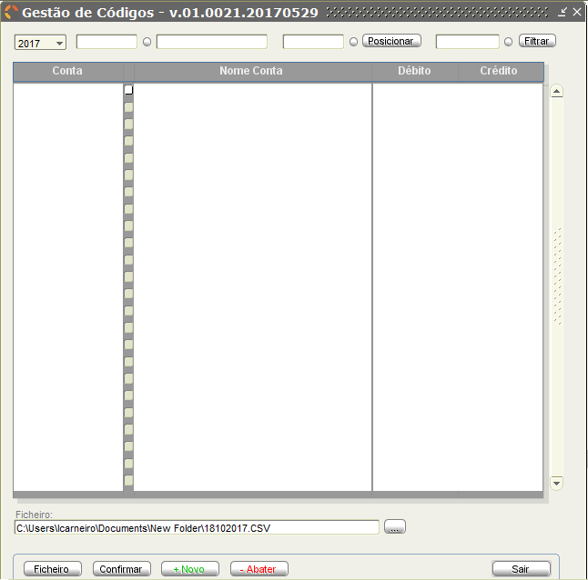

# Parametrização

Este menu permite efetuar a parametrização de informação necessária ao correto funcionamento da aplicação.

Acedendo ao mesmo temos as seguintes opções disponíveis:

| Opção | Descrição | Utilizadores |
|:---|:---|:---:|
|  | Manipular a informação relacionada com a instituição, com os exercícios e configurações de sistema. | Todos |
|  | Atualizar as informações genéricas do sistema, nomeadamente a informação relativa a códigos postais, bancos, fatores de aglutinação, tipo de entidade, instituições bancárias, responsáveis e ROC. | Todos |
|  | Atualizar as informações relacionadas com contabilidade, nomeadamente o plano de contas, a contabilidade pública, tipos de diário, centros de custo, CRI/departamentos e associações LCPA. | Todos |
|  | Atualizar as informações relacionadas com terceiros, nomeadamente a gestão de entidades, tabela de projetos e gestão de entidades *factoring*. | Todos |
| | Terminar sessão de utilização. | Todos |
|  | Sair da aplicação. | Todos |

 A maioria dos sub-menus disponiliza formulários de recolha de dados, "Recolhas", e a listagem dos dados já guardados em cada sub-menu, "Listagens".

**Recolhas**

Os formulários "Recolhas" são detalhadamente descritos ao longo deste capítulo para cada sub-menu.

 **Listagens**

A janela correspondente às "Listagens" segue a mesma lógica de processo, para cada sub-menu, indicada seguidamente. Os casos excepcionais são descritos detalhadamente no respectivo sub-menu.
Para efeitos de exemplo na imagem que se segue está indicada a janela de "Listagens" referente ao sub-menu Tabelas Genéricas >  Códigos Postais.

Este ecrã permite ao utilizador extrair a listagem de Códigos Postais, para ficheiro de texto com o formato CSV e imprimir o ficheiro em formato PDF.

| Campo | Descrição |
|:---|:---|
| Primeiro Cód. Postal | Código do primeiro código postal a extrair. Apenas é extraída informação cujo código postal seja igual ou superior ao indicado neste campo. |
| Último Cód. Postal | Código do último código postal a extrair. Apenas é extraída informação cujo código postal seja igual ou superior ao indicado no campo superior e menor ou igual ao indicado neste campo. |
| Ficheiro | Este campo indica a localização onde o ficheiro será gravado. |

| Botão | Ação |
|:---|:---|
| | Escolher a localização onde pretende guardar a informação a extrair, seja dentro da máquina local ou de uma pasta de rede. O nome do ficheiro é composta pela sigla “LIST\_CODPOST_” mais a data de extração, no formato DDMMAAAA ( D – Dia; M – Mês; A – Ano ). |
|  | Extrair a informação pretendida para um ficheiro de texto com o formato CSV. |
|  | Imprimir uma listagem de códigos postais com base nos critérios definidos.|
| | Sair do ecrã. |

 Existem ecrãs de "Listagens" que possibilitam a pesquisa do primeiro e último registo a listar através do botão posicionado entre dois campos.
A título de exemplo está apresentado na imagem abaixo o processo de listagem de contas no sub-menu Contabilidade > Plano multidimensional > Plano de Contas-SNC-AP.

- Aspeto da exportação para "Ficheiro" (CSV):

- Aspeto da Impressão (PDF):

## 1 Instituição
Este submenu permite o acesso ao tratamento de informação relacionada com a instituição, exercícios e configurações.

### 1.1. Recolha

Menu de acesso:

Esta opção permite ao utilizador manipular as informações relacionadas com a instituição. Por exemplo, Ministério da Saúde.

No ecrã o utilizador pode introduzir ou alterar toda a informação relacionada com uma
instituição, nomeadamente:

| Campo | Descrição |
|:---|:---|
| Ministério/Região Autónoma | Identificação do ministério ou região autónoma a que pertence a instituição. |
| Serviço Central | Identificação do serviço central a que pertence a instituição. |
| Sigla | Sigla da instituição. Ex: ACSS. |
| Nome da Instituição | Nome da instituição. |
| Morada | Morada da instituição. |
| Localidade | Localidade a que pertence a instituição. |
| Código Postal | Código postal associado à instituição. A lista de códigos postais é acessível através do botão redondo que se encontra entre os campos.  |
| NIF | Número de identificação fiscal da instituição. |
| CAE | Classificação portuguesa das atividades económicas a que pertence a Instituição. |
| Capital | Capital da instituição. |
| Matrícula | Matrícula da instituição. |
| De | Data de início da validade da matrícula. |
| Em | Data de fim da validade da matrícula. |
| Rep. Finanças | Repartição de finanças em que a instituição está registada. |
| Atividade | Atividade exercida pela instituição. |
| NIF RL | |
| NIF TOC | Número de identificação fiscal do técnico oficial de contas. |
| SIEF (Código da Instituição) | Código da instituição no Sistema Integrado de Informações Económico Fiscais. |
| DGO (Classificação Funcional) | Classificação funcional da instituição na Direção Geral do Orçamento. |
| Exercício | Exercício a que dizem respeito as informação da instituição. |
| Fecho do Mês | Data de fecho do mês. |
| Entidade Jurídica | Identificação da entidade jurídica, que pode ser Entidade Pública Empresarial (EPE) ou Sector Público Administrativo (SPA/EPR). |

| Botão | Ação |
|:---|:---|
|  | Bloquear os dados do ecrã, impedindo que os mesmos sejam alterados até confirmar ou cancelar os mesmos ou desbloquear os dados, que entretanto assumiu o nome <Desbloquear Alterações>. |

### 1.2. Exercícios
Menu de acesso:

Este ecrã permite ao utilizador introduzir novos períodos de exercício ou somente atualizar os actuais.

Os campos disponíveis para utilizador são os seguintes:

| Campo | Descrição |
|:---|:---|
| Exercícios | Esta lista permite ao utilizar visualizar a informação existente para cada um dos períodos definidos. O utilizador poderá ainda atualizar a informação constante do quadro direito e confirmar essas alterações através do botão . Para introduzir um novo exercício o utilizador deve carregar com o botão esquerdo no rato na primeira posição vazia, no final da lista Exercício (ver rectângulo laranja). Posteriormente deve preencher as informações do quadro direito (instruções de preenchimento, por baixo) e para finalizar carregar no botão , conforme mostra na image:  |
| Início | Data inicial do exercício. Este valor pode ser diferente de dia 01 de janeiro. |
|Fim | Data Final do exercício. Este valor pode ser diferente de dia 31 de dezembro. |
| Contab. Fechada a: | Data de fecho da contabilidade para o exercício. |
| Fundos Disponíveis Transitados | Fundos disponíveis para serem usados durante o exercício. |
|Contabilidade Orçamental   |Chave Orçamental do exercício aberto. A lista de códigos para cada campo estão disponível no botão redondo entre os campos.    |
| Mês de final de exercício | O utilizador deve selecionar os meses extras que devem ser tidos em conta no ano selecionado. |

| Botão | Ação |
|:---|:---|
|  |Ao carregar neste botão o utilizador vai ter acesso aos documentos ainda por regularizar. (_Em atualização_)  |

### 1.3. Configurações

Menu de acesso:

Este ecrã permite ao utilizador atualizar as informações do SICC, em diferentes tabulações.

| Campo | Descrição |
|:---|:---|
| IP | Neste campo o utilizador deve definir o Protocolo de Internet de acesso ao SICC. Este campo é de preenchimento **obrigatório**. |
| Porta | Neste campo o utilizador deve definir a porta para acesso ao SICC. Este campo é de preenchimento **obrigatório**. |
| Email | Neste campo o utilizador deve definir o email do responsável pelo SICC, na instituição. Este campo é de preenchimento **obrigatório**. |
|Email bcc |  Endereço de email para enviar cópia oculta |
| Contabilidade Orçamental | Nestes campos o utilizador deve identificar qual o método classificador da Contabilidade Orçamental. Deverá escolher entre: i) Método - Classificador Económico  ii) Método – Contas Patrimoniais. |

<!-- | Sistema  |  Identificador numérico do sistema de informação. |
| Entidade Cobrança  | Identificador da entidade detentora da conta bancária para a qual será feito pagamento multibanco. |
| Prefixo   | Identificador numérico, com tamanho variável de 1 a 9, que será incluído no início das referências multibanco geradas. Exemplo: se o prefixo for "999", todas as referências geradas terão a seguinte composição 999 xxx xxx. O total de referências que será possível gerar, depende do tamanho do prefixo definido. Por exemplo, se o prefixo tiver um tamanho de 8 algarismos, apenas poderão ser geradas 9 referências. | -->

## 2. Tabelas Genéricas

Este submenu permite o acesso ao tratamento de informação genérica do sistema, tais como Códigos Postais, Bancos, Fatores de Aglutinação, Tipos de Entidades, Instituições Bancárias, Responsáveis e R.O.C.

### 2.1. Códigos Postais

##### Recolhas
Este ecrã permite ao utilizador manipular as informações relacionadas com os Códigos Postais.

| Campo | Descrição |
|:---|:---|
| Listagem de Códigos Postais | A listagem de códigos, números e localidades apresentada no ecrã, permite a manipulação da mesma. |
| (Pesquisa) Código Postal | Este campo permite ao utilizador efetuar uma pesquisa de código postal através da introdução de um código numérico de quatro dígitos. Deve o utilizador após introduzir, pelo menos esta informação e carregar no botão Filtrar, para ter acesso à informação pretendida na listagem de códigos postais. Este campo pode ser utilizado em simultâneo com os restantes. |
| (Pesquisa) Número Postal | Este campo permite ao utilizador efetuar uma pesquisa de código postal através da introdução de um código numérico de três dígitos. Deve o utilizador após introduzir, pelo menos esta informação e carregar no botão Filtrar, para ter acesso à informação pretendida na listagem de códigos postais. Este campo pode ser utilizado em simultâneo com os restantes. |
| (Pesquisa) Localidade | Este campo permite ao utilizador efetuar uma pesquisa de código postal através da introdução da localidade. Deve o utilizador após introduzir, pelo menos esta informação e carregar no botão Filtrar, para ter acesso à informação pretendida na listagem de códigos postais. Este campo pode ser utilizado em simultâneo com os restantes. **NOTA**: **A informação introduzida neste campo deve estar em letras maiúsculas.** |

### 2.2. Bancos

##### Recolhas

Este ecrã permite ao utilizador manipular as informações relacionadas com os bancos.

| Campo | Descrição |
|:---|:---|
| Código | Código sequencial atribuído aos bancos no registo da mesma no sistema. |
| Nome | Nome ou designação do banco. |
| Morada | Morada do banco. |
| Localidade | Localidade do banco. |
| Código Postal | Código postal do banco. A parte do código postal (XXXX) deve ser introduzido no primeiro campo e a parte do número postal, no segundo campo. |
| NIB | Número de Identificação Bancária do banco. |
| Contacto | Contacto definido pelo banco. |
| Critério de filtragem | Critério para filtragem da pesquisa.   |
| Critério de posicionamento | Critério a escolher para realçar um resultado da pesquisa.   |

### 2.3. Factores de Aglutinação
##### Recolhas
Este ecrã permite ao utilizador manipular as informações relacionadas com os Fatores de Aglutinação.

| Campo | Descrição |
|:---|:---|
| Critério de filtragem | Critério para filtragem da pesquisa.  |
| Critério de posicionamento | Critério a escolher para realçar um resultado da pesquisa.  |

 Para **inserir** novos Factores de aglutinação deve o utilizador seguir o processo:

1. Clicar em "+ Novo";
2. Na nova linha aberta, inserir o código e a designação do factor pretendido;
3. Clicar em "Confirmar".

### 2.4. Tipos de Entidade

##### Recolhas

Este ecrã permite ao utilizador manipular as informações relacionadas com os Tipos de
Entidades.

| Campo | Descrição |
|:---|:---|
| Critério de filtragem | Critério para filtragem da pesquisa.  |
| Critério de posicionamento | Critério a escolher para realçar um resultado da pesquisa.   |

 Para **inserir** novos Tipos de Entidade deve o utilizador seguir o processo:

1. Clicar em "+ Novo";
2. Na nova linha aberta, inserir o código e a designação do tipo pretendido;
3. Clicar em "Confirmar".

### 2.5. Instituições Bancárias

##### Recolhas

Este ecrã permite ao utilizador manipular as informações relacionadas com as Instituições Bancárias.

| Campo | Descrição |
|:---|:---|
| Número | Código sequencial atribuído à entidade bancária no registo da mesma no sistema. |
| Conta Contabilidade Geral | Conta do Plano Oficial de Contas a que está associada a Instituição Bancária. |
| Nome | Nome ou designação da Instituição Bancária. |
| Morada | Morada da Instituição Bancária. |
| Localidade | Localidade da Instituição Bancária. |
| Código Postal | Código Postal da Instituição Bancária. A parte do código postal (XXXX) deve ser introduzido no primeiro campo e a parte do número postal, no segundo campo. |
| IBAN | Número Internacional de Conta Bancária da Instituição Bancária. |
| BIC/SWIFT |Código Internacional Bancário da instituição bancária. |
| Telefone | Telefone de contacto da Instituição Bancária. |
| Fax | Fax de contacto da Instituição Bancária. |
| Contacto | Pessoa de contacto definido pela Instituição Bancária. |
| Email | Email de contacto da Instituição Bancária. |
|Identificador IGCP   | Instituto de Gestão de Tesouraria e do Crédito Público  |
|Num. de sequência prox.:   | Número com o qual será lançado o ficheiro da transferência bancária  |
|Departamento   | Departamento da entidade associado à instituição bancária  |

 Neste formulário de configuração, entidades que tenham acesso a 2 Departamentos, o utilizador define o Identificador do IGCP, o Num. de Sequência e o Departamento a que diz respeito. Todas as restantes informações já existiam, pelo que o procedimento de preenchimento continua a ser o mesmo utilizado até à data.

### 2.6. Responsáveis

Este ecrã permite ao utilizador manipular as informações relacionadas com os Responsáveis.

| Campo | Descrição |
|:---|:---|
| Número | Código sequencial atribuído responsável no registo do mesmo no sistema.
| Período de Gerência de: | Período em que a pessoa está responsável pela aplicação. Deve ser introduzida a data de inicio e a data de fim. |
| Vencimento | Vencimento do responsável. |
| Morada | Morada do responsável. |
| Localidade | Localidade do responsável. |
| Código Postal | Código Postal do responsável. A parte do código postal (XXXX) deve ser introduzido no primeiro campo e a parte do número postal, no segundo campo. Para obter a listagem de códigos postal, o utilizador deve carregar no círculo à direita do campo. |
| Telefone | Telefone de contacto do responsável. |
| Nº de Contribuinte | Número de Identificação Fiscal do responsável. |
| Cargo | Cargo desempenhado pelo responsável. |

| Botão | Ação |
|:---|:---|
|  | Bloquear o registo atual contra alterações ou desbloquear o registo atual, permitindo assim a sua alteração. |

### 2.7. R.O.C.- Revisor Oficial de Contas

Este ecrã permite ao utilizador manipular as informações relativas aos diferentes Revisores Oficiais de Contas.

| Campo | Descrição |
|:---|:---|
| Número | Código sequencial atribuído ao revisor oficial de contas no registo do mesmo no sistema. |
| Nome | Nome do revisor oficial de contas. |
| Morada | Morada do revisor oficial de contas. |
| Localidade | Localidade do revisor oficial de contas. |
| Código Postal | Código Postal de residência do revisor oficial de contas. A parte do código postal (XXXX) deve ser introduzido no primeiro campo e a parte do número postal, no segundo campo. Para obter a listagem de códigos postal, o utilizador deve carregar no círculo  à direita do campo. |
| Nº de Contribuinte | Número de identificação fiscal do revisor oficial de contas. |
| NIB | Número de identificação bancária do revisor oficial de contas. |
| Telefone nº 1 | Primeiro número de telefone de contacto do revisor oficial de contas. |
| Telefone nº 2 | Segundo número de telefone de contacto do revisor oficial de contas. |
| Fax | Fax de contacto do revisor oficial de contas. |
| Email | Email de contacto do revisor oficial de contas. |

| Botão | Ação |
|:---|:---|
|  | Bloquear o registo atual contra alterações ou desbloquear o registo atual, permitindo assim a sua alteração. |

## 3. Contabilidade

Este submenu permite o acesso à parametrização de informação contabilística do sistema.

### 3.1. Plano Multidimensional

Neste menu estão contempladas as funcionalidades necessárias para parametrização do Plano Multidimensional.

#### 3.1.1. Plano de Contas SNC-AP

##### Recolha

Formulário de parametrização:

| Campo | Descrição |
|:---|:---|
| Exercício | Listagem de exercícios disponíveis conforme o Plano de Contas. Neste campo o utilizador pode escolher o exercício e apenas verá as informações das contas registadas para esse ano. Caso o utilizador pretenda inserir uma nova conta, deve indicar neste campo a qual a exercício que pertence.  |
| Critério de filtragem | Critério para filtragem da pesquisa. Permite ao utilizador, mediante os critérios de pesquisa disponíveis, efetuar consultas aos dados (contas). Os critérios disponíveis são os indicados na imagem.  O utilizador também pode optar por filtrar os dados apenas por tipo e acumulação ou movimento.  |
| Critério de posicionamento |  Critério a escolher para realçar um resultado da pesquisa. O utilizador pode escolher uma conta e após carregar no botão, o registo atual passa a ser aquele que o utilizador identificou.  |
| Tipo | A informação contida neste campo, indica se a conta selecionada é uma conta do tipo Acumulação ou do tipo Movimento.  |
| Código | Esta informação, está dividida em dois campos. O primeiro indica o número da conta, conforme aparece na listagem. E o segundo, apresenta o descritivo dessa mesma conta. |
| Conta Acumulação | Esta informação, está dividida em dois campos. O primeiro indica o número da conta de acumulação a que pertence a conta selecionada, conforme aparece na listagem. E o segundo, apresenta o descritivo dessa mesma conta. |
| Valores de Balanço N-1 (Débito) | Valores a débito do balanço do ano anterior. |
| Valores de Balanço N-1 (Crédito) | Valores a crédito do balanço do ano anterior. |
| Valores Resultados N-1 (Débito) | Valores a débito do resultado do ano anterior. |
| Valores Resultados N-1 (Crédito) | Valores a crédito do resultado do ano anterior. |
| Rubrica Financeira | Informação relativa à rubrica financeira. No caso da inserção de uma nova conta, o utilizador tem acesso a uma listagem de rubricas financeiras, carregando no círculo  à direita do campo de código. A descrição da rubrica financeira será colocada automaticamente pelo sistema. |
| Rubrica Financeira Ano Anterior | Informação relativa à rubrica financeira do ano anterior. No caso da inserção de uma nova conta, o utilizador tem acesso a uma listagem de rubricas financeiras, carregando no círculo  à direita do campo de código. A descrição da rubrica financeira será colocada automaticamente pelo sistema. |
| Conta Analítica | Informação relativa à conta analítica. No caso da inserção de uma nova conta, o utilizador tem acesso a uma listagem de contas analíticas, carregando no círculo  à direita do campo de código. A descrição da conta analítica será colocada automaticamente pelo sistema. |
| Receita / Despesa | Informação relativa à conta analítica, indicando se é uma conta de despesa ou de receita. Na inserção de uma nova conta, o utilizador deve marcar a opção correta.  |
| Classificador económico | Informação relativa ao classificador económico. No caso da inserção de uma nova conta, o utilizador tem acesso a uma listagem de classificadores económicos, carregando no círculo  à direita do campo de código. A descrição do classificador económico será colocada automaticamente pelo sistema. |

##### Desdobramento de Contas
Quando o utilizador pretende desdobrar uma conta deve ele seguir o seguinte processo:

1. Deve o utilizador selecionar a conta que pretende desdobrar;
2. Indicar que a conta selecionada passa a ser de acumulação;
3. Selecionar o botão "+Novo";
4. Atribuir o número à conta;
5. Indicar a sua designação, a Conta de Financiamento e o Classificador Económico;
6. Por fim, deve selecionar o botão "Confirmar".

**O exemplo seguinte é meramente ilustrativo.**

> Não é permitido ao utilizador criar contas novas, apenas é permitido o desdobramento de contas já contempladas no Plano de Contas carregado no sistema. Para o efeito, devem ser desdobradas, apenas as contas do tipo de **movimento** do plano de contas Oficial.

#### 3.1.2. Classificadores económicos

Menu de acesso:

##### Recolha

Este ecrã permite ao utilizador manipular as informações relacionadas com Classificadores económicos.

- Formulário de parametrização:

<!---->
<!--  -->

| Campo | Descrição |
|:---|:---|
| Exercício | Listagem de exercícios disponíveis conforme o Plano de Contas. Neste campo o utilizador pode escolher o exercício e apenas verá as informações das contas registadas para esse ano. Caso o utilizador pretenda inserir uma nova conta, deve indicar neste campo a qual a exercício que pertence.  |
| Critério de posicionamento |  Critério a escolher para realçar um resultado da pesquisa. O utilizador pode escolher uma conta e após carregar no botão, o registo atual passa a ser aquele que o utilizador identificou. |
| Critério de filtragem | Critério para filtragem da pesquisa. Permite ao utilizador, mediante os critérios de pesquisa disponíveis, efetuar consultas aos dados (contas). Os critérios disponíveis são os indicados na imagem. |
| Código | Esta informação, está dividida em dois campos. O primeiro indica o número da conta, conforme aparece na listagem. E o segundo, apresenta o descritivo dessa mesma conta. |
| Tipo de Movimento | Indicação do tipo de movimento: despesa ou receita.) |
| Tipo de Conta | Indicação do tipo de conta.  |
| Conta Acumulação | Esta informação, está dividida em dois campos. O primeiro indica o número da conta de acumulação a que pertence a conta selecionada, conforme aparece na listagem. E o segundo, apresenta o descritivo dessa mesma conta. |
|Conta Multi.   |Esta informação está dividida em dois campos.  O primeiro indica o número de conta e o segundo a sua descrição. O acesso à listagem de contas Multi. é feito através do botão que está entre os dois campos.   |

#### 3.1.3. Chave Orçamental

Componentes parametrizáveis da chave orçamental:

- Fonte Financiamento;
- Grupos de Fonte Financiamentos;
- Programa;
- Medida;
- Projeto;
- Regionalização;
- Atividade;
- Natureza;
- Class. Orgânica.

Menu de acesso:

Cada componente da chave orçamental é gerida através do seguinte tipo de formulário:

| Campo | Descrição |
|:---|:---|
| Exercício | Ano do exercício. Para pesquisar é necessário selecionar a tecla *Enter* ou *Tab*. Caso o utilizador pretenda inserir uma nova componente, deve indicar neste campo o exercício a que pertence. |
| _Nome da componente da chave orçamental_ | Este campo indica o código da componente. |
| Nome | Este campo apresenta a descrição da componente para o código indicado. |

 No caso específico da componente da chave orçamental **Fonte de Financiamento** a parametrização desta componente engloba também o Grupo da Fonte de Financiamento.

O acesso à lista dos grupos de financiamento é feito através do botão redondo.

- Parametrização dos Grupos das Fontes de Financiamento

A parametrização dos grupos das Fontes de Financiamento é feita da mesma forma que as restantes componentes da Chave Orçamental:

#### 3.1.4. Rúbricas Orçamentais
Para aceder ao ecrã das parametrizações das Rubricas Orçamentais o utilizador deve seguir o seguinte caminho:

No ecrã que é aberto, o utilizador pode consultar, desdobrar e abater rubricas.

O processo de desdobramento de uma rubrica orçamental segue a mesma lógica que o processo de desdobramento de contas no Plano de Contas descrito em 1.3.1.1.

### 3.2. Gestão de Tabelas

Neste menu estão contempladas as funcionalidades necessárias para parametrização das várias Tabelas do Sistema.

#### 3.2.1. Tipo de Diário

##### Recolhas
Este ecrã permite ao utilizador manipular as informações relacionadas com Tipo de Diário.

| Campo | Descrição |
|:---|:---|
| Critério de posicionamento | Critério a escolher para realçar um resultado da pesquisa.. O utilizador pode escolher uma código e após carregar no botão, o registo atual passa a ser aquele que o utilizador identificou.  |
| Designação | Este campo apresenta a designação do código de diário apresentado. |
| Ano | Este campo indica a que exercício pretende o tipo de diário. |
| Último Número | Este campo indica o último número do tipo de diário. |

#### 3.2.2. Centros de Custo
##### Recolhas
Este ecrã permite ao utilizador manipular as informações relacionadas com Centros de Custos.

| Campo | Descrição |
|:---|:---|
| Critério de filtragem | Critério para filtragem da pesquisa. Permite ao utilizador, mediante os critérios de pesquisa disponíveis, efetuar consultas aos dados (centros de custos). Os critérios disponíveis são os indicados na imagem. |
| Critério de posicionamento |  Critério a escolher para realçar um resultado da pesquisa. O utilizador pode escolher um centro de custos e após carregar no botão, o registo atual passa a ser aquele que o utilizador identificou. |
| Ano | Este campo indica a que exercício pretende o centro de custos. |
| Designação | Este campo apresenta a designação do código de centro de custos apresentado. |
| Tipo | Este campo indica o tipo de centro de custo. |
| Centro Custo Acumulação | Código do centro de custos de acumulação. |
| Código CRI \ Departamento | Descrição do centro de custos de acumulação. |
| Unidade Obra | Unidade de obra. |
| Quantidade | Quantidade. |
| Unidade Obra nº 2 | Unidade de obra. |
| Quantidade nº 2 | Quantidade. |

#### 3.2.3. CRI/Departamentos
##### Recolhas
Este ecrã permite ao utilizador manipular as informações relacionadas com Centro de Responsabilidade Integrado (CRI).

| Campo | Descrição |
|:---|:---|
| Critério de posicionamento | Critério a escolher para realçar um resultado da pesquisa. O utilizador pode escolher um centro de responsabilidade integrado e após carregar no botão, o registo atual passa a ser aquele que o utilizador identificou. |
| Ano | Este campo indica a que exercício pretende o centro de responsabilidade integrado. |
| Descrição | Este campo apresenta a designação do código do centro de responsabilidade integrado apresentado. |
| Unidade Obra | Unidade de obra. |
| Quantidade | Quantidade. |
| Unidade Obra nº 2 | Unidade de obra. |
| Quantidade nº 2 | Quantidade. |

#### 3.2.4. Gestão Departamento
##### Actividades Departamentos

| Campo | Descrição |
|:---|:---|
| Exercício | Ano do exercício. Para pesquisar é necessário selecionar a tecla *Enter* ou *Tab*. Caso o utilizador pretenda inserir uma nova componente, deve indicar neste campo o exercício a que pertence. |
|  Critério de posicionamento |  Critério a escolher para realçar um resultado da pesquisa. O utilizador pode escolher um centro de custos e após carregar no botão, o registo atual passa a ser aquele que o utilizador identificou. |
|  Critério de filtragem | Critério para filtragem da pesquisa. Permite ao utilizador, mediante os critérios de pesquisa disponíveis, efetuar consultas aos dados (centros de custos). Os critérios disponíveis são os indicados na imagem. |
| Departamento  | Representa o número correspondente ao departamento.  |
| Nome | Este campo apresenta a descrição do departamento para o código indicado. |

##### Saldos Iniciais
_Em atualização_
<!--  -->

## 4. Terceiros

### 4.1. Gestão de Entidades

##### Recolhas
Este ecrã permite ao utilizador manipular as informações relacionadas com a Gestão de Entidades.

| Campo | Descrição |
|:---|:---|
| Número | Este campo identifica o número da entidade. Caso a entidade introduzida já exista, todos os campos são preenchidos com os dados anteriormente introduzidos, podendo o utilizador alterar a informação pretendida. Caso a entidade ainda não exista, é perguntado ao utilizador se pretende inserir uma nova (Esta entidade não existe, quer inserir uma nova?). Se o utilizador disser que Sim, todos os campos são limpos à exceção do campo Número. Caso contrário são todos os campos limpos, incluindo o campo Número. |
| Intragrupo | Este campo indica se a entidade é intragrupo ou não. Caso seja, é apresentado um campo com o descritivo do intragrupo. |
| Entidade Parceira | Este campo indica se a entidade é uma entidade parceira ou não. Caso seja, é apresentado um campo com o descritivo da entidade parceira. |
| Tipo de Entidade | Identificação do tipo de entidade. Na inserção ou alteração de um registo, o utilizador carregando no círculo  entre o campo de código e descritivo pode obter uma listagem de todos os tipos de entidades disponíveis. |
| Fator de Aglutinação | Identificação do fator de aglutinação. Na inserção ou alteração de um registo, o utilizador carregando no círculo  entre o campo de código e descritivo pode obter uma listagem de todos os fator de aglutinação disponíveis. |
| Nome | Nome ou descrição da entidade. |
| Morada | Morada da entidade. |
| Localidade | Localidade da entidade. |
| País | País da entidade. Na inserção ou alteração de um registo, o utilizador carregando no círculo  entre o campo de código e descritivo pode obter uma listagem de todos os países disponíveis. **O preenchimento deste campo é obrigatório para que o sistema faça a validação do NIF.** |
| Código Postal | Código postal da entidade. |
| Telefone | Número de telefone da entidade. |
| Fax | Número de fax da entidade. |
| Contacto | Responsável de relações públicas da entidade. |
| Email | Endereço de correio eletrónico da entidade. |
| Nº de Contribuinte | Número de identificação fiscal da entidade. |
| Situação Contributiva | As explicações desta opção encontram-se no final das tabelas relacionadas com este ecrã. |
| Número - Entidade | Identificação da conta bancária associada à entidade.     **Tipo:**NIB - Número de Identificação Bancária; IBAN - Número Internacional de Conta Bancária.    **Número:** Número de conta bancária, no formato indicado pelo Tipo    **Swift:** Número de BIC (Bank Identifier Code), código que permite identificar bancos internacionais.   **Banco:** Designação da instituição bancária assignada à conta introduzida. Este campo é de preenchimento automático pelo sistema. |
| Número - *Factoring*   | Identificação da conta Factoring.    **Número:** Identificação da conta bancário responsável pelo *factoring*. Na inserção ou alteração de um registo, o utilizador carregando no círculo  entre o campo de código e descritivo pode obter uma listagem de ajuda, com os dados já existentes no sistema.    **Nome Entidade:** Identificação da instituição bancária escolhida no campo anterior. Este campo é de preenchimento automático pelo sistema. |
| Observações | Campo de observações onde estão ou devem ser colocadas todas as informações pretendidas pelo utilizador. |

##### Alteração dos dados
Para efetuar alterações nos dados de uma entidade já criada, deve o utilizador seguir os seguintes passos:
 (Para efeitos de exemplo é considerado que se pretende passar a conta _factoring_ para uma conta bancária normal.)

1. No campo referente ao "Número" inserir o número associado à entidade cujos dados se pretendem alterar.
2. Selecionar os dados do campo referente, neste exemplo, ao número da conta _factoring_.
3. Limpar o campo selecionado e para validar a eliminação de dados pressionar a tecla _TAB_.
4. Selecionar o tipo de Número da Conta Bancária (NIB ou IBAN).
5. Inserir o respectivo número de conta e pressionar a tecla _TAB_ para que o nome do banco fique automaticamente preenchido.
6. Pressionar o botão "Confirmar" para confirmar os dados alterados.

##### Situação Contributiva

Ao carregar no botão Situação Contributiva, é aberto o seguinte ecrã:

| Campo | Descrição |
|:---|:---|
| Critério de filtragem | Critério para filtragem da pesquisa. Permite ao utilizador, mediante os critérios de pesquisa disponíveis, efetuar consultas aos dados.|
| Critério de posicionamento | Critério a escolher para realçar um resultado da pesquisa. O utilizador pode escolher um NIF e após carregar no botão, o registo atual passa a ser aquele que o utilizador identificou. |
| Nº de Contribuinte | Número de identificação fiscal da entidade. |
| NISS | Número de Identificação de Segurança Social. |
| Dívida | Valor em dívida à Segurança Social. |
| Data de Contribuição | Data da contribuição para a Segurança Social. Caso o utilizador pretenda indicar informação neste campo, deve primeiro marcar a caixa da Data de Contribuição. |
| Data da Declaração | Data de entrada da declaração. Caso o utilizador pretenda indicar informação neste campo, deve primeiro marcar a caixa da Data de Contribuição. |
| Data da Validade | Data de validade da declaração. Caso o utilizador pretenda indicar informação neste campo, deve primeiro marcar a caixa da Data de Contribuição. |
| Data do Consentimento | Data de consentimento da declaração. Caso o utilizador pretenda indicar informação neste campo, deve primeiro marcar a caixa da Data de Contribuição. |
| Data da Revogação | Data de revogação da declaração. Caso o utilizador pretenda indicar informação neste campo, deve primeiro marcar a caixa da Data de Contribuição. |
| Data da Consulta | Data de consulta da declaração. Caso o utilizador pretenda indicar informação neste campo, deve primeiro marcar a caixa da Data de Contribuição. |
| Data de Validade | Data de validade da declaração. Caso o utilizador pretenda indicar informação neste campo, deve primeiro marcar a caixa da Data de Contribuição. |
| Data de Declaração Tributária | Data de entrada da declaração tributária à segurança social. |
| Data da Declaração | Data de entrada da declaração. Caso o utilizador pretenda indicar informação neste campo, deve primeiro marcar a caixa da Data de Declaração tributária. |
| Data da Validade | Data de validade da declaração. Caso o utilizador pretenda indicar informação neste campo, deve primeiro marcar a caixa da Data de Declaração tributária. |
| Data do Consentimento | Data de consentimento da declaração. Caso o utilizador pretenda indicar informação neste campo, deve primeiro marcar a caixa da Data de declaração tributária. |
| Data da Revogação | Data de revogação da declaração. Caso o utilizador pretenda indicar informação neste campo, deve primeiro marcar a caixa da Data de Declaração tributária. |
| Data da Consulta | Data de consulta da declaração. Caso o utilizador pretenda indicar informação neste campo, deve primeiro marcar a caixa da Data de Declaração tributária. |
| Date de Validade | Data de validade da declaração. Caso o utilizador pretenda indicar informação neste campo, deve primeiro marcar a caixa da Data de Declaração tributária. |
| Observações | Campo de observações onde estão ou devem ser colocadas todas as informações pretendidas pelo utilizador. |

| Botão | Ação |
|:---|:---|
|  | Criar listagens de NIFs (Número de Identificação Fiscal), na totalidade ou em parte, conforme os dados introduzidos nos critérios disponíveis. Os critérios de filtragem definidos são:  - Primeiro NIF;  - Último NIF.  A extração dos dados pode ser efetuada de duas formas distintas: - Ficheiro : Neste caso o utilizador deve indicar a pasta onde o ficheiro deve ser guardado, sendo que o nome possui sempre o nome “LIST\_SITCONTRIB_” + DATA (no formato, DDMMAAAA).  Imprime: Neste caso, a impressão é feita em documento com o formato PDF. |

### 4.2. Tabela de Projectos
##### Recolhas
Este ecrã permite ao utilizador manipular as informações relacionadas com a Tabela de Projectos.

| Campo | Descrição |
|:---|:---|
| Critério de posicionamento | Critério a escolher para realçar um resultado da pesquisa. O utilizador pode escolher um código de projeto e após carregar no botão, o registo atual passa a ser aquele que o utilizador identificou. |
| Nome | Nome do projeto. Este campo é preenchido de forma automática sempre que é escolhido um código na listagem de códigos de projeto. No caso da inserção de um projeto novo ou alteração de um existente este campo passa a editável. |
| Valor | Valor do projeto. Este campo é preenchido de forma automática sempre que é escolhido um código na listagem de códigos de projeto. No caso da inserção de um projeto novo ou alteração de um existente este campo passa a editável. |

### 4.3. Gestão de Entidades _Factoring_
##### Recolhas
Este ecrã permite ao utilizador manipular as informações relacionadas com a Gestão de Entidades *Factoring*.

| Campo | Descrição |
|:---|:---|
| Número | Este campo identifica o número da entidade. Caso a entidade introduzida já exista, todos os campos são preenchidos com os dados anteriormente introduzidos, podendo o utilizador alterar a informação pretendida. Caso a entidade ainda não exista, é perguntado ao utilizador se pretende inserir uma nova (Esta entidade não existe, quer inserir uma nova?). Se o utilizador disser que Sim, todos os campos são limpos à exceção do campo Número. Caso contrário são todos os campos limpos, incluindo o campo Número. |
| Nome | Nome ou descrição da entidade. |
| Morada | Morada da entidade. |
| Localidade | Localidade da entidade. |
| País | País da entidade. Na inserção ou alteração de um registo, o utilizador carregando no círculo  entre o campo de código e descritivo pode obter uma listagem de todos os países disponíveis. |
| Código Postal | Código postal da entidade. |
| Telefone nº 1 | Número de telefone da entidade. |
| Fax | Número de fax da entidade. |
| Contacto | Responsável de relações publicas da entidade. |
| Email | Endereço de correio eletrónico da entidade. |
| Nº de Contribuinte | Número de identificação fiscal da entidade. |
| (Entidade *Factoring*) – Tipo | Tipo de número de conta bancária:- NIB : Numero de Identificação Bancária;- IBAN : Número Internacional de Conta Bancária. |
| (Entidade *Factoring*) – Numero | Número de conta bancária, no formato indicado no campo anterior. |
| (Entidade *Factoring*) – Swift | Número de BIC (*Bank Identifier Code*), código que permite identificar bancos internacionais. |
| (Entidade *Factoring*) – Nome | Identificação da instituição bancária escolhida no campo anterior. Este campo é de preenchimento automático pelo sistema. |
| Observações | Campo de observações onde estão ou devem ser colocadas todas as informações pretendidas pelo utilizador. |

### 4.4. Gestão de Produtos
##### Recolhas
_Em actualização_

## 5 POCMS -> SNC-AP
Para aceder ao menu que permite verificar e alterar a tabela de conversão do normativo POCMS para SNC-AP, deve seguir o caminho:

No ecrã que será aberto o utilizador pode consultar as contas relativas ao POCMS da entidade, disponibilizadas na janela do lado esquerdo, e as respetivas contas em SNC-AP, disponíveis na janela do lado direito.

O utilizador pode pesquizar a conta POCMS que pretende verificar. Para isso, deve introduzir o respetivo número da conta ou selecioná-la da lista disponível. Por fim deve clicar no botão "Posicionar".

Se a entidade tiver uma conta de movimento em POCMS que não tiver nenhuma conta associada em SNC-AP, o utilizador pode efetuar essa associação.

Para isso, deve selecionar a conta em POCMS e no campo "Conta:" de SNC-AP selecionar, através do botão redondo, a conta de movimento que pretende associar.

Por fim deve selecionar o botão "Confirmar".

Em caso de no plano de contas SNC-AP não existir uma conta movimento que se adeque à conta POCMS que o utilizador pretende converter, deve o utilizador proceder ao desdobramento de contas no plano de contas SNC-AP.

O processo de desdobramento de contas está descrito no manual SNC-AP no capítulo 1.3.1.1..

Abaixo segue um exemplo **ilustrativo** da situação referida acima.

No plano de contas POCMS verificou-se que a conta 2414 (de movimento) não tem nenhuma conta SNC-AP associada.

Com o auxílio do botão redondo consultou-se a lista das contas SNC-AP disponíveis no sistema e verificou-se que não existe uma conta adequada.

Por isso, na janela do plano de contas SNC-AP, foi criada a conta 2415 (de movimento) que acumula para a 241.
**NOTA: Este exemplo é meramente ilustrativo.**

É possível agora, na tabela de conversão, associar a conta POCMS, neste caso 2414 (Impostos liquidados), à conta SNC-AP criada (2415-Impostos liquidados). Para confirmar a associação, deve-se clicar em "Confirmar".

>**NOTA:** Quando é efetuado um desdobramento numa conta de movimento em SNC-AP esta passa para o tipo de acumulação. Se a conta já for associada a uma conta movimento em POCMS a associação fica inválida pois só se podem associar contas de movimento. deste modo, deve-se efetuar a alteração na associação.  

O utilizador também pode exportar a tabela de conversão para um ficheiro **CSV**. Para taldeve indicar a diretoria do seu computador onde pretende guardar o ficheiro e clicar em "Ficheiro".

O aspeto do ficheiro exportado será como apresentado seguidamente:

Neste ficheiro, no final da tabela, o utilizador pode verificar uma divisão da tabela.

Nesta zona serão apresentadas as contas POCMS não contempladas para a tabela de conversão.
