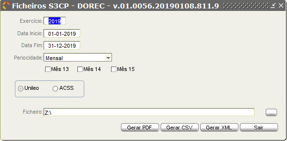
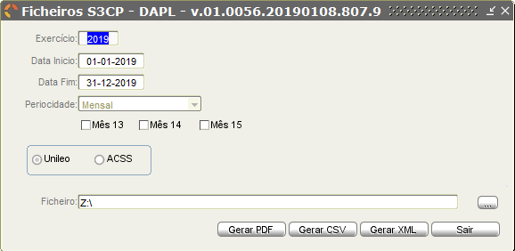
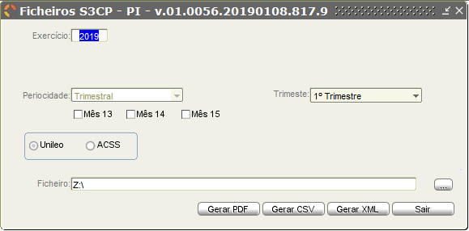

# Ficheiros S3CP (em atualização)

Este menu permite ao utilizador gerar os ficheiros a serem enviados para entidades como UniLeo, ACSS entre outras.

Os ficheiros que podem ser gerados são os seguintes:

## 1. AFT - Ativos Fixos Tangíveis

Nesta opção o utilizador define os parâmetros de pesquisa, para gerar o ficheiro correspondente ao AFT.

| Campo         | Descrição                                                                                                 |
|:--------------|:----------------------------------------------------------------------------------------------------------|
| Exercício     | Indicação do exercício do qual se pretende gerar o AFT                                                    |
| Periodicidade | Indicação da periodicidade do AFT. Neste mapa, a periodicidade é trimestral e não pode ser alterada.      |
| Trimestre     | Indicação do trimestre do AFT.  |

 O utilizador deve também indicar se o mapa gerado é para a UniLeo ou para ACSS. Esta indicação deve ser realizada através da seleção da respetiva _checkbox_ 

De seguida deve o utilizador gerar o ficheiro no formato pretendido: PDF, CSV ou XML. Para cada um destes ficheiros, o utilizador deve indicar o local no computador onde pretende guardar o ficheiro

A nomenclatura do ficheiro segue as regras estipuladas, no entanto não aparece visível para evitar alterações.

O aspeto dos ficheiros gerados é o seguinte (4º trimestre do ano 2018):

|PDF | CSV | XML |
|:--:|:--:|:--:|
|      |  |  |

## 2. AI - Ativos Intangíveis

Nesta opção o utilizador define os parâmetros de pesquisa, para gerar o ficheiro correspondente ao AI.

| Campo         | Descrição                                                                                                 |
|:--------------|:----------------------------------------------------------------------------------------------------------|
| Exercício     | Indicação do exercício do qual se pretende gerar o AI                                                     |
| Periodicidade | Indicação da periodicidade do AFT. Neste mapa, a periodicidade é trimestral e não pode ser alterada.      |
| Trimestre     | Indicação do trimestre do AFT.  |

 O utilizador deve também indicar se o mapa gerado é para a UniLeo ou para ACSS. Esta indicação deve ser realizada através da seleção da respetiva _checkbox_ 

De seguida deve o utilizador gerar o ficheiro no formato pretendido: PDF, CSV ou XML. Para cada um destes ficheiros, o utilizador deve indicar o local no computador onde pretende guardar o ficheiro.

A nomenclatura do ficheiro segue as regras estipuladas, no entanto não aparece visível para evitar alterações.

O aspeto dos ficheiros gerados é o seguinte (1º trimestre para o ano de 2018):

| PDF | CSV | XML |
|:---:|:---:|:---:|
|        |     |     |

## 3. BA - Balancete Analítico

Nesta opção o utilizador define os parâmetros de pesquisa, para gerar o ficheiro correspondente ao balancete analítico (BA).

|Campo| Descrição|
|:---|:---|
|Exercício |Indicação do exercício do qual se pretende gerar o BA.  |
|Data Início | Indicação da data a partir da qual se consideram os dados para o BA.    |
|Data Fim | Indicação da data até a qual, inclusive,  são considerados dados para o BA.   |
|Periodicidade | Indicação da periodicidade do documento.    |
|Data autorização | Caso a entidade tenha autorização do Tribunal de Contas para o diferimento da prestação de contas, deve ser indicada, neste campo a data quando esta autorização foi emitida.   |
|Data Limite Entrega Conta Gerência | Indicação da data limite, até a qual foi dado o diferimento para a prestação de contas pelo Tribunal de Contas.   |

**Caso a periodicidade for mensal, na data de inicio e de fim, deve ser indicado o primeiro e o último dia do mês. O mesmo se sucede se a periodicidade for semanal.**

 O utilizador deve também indicar se o mapa gerado é para a UniLeo ou para ACSS. Esta indicação deve ser realizada através da seleção da respetiva _checkbox_ 

De seguida deve o utilizador gerar o ficheiro no formato pretendido: PDF, CSV ou XML. Para cada um destes ficheiros, o utilizador deve indicar o local no computador onde pretende guardar o ficheiro

A nomenclatura do ficheiro segue as regras estipuladas, no entanto não aparece visível para evitar alterações.

O aspeto dos ficheiros gerados é o seguinte:

|PDF|CSV|XML|
|:--:|:--:|:--:|
|   |   |   |

## 4. BLC - Balanço

Nesta opção o utilizador define os parâmetros de pesquisa, para gerar o ficheiro correspondente ao balanço (BLC).

| Campo          | Descrição                                                                                                              |
|:---------------|:-----------------------------------------------------------------------------------------------------------------------|
| Exercício      | Indicação do exercício do qual se pretende gerar o BLC                                                                 |
| Primeira Conta | Indicação da primeira conta que será incluída no BLC. Serão incluídas contas iguais e superiores à conta indicada.     |
| Última Conta   | Indicação da última conta que será incluída no BLC. Serão incluídas contas iguais e inferiores à indicada neste campo. |
| Data Início    | Indicação da data a partir da qual se consideram os dados para o BLC.                                                  |
| Data Fim       | Indicação da data até a qual, inclusive,  são considerados dados para o BLC.                                           |

**Neste caso a periodicidade do documento é mensal, pelo que, na data de inicio e de fim, deve ser indicado o primeiro e o último dia do mês.**

 O utilizador deve também indicar se o mapa gerado é para a UniLeo ou para ACSS. Esta indicação deve ser realizada através da seleção da respetiva _checkbox_. 

De seguida deve o utilizador gerar o ficheiro no formato pretendido: PDF, CSV, XML ou pode gerar um extrato. Para cada um destes ficheiros, o utilizador deve indicar o local no computador onde pretende guardar o ficheiro

<!--  -->

A nomenclatura do ficheiro segue as regras estipuladas, no entanto não aparece visível para evitar alterações.

 O aspeto dos ficheiros gerados é o seguinte:

|PDF|CSV|XML|
|:--:|:--:|:--:|
| |  |   |

  O extrato permite a visualizar, por rubrica, as contas e os respetivos montantes. Neste documento, também vem indicado se houve um aumento ou uma diminuição do saldo Credor/Devedor.

## 5. CPLC - Correspondência Plano Contas

Nesta opção o utilizador define os parâmetros de pesquisa, para gerar o ficheiro correspondente ao CPLC.

| Campo          | Descrição                                                                                                               |
|:---------------|:------------------------------------------------------------------------------------------------------------------------|
| Exercício      | Indicação do exercício do qual se pretende gerar o CPLC.                                                                |
| Primeira Conta | Indicação da primeira conta que será incluída no CPLC. Serão incluídas contas iguais e superiores à conta indicada.     |
| Última Conta   | Indicação da última conta que será incluída no CPLC. Serão incluídas contas iguais e inferiores à indicada neste campo. |
| Data Início    | Indicação da data a partir da qual se consideram os dados para o CPLC.                                                  |
| Data Fim       | Indicação da data até a qual, inclusive,  são considerados dados para o CPLC.                                           |

**Neste caso a periodicidade do documento é mensal, pelo que, na data de inicio e de fim, deve ser indicado o primeiro e o último dia do mês.**

 O utilizador deve também indicar se o mapa gerado é para a Unileo ou para ACSS. Esta indicação deve ser realizada através da seleção da respetiva _checkbox_. 

De seguida deve o utilizador gerar o ficheiro no formato pretendido: CSV ou XML. Para cada um destes ficheiros, o utilizador deve indicar o local no computador onde pretende guardar o ficheiro

A nomenclatura do ficheiro segue as regras estipuladas, no entanto não aparece visível para evitar alterações.

 O aspeto dos ficheiros gerados é o seguinte:

|CSV|XML|
|:--:|:--:|
 | |   |

## 6. DAPL - Dem. Alt. Patr. Líquido

Nesta opção o utilizador define os parâmetros de pesquisa, para gerar o ficheiro correspondente ao DAPL.

| Campo          | Descrição                                                                                                               |
|:---------------|:------------------------------------------------------------------------------------------------------------------------|
| Exercício      | Indicação do exercício do qual se pretende gerar o DAPL                                                                 |
| Data Início    | Indicação da data a partir da qual se consideram os dados para o DAPL.                                                  |
| Data Fim       | Indicação da data até a qual, inclusive,  são considerados dados para o DAPL.                                           |
| Periodicidade  | Indicação da periodicidade do DAPL. Neste mapa, a periodicidade é mensal e não pode ser alterada.  |

**Como a periodicidade do documento é mensal, nos campos da data de inicio e de fim, deve ser indicado o primeiro e o último dia do mês.**

 O utilizador deve também indicar se o mapa gerado é para a UniLeo ou para ACSS. Esta indicação deve ser realizada através da seleção da respetiva _checkbox_ 

De seguida deve o utilizador gerar o ficheiro no formato pretendido: PDF, CSV ou XML. Para cada um destes ficheiros, o utilizador deve indicar o local no computador onde pretende guardar o ficheiro.

A nomenclatura do ficheiro segue as regras estipuladas, no entanto não aparece visível para evitar alterações.

O aspeto dos ficheiros gerados é o seguinte (mapas retirados para o mês de dezembro de 2018):

| PDF | CSV | XML |
|:---:|:---:|:---:|
|        |     |     |

## 7. DDORC - Demonstração de Desempenho Orçamental

Nesta opção o utilizador define os parâmetros de pesquisa, para gerar o ficheiro correspondente ao DDORC.

| Campo         | Descrição                                                                                                      |
|:--------------|:---------------------------------------------------------------------------------------------------------------|
| Exercício     | Indicação do exercício do qual se pretende gerar o DDORC                                                       |
| Data Início   | Indicação da data a partir da qual se consideram os dados para o DDORC.                                        |
| Data Fim      | Indicação da data até a qual, inclusive,  são considerados dados para o DDORC.                                 |
| Periodicidade | Indicação da periodicidade do mapa.  |

**Quando se seleciona a periodicidade mensal, a data de inicio e de fim, deve ser o primeiro e o último dia do mês, respetivamente. Caso a periodicidade seja semanal, as datas de início e fim devem corresponder à semana pretendida.**

 O utilizador deve também indicar se o mapa gerado é para a UniLeo ou para ACSS. Esta indicação deve ser realizada através da seleção da respetiva _checkbox_ 

De seguida deve o utilizador gerar o ficheiro no formato pretendido: PDF, CSV ou XML. Para cada um destes ficheiros, o utilizador deve indicar o local no computador onde pretende guardar o ficheiro.

A nomenclatura do ficheiro segue as regras estipuladas, no entanto não aparece visível para evitar alterações.

O aspeto dos ficheiros gerados é o seguinte (periodicidade mensal - janeiro - dezembro de 2018):

| PDF | CSV | XML |
|:---:|:---:|:---:|
|     |     |     |

## 8. DFC - Demonstração dos Fluxos de Caixa

Nesta opção o utilizador define os parâmetros de pesquisa, para gerar o ficheiro correspondente ao DFC.

| Campo         | Descrição                                                                                             |
|:--------------|:------------------------------------------------------------------------------------------------------|
| Exercício     | Indicação do exercício do qual se pretende gerar o DFC                                                |
| Data Início   | Indicação da data a partir da qual se consideram os dados para o DFC.                                 |
| Data Fim      | Indicação da data até a qual, inclusive,  são considerados dados para o DFC.                          |
| Periodicidade | Indicação da periodicidade do mapa DFC. Neste mapa, a periodicidade é mensal e não pode ser alterada. |

**Como a periodicidade do documento é mensal, nos campos da data de inicio e de fim, deve ser indicado o primeiro e o último dia do mês, respetivamente.**

 O utilizador deve também indicar se o mapa gerado é para a UniLeo ou para ACSS. Esta indicação deve ser realizada através da seleção da respetiva _checkbox_ 

De seguida deve o utilizador gerar o ficheiro no formato pretendido: Extrato, PDF, CSV ou XML. Para cada um destes ficheiros, o utilizador deve indicar o local no computador onde pretende guardar o ficheiro.

A nomenclatura do ficheiro segue as regras estipuladas, no entanto não aparece visível para evitar alterações.

O aspeto dos ficheiros gerados é o seguinte:

| Extrato | PDF | CSV | XML |
|:-------:|:---:|:---:|:---:|
|     |      |     |     |

## 9. DODES - Dem. Exec. Orçamental - Despesa

Nesta opção o utilizador define os parâmetros de pesquisa, para gerar o ficheiro correspondente ao DODES.

| Campo         | Descrição                                                                                                             |
|:--------------|:----------------------------------------------------------------------------------------------------------------------|
| Exercício     | Indicação do exercício do qual se pretende gerar o DODES                                                              |
| Data Início   | Indicação da data a partir da qual se consideram os dados para o DODES.                                                |
| Data Fim      | Indicação da data até a qual, inclusive,  são considerados dados para o DODES.                                         |
| Periodicidade | Indicação da periodicidade do mapa DODES.   |

**Como a periodicidade do documento é mensal, nos campos da data de inicio e de fim, deve ser indicado o primeiro e o último dia do mês, respetivamente.**

 O utilizador deve também indicar se o mapa gerado é para a UniLeo ou para ACSS. Esta indicação deve ser realizada através da seleção da respetiva _checkbox_ 

De seguida deve o utilizador gerar o ficheiro no formato pretendido: PDF, CSV ou XML. Para cada um destes ficheiros, o utilizador deve indicar o local no computador onde pretende guardar o ficheiro.

A nomenclatura do ficheiro segue as regras estipuladas, no entanto não aparece visível para evitar alterações.

O aspeto dos ficheiros gerados é o seguinte (periodicidade mensal - janeiro de 2018):

| PDF | CSV | XML |
|:---:|:---:|:---:|
|       |     |     |

## 10. DOREC - Dem. Exec. Orçamental - Receita

Nesta opção o utilizador define os parâmetros de pesquisa, para gerar o ficheiro correspondente ao DOREC.

| Campo         | Descrição                                                                                                             |
|:--------------|:----------------------------------------------------------------------------------------------------------------------|
| Exercício     | Indicação do exercício do qual se pretende gerar o DODES                                                              |
| Data Início   | Indicação da data a partir da qual se consideram os dados para o DOREC.                                               |
| Data Fim      | Indicação da data até a qual, inclusive,  são considerados dados para o DOREC.                                        |
| Periodicidade | Indicação da periodicidade do mapa DODES.   |

**Como a periodicidade do documento é mensal, nos campos da data de inicio e de fim, deve ser indicado o primeiro e o último dia do mês, respetivamente.**

 O utilizador deve também indicar se o mapa gerado é para a UniLeo ou para ACSS. Esta indicação deve ser realizada através da seleção da respetiva _checkbox_ 

De seguida deve o utilizador gerar o ficheiro no formato pretendido: PDF, CSV ou XML. Para cada um destes ficheiros, o utilizador deve indicar o local no computador onde pretende guardar o ficheiro.

A nomenclatura do ficheiro segue as regras estipuladas, no entanto não aparece visível para evitar alterações.

O aspeto dos ficheiros gerados é o seguinte (Periodicidade mensal - janeiro de 2018):

| PDF | CSV | XML |
|:---:|:---:|:---:|
|     |     |     |

<!-- ## 11. DPPI - Dem. Exec. P.Pluri. Invest.

Nesta opção o utilizador define os parâmetros de pesquisa, para gerar o ficheiro correspondente ao DPPI.

| Campo         | Descrição                                                                                                        |
|:--------------|:-----------------------------------------------------------------------------------------------------------------|
| Exercício     | Indicação do exercício do qual se pretende gerar o DPPI.                                                         |
| Data Início   | Indicação da data a partir da qual se consideram os dados para o DPPI.                                           |
| Data Fim      | Indicação da data até a qual, inclusive,  são considerados dados para o DPPI.                                    |
| Periodicidade | Indicação da periodicidade do mapa DPPI. Neste caso a periodicidade deste mapa é mensal e não pode ser alterada. |

**Como a periodicidade do documento é mensal, nos campos da data de inicio e de fim, deve ser indicado o primeiro e o último dia do mês, respetivamente.**

 O utilizador deve também indicar se o mapa gerado é para a UniLeo ou para ACSS. Esta indicação deve ser realizada através da seleção da respetiva _checkbox_ 

De seguida deve o utilizador gerar o ficheiro no formato pretendido: CSV ou XML. Para cada um destes ficheiros, o utilizador deve indicar o local no computador onde pretende guardar o ficheiro.

A nomenclatura do ficheiro segue as regras estipuladas, no entanto não aparece visível para evitar alterações.

O aspeto dos ficheiros gerados é o seguinte (janeiro de 2018):

| PDF | CSV | XML |
|:---:|:---:|:---:|
|     |     |     | -->

## 12. DR - Demonstração dos Resultados por Natureza

Nesta opção o utilizador define os parâmetros de pesquisa, para gerar o ficheiro correspondente à Demonstração de Resultados por Natureza (DR).

|Campo| Descrição|
|:---|:---|
|Exercício    |Indicação do exercício do qual se pretende gerar a DR.  |
|Primeira Conta    |Indicação da primeira conta que será incluída na DR. Serão incluídas contas iguais e superiores à conta indicada.   |
|Última Conta    |Indicação da última conta que será incluída na DR. Serão incluídas contas iguais e inferiores à indicada neste campo.    |
|Data Início    | Indicação da data a partir da qual se consideram os dados para a DR.    |
|Data Fim    | Indicação da data até a qual, inclusive,  são considerados dados para a DR.   |

**Neste caso a periodicidade do documento é mensal, pelo que, na data de inicio e de fim, deve ser indicado o primeiro e o último dia do mês.**

 O utilizador deve também indicar se o mapa gerado é para a Unileo ou para ACSS. Esta indicação deve ser realizada através da seleção da respetiva _checkbox_. 

De seguida deve o utilizador gerar o ficheiro no formato pretendido: PDF, CSV, XML ou pode gerar um extrato. Para cada um destes ficheiros, o utilizador deve indicar o local no computador onde pretende guardar o ficheiro.

<!--  -->

A nomenclatura do ficheiro segue as regras estipuladas, no entanto não aparece visível para evitar alterações.

 O aspeto dos ficheiros gerados é o seguinte:

|PDF|CSV|XML|
|:--:|:--:|:--:|
| |  |   |

  O extrato permite a visualizar, por rubrica, as contas e os respetivos montantes. Neste documento, também vem indicado se houve um aumento ou uma diminuição do saldo Credor/Devedor.

## 13. DTAS - Dívidas a Terc. por Ant. de Saldos

Nesta opção o utilizador define os parâmetros de pesquisa, para gerar o ficheiro correspondente ao DTAS.

| Campo         | Descrição                                                                                                        |
|:--------------|:-----------------------------------------------------------------------------------------------------------------|
| Exercício     | Indicação do exercício do qual se pretende gerar o DTAS.                                                         |
| Data Início   | Indicação da data a partir da qual se consideram os dados para o DTAS.                                           |
| Data Fim      | Indicação da data até a qual, inclusive,  são considerados dados para o DTAS.                                    |
| Periodicidade | Indicação da periodicidade do mapa DTAS. Neste caso a periodicidade deste mapa é mensal e não pode ser alterada. |

**Neste caso a periodicidade do documento é mensal, pelo que, na data de inicio e de fim, deve ser indicado o primeiro e o último dia do mês.**

 O utilizador deve também indicar se o mapa gerado é para a UniLeo ou para ACSS. Esta indicação deve ser realizada através da seleção da respetiva checkbox 

De seguida deve o utilizador gerar o ficheiro no formato pretendido: CSV ou XML. Para cada um destes ficheiros, o utilizador deve indicar o local no computador onde pretende guardar o ficheiro.

A nomenclatura do ficheiro segue as regras estipuladas, no entanto não aparece visível para evitar alterações.

O aspeto dos ficheiros gerados é o seguinte (janeiro de 2018):

| PDF | CSV | XML |
|:---:|:---:|:---:|
|       |     |     |

<!-- ## 14. EC -Encargos Contratuais

Nesta opção o utilizador define os parâmetros de pesquisa, para gerar o ficheiro correspondente ao DAPL.

|Campo| Descrição|
|:---|:---|
|Exercício    |Indicação do exercício do qual se pretende gerar o DAPL  |
|Primeira Conta    |Indicação da primeira conta que será incluída no DAPL. Serão incluídas contas iguais e superiores à conta indicada.   |
|Última Conta    |Indicação da última conta que será incluída no DAPL. Serão incluídas contas iguais e inferiores à indicada neste campo.    |
|Data Início    | Indicação da data a partir da qual se consideram os dados para o DAPL.    |
|Data Fim    | Indicação da data até a qual, inclusive,  são considerados dados para o DAPL.   |

**Neste caso a periodicidade do documento é mensal, pelo que, na data de inicio e de fim, deve ser indicado o primeiro e o último dia do mês.**

 O utilizador deve também indicar se o mapa gerado é para a UniLeo ou para ACSS. Esta indicação deve ser realizada através da seleção da respetiva checkbox 

De seguida deve o utilizador gerar o ficheiro no formato pretendido: CSV ou XML. Para cada um destes ficheiros, o utilizador deve indicar o local no computador onde pretende guardar o ficheiro

A nomenclatura do ficheiro segue as regras estipuladas, no entanto não aparece visível para evitar alterações.

O aspeto dos ficheiros gerados é o seguinte:

| PDF | CSV | XML |
|:---:|:---:|:---:|
|     |     |     | -->

## 15. Propriedades de Investimento

Nesta opção o utilizador define os parâmetros de pesquisa, para gerar o ficheiro correspondente ao PI.

| Campo         | Descrição                                                                                                      |
|:--------------|:---------------------------------------------------------------------------------------------------------------|
| Exercício     | Indicação do exercício do qual se pretende gerar o DAPL                                                        |
| Periodicidade | Indicação da periodicidade do PI. Neste caso, a periodicidade deste mapa é trimestral e não pode ser alterada. |
| Trimestre     | Indicação do trimestre do PI.        |

 O utilizador deve também indicar se o mapa gerado é para a UniLeo ou para ACSS. Esta indicação deve ser realizada através da seleção da respetiva _checkbox_ 

De seguida deve o utilizador gerar o ficheiro no formato pretendido: PDF, CSV ou XML. Para cada um destes ficheiros, o utilizador deve indicar o local no computador onde pretende guardar o ficheiro.

A nomenclatura do ficheiro segue as regras estipuladas, no entanto não aparece visível para evitar alterações.

O aspeto dos ficheiros gerados é o seguinte (1º trimestre 2018):

| PDF | CSV | XML |
|:---:|:---:|:---:|
|      |    |     |
