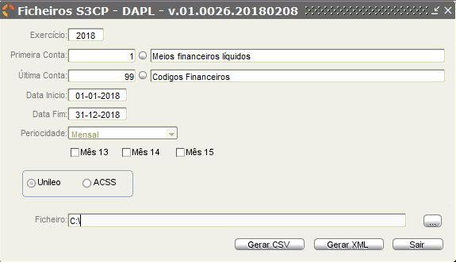

# Ficheiros S3CP (em atualização)

Este menu permite ao utilizador gerar os ficheiros a serem enviados para entidades como UniLeo, ACSS entre outras.

Os ficheiros que podem ser gerados são os seguintes :

<!--
## 1. AFT - Ativos Fixos Tangíveis

Nesta opção o utilizador define os parêmetros de pesquisa, para gerar o ficheiro correspondente ao AFT.

|Campo| Descrição|
|:---|:---|
|Exercício    |Indicação do exercício do qual se pretende gerar o AFT  |
|Primeira Conta    |Indicação da primeira conta que será incluida no AFT. Serão incluídas contas iguais e superiores à conta indicada.   |
|Última Conta    |Indicação da última conta que será incluida no AFT. Serão incluidas contas iguais e inferiores à indicada neste campo.    |
|Data Início    | Indicação da data a partir da qual se consideram os dados para o AFT.    |
|Data Fim    | Indicação da data até a qual, inclusivé,  são considerados dados para o AFT.   |

**Neste caso a periodicidade do documento é mensal, pelo que, na data de inicio e de fim, deve ser indicado o primeiro e o último dia do mês.**

 O utilizador deve também indicar se o mapa gerado é para a UniLeo ou para ACSS. Esta indicação deve ser realizada através da selecção da respetiva checkbox 

De seguida deve o utilizador gerar o ficheiro no formato pretendido: CSV ou XML. Para cada um destes ficheiros, o utilizador deve indicar o local no computador onde pretende guardar o ficheiro

A numenclatura do ficheiro segue as regras estipuladas, no entanto não aparece visível para evitar alterações.

O aspeto dos ficheiros gerados é o seguinte:

|CSV|XML|
|:--:|:--:|
|  |  |

## 2. AI - Ativos Intangíveis

Nesta opção o utilizador define os parêmetros de pesquisa, para gerar o ficheiro correspondente ao AI.

|Campo| Descrição|
|:---|:---|
|Exercício    |Indicação do exercício do qual se pretende gerar o AI  |
|Primeira Conta    |Indicação da primeira conta que será incluida no AI. Serão incluídas contas iguais e superiores à conta indicada.   |
|Última Conta    |Indicação da última conta que será incluida no AI. Serão incluidas contas iguais e inferiores à indicada neste campo.    |
|Data Início    | Indicação da data a partir da qual se consideram os dados para o AI.    |
|Data Fim    | Indicação da data até a qual, inclusivé,  são considerados dados para o AI.   |

**Neste caso a periodicidade do documento é mensal, pelo que, na data de inicio e de fim, deve ser indicado o primeiro e o último dia do mês.**

 O utilizador deve também indicar se o mapa gerado é para a UniLeo ou para ACSS. Esta indicação deve ser realizada através da selecção da respetiva checkbox 

De seguida deve o utilizador gerar o ficheiro no formato pretendido: CSV ou XML. Para cada um destes ficheiros, o utilizador deve indicar o local no computador onde pretende guardar o ficheiro

A numenclatura do ficheiro segue as regras estipuladas, no entanto não aparece visível para evitar alterações.

O aspeto dos ficheiros gerados é o seguinte:

|CSV|XML|
|:--:|:--:|
|  |  | -->

## 3. BA - Balancete Analítico

Nesta opção o utilizador define os parêmetros de pesquisa, para gerar o ficheiro correspondente ao balancete analítico (BA).

|Campo| Descrição|
|:---|:---|
|Exercício    |Indicação do exercício do qual se pretende gerar o BA.  |
|Primeira Conta    |Indicação da primeira conta que será incluida no BA. Serão incluídas contas iguais e superiores à conta indicada.   |
|Última Conta    |Indicação da última Conta que será incluida no BA. Serão incluidas contas iguais e inferiores à indicada neste campo.    |
|Data Início    | Indicação da data a partir da qual se consideram os dados para o BA.    |
|Data Fim    | Indicação da data até a qual, inclusivé,  são considerados dados para o BA.   |
|Periodicidade    | Indicação da periodicidade do documento.    |
|Data autorização    | Caso a entidade tenha autorização do Tribunal de Contas para o diferimento da prestação de contas, deve ser indicada, neste campo a data quando esta autorização foi emitida.   |
|Data Limite Entrega Conta Gerência    | Indicação da data limite, até a qual foi dado o diferimento para a prestação de contas pelo Tribunal de Contas.   |

**Caso a periodicidade for mensal, na data de inicio e de fim, deve ser indicado o primeiro e o último dia do mês. O mesmo se sucede se a priodicidade for semanal.**

 O utilizador deve também indicar se o mapa gerado é para a UniLeo ou para ACSS. Esta indicação deve ser realizada através da selecção da respetiva checkbox 

De seguida deve o utilizador gerar o fixheiro no formato pretendido: PDF, CSV ou XML. Para cada um destes ficheiros, o utilizador deve indicar o local no computador onde pretende guardar o ficheiro

A numenclatura do ficheiro segue as regras estipuladas, no entanto não aparece visível para evitar alterações.

O aspeto dos ficheiros gerados é o seguinte:

|PDF|CSV|XML|
|:--:|:--:|:--:|
|   |   |   |

## 4. BLC - Balanço

Nesta opção o utilizador define os parêmetros de pesquisa, para gerar o ficheiro correspondente ao balanço (BLC).

|Campo| Descrição|
|:---|:---|
|Exercício    |Indicação do exercício do qual se pretende gerar o BLC  |
|Primeira Conta    |Indicação da primeira conta que será incluida no BLC. Serão incluídas contas iguais e superiores à conta indicada.   |
|Última Conta    |Indicação da última conta que será incluida no BLC. Serão incluidas contas iguais e inferiores à indicada neste campo.    |
|Data Início    | Indicação da data a partir da qual se consideram os dados para o BLC.    |
|Data Fim    | Indicação da data até a qual, inclusivé,  são considerados dados para o BLC.   |

**Neste caso a periodicidade do documento é mensal, pelo que, na data de inicio e de fim, deve ser indicado o primeiro e o último dia do mês.**

 O utilizador deve também indicar se o mapa gerado é para a UniLeo ou para ACSS. Esta indicação deve ser realizada através da selecção da respetiva checkbox. 

De seguida deve o utilizador gerar o ficheiro no formato pretendido: PDF, CSV, XML ou pode gerar um extrato. Para cada um destes ficheiros, o utilizador deve indicar o local no computador onde pretende guardar o ficheiro

<!--  -->

A numenclatura do ficheiro segue as regras estipuladas, no entanto não aparece visível para evitar alterações.

 O aspeto dos ficheiros gerados é o seguinte:

|PDF|CSV|XML|
|:--:|:--:|:--:|
| |  |   |

  O extrato permite a visualizar, por rubrica, as contas e os respetivos montantes. Neste documento, també vem indicado se houve um aumento ou uma diminuição do saldo Credor/Devedor.

## 5. CPLC - Correspondência Plano Contas

Nesta opção o utilizador define os parêmetros de pesquisa, para gerar o ficheiro correspondente ao CPLC.

|Campo| Descrição|
|:---|:---|
|Exercício    |Indicação do exercício do qual se pretende gerar o CPLC.  |
|Primeira Conta    |Indicação da primeira conta que será incluida no CPLC. Serão incluídas contas iguais e superiores à conta indicada.   |
|Última Conta    |Indicação da última conta que será incluida no CPLC. Serão incluidas contas iguais e inferiores à indicada neste campo.    |
|Data Início    | Indicação da data a partir da qual se consideram os dados para o CPLC.    |
|Data Fim    | Indicação da data até a qual, inclusivé,  são considerados dados para o CPLC.   |

**Neste caso a periodicidade do documento é mensal, pelo que, na data de inicio e de fim, deve ser indicado o primeiro e o último dia do mês.**

 O utilizador deve também indicar se o mapa gerado é para a Unileo ou para ACSS. Esta indicação deve ser realizada através da selecção da respetiva checkbox. 

De seguida deve o utilizador gerar o ficheiro no formato pretendido: CSV ou XML. Para cada um destes ficheiros, o utilizador deve indicar o local no computador onde pretende guardar o ficheiro

A numenclatura do ficheiro segue as regras estipuladas, no entanto não aparece visível para evitar alterações.

 O aspeto dos ficheiros gerados é o seguinte:

|CSV|XML|
|:--:|:--:|
 | |   |

<!-- ## 6. DAPL - Dem. Alt. Patr. Líquido

Nesta opção o utilizador define os parêmetros de pesquisa, para gerar o ficheiro correspondente ao DAPL.

|Campo| Descrição|
|:---|:---|
|Exercício    |Indicação do exercício do qual se pretende gerar o DAPL  |
|Primeira Conta    |Indicação da primeira conta que será incluida no DAPL. Serão incluídas contas iguais e superiores à conta indicada.   |
|Última Conta    |Indicação da última conta que será incluida no DAPL. Serão incluidas contas iguais e inferiores à indicada neste campo.    |
|Data Início    | Indicação da data a partir da qual se consideram os dados para o DAPL.    |
|Data Fim    | Indicação da data até a qual, inclusivé,  são considerados dados para o DAPL.   |

**Neste caso a periodicidade do documento é mensal, pelo que, na data de inicio e de fim, deve ser indicado o primeiro e o último dia do mês.**

 O utilizador deve também indicar se o mapa gerado é para a UniLeo ou para ACSS. Esta indicação deve ser realizada através da selecção da respetiva checkbox 

De seguida deve o utilizador gerar o ficheiro no formato pretendido: CSV ou XML. Para cada um destes ficheiros, o utilizador deve indicar o local no computador onde pretende guardar o ficheiro

A numenclatura do ficheiro segue as regras estipuladas, no entanto não aparece visível para evitar alterações.

O aspeto dos ficheiros gerados é o seguinte:

|CSV|XML|
|:--:|:--:|
|  |  |

## 7. DDORC - Demonstração de Desempenho Orçamental

## 8. DFC - Demosntração dos Fluxos de Caixa

## 9. DODES - Dem. Exec. Orçamental - Despesa

## 10. DOREC - Dem. Exec. Orçamental - Receita

## 11. DPPI - Dem. Exec. P.Pluri. Invest. -->

## 12. DR - Demonstarção dos Resultados por Natureza

Nesta opção o utilizador define os parêmetros de pesquisa, para gerar o ficheiro correspondente à Demonstração de Resultados por Natureza (DR).

|Campo| Descrição|
|:---|:---|
|Exercício    |Indicação do exercício do qual se pretende gerar a DR.  |
|Primeira Conta    |Indicação da primeira conta que será incluida na DR. Serão incluídas contas iguais e superiores à conta indicada.   |
|Última Conta    |Indicação da última conta que será incluida na DR. Serão incluidas contas iguais e inferiores à indicada neste campo.    |
|Data Início    | Indicação da data a partir da qual se consideram os dados para a DR.    |
|Data Fim    | Indicação da data até a qual, inclusivé,  são considerados dados para a DR.   |

**Neste caso a periodicidade do documento é mensal, pelo que, na data de inicio e de fim, deve ser indicado o primeiro e o último dia do mês.**

 O utilizador deve também indicar se o mapa gerado é para a Unileo ou para ACSS. Esta indicação deve ser realizada através da selecção da respetiva checkbox. 

De seguida deve o utilizador gerar o ficheiro no formato pretendido: PDF, CSV, XML ou pode gerar um extrato. Para cada um destes ficheiros, o utilizador deve indicar o local no computador onde pretende guardar o ficheiro.

<!--  -->

A numenclatura do ficheiro segue as regras estipuladas, no entanto não aparece visível para evitar alterações.

 O aspeto dos ficheiros gerados é o seguinte:

|PDF|CSV|XML|
|:--:|:--:|:--:|
| |  |   |

  O extrato permite a visualizar, por rubrica, as contas e os respetivos montantes. Neste documento, també vem indicado se houve um aumento ou uma diminuição do saldo Credor/Devedor.

<!-- ## 13. DTAS - Dívidas a Terc. por Ant. de Saldos

## 14. EC -Encargos Cotratuais

## 15. Propriedades de Investimento -->
